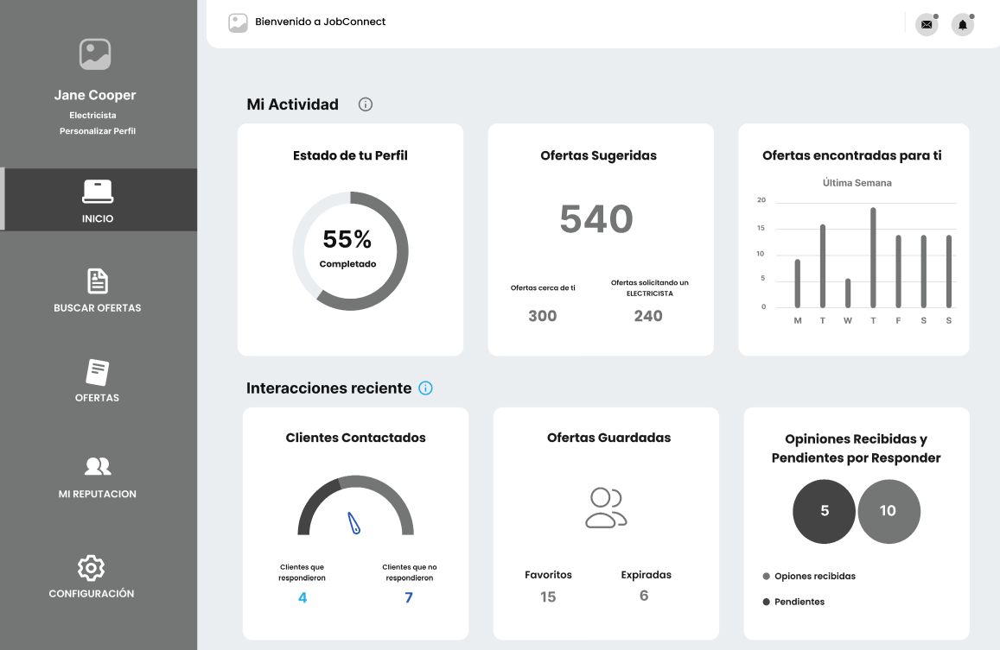

# Informe del Trabajo Final

**Universidad Peruana de Ciencias Aplicadas**

**Ingeniería de software**

**1ASI0730 Aplicaciones Web**

**Sección:** 4381

**Profesor:** Villafuerte Bazan, Oscar Ivan 

**Nombre del StartUp:** TuChamba

**Nombre del Producto:** JobConnect

| Nombre                              | Código    |
| ----------------------------------- | ---------- |
| Chi Cruzatt, Kevin Jorge            | U202313655 |
| Paucar Meneses, Jeremy Alion         | U202019449 |
| Hallasi Saravia, Miguel Angel | U202312391 |
| Oroncoy Almeyda, Alejandro Daniel       | U202313397 |
| Cossar Sanchez, Eduardo Jose           | U202312109 |
| Mostajo Orosco, Maria Fernanda           | U202312874|

**Ciclo 2025-01**

# Registro de Versiones del Informe

| Version | Fecha      | Autor                            | Descripción de modificación                          |
| ------- | ---------- | -------------------------------- | ------------------------------------------------------ |
| 1ra    | 25/04/2025 | Chi, Paucar, Hallasi, Oroncoy, Cossar, Mostajo | TB1: Se realizo los capitulos 1, 2, 3, 4 y el primer sprint del capitulo 5 |
|

# Project Report Collaboration Insights

URL del repositorio para el proyecto: https://github.com/JobConnect-AW/tuchamba.pe

**TB1**

Para el desarrollo del informe perteneciente a la entrega TB1, se dividió la implementación de secciones de la siguiente forma
para cada integrante del equipo:

| Integrantes    | Tareas Asignadas |
| -------------- | ---------------- |
| Kevin Chi      |   2.3.1 User Persona, 3.2 User Stories, 4.7.1 Class Diagram, Diagramas C4               |
| Jeremy Paucar   | 2.3.2 User persona, 2.3.3 User Journey mapping, 2.3.4 Empathy mapping, 2.3.2 User matrix, 2.3.5. AS-IS Scenario Mapping, 4.8 Diagrama de base de datos                 |
| Miguel Hallasi | 2.2 Entrevistas, 3.2 User Stories y Diagramas c4                 |
| Alejandro Oroncoy   |  2.2 Entrevistas, Capitulo V: Product Implementation, Validation & Deployment                |
| Eduardo Cossar      | Capitulo I: Introducción,  2.1 Competidores, 4.3 Landing Page UI Desing, 4.4 Web Applications UX/UI Design, 4.7.2 Class Dictionary               |
| Maria Fernanda Mostajo     | 4.1 Style Guidelines, 4.2 Information Architecture, 4.3 Landing Page UI Desing, 4.4 Web Applications UX/UI Design                 |

**Github Collaboration Insights**

Github también presenta un timeline de las ramas principales y los procesos de merge a los que se han sometido. Todas las
ramas se crearon tomando en cuenta el diseño de GitFlow para una buena organización cuando se usa un software de control
de versiones.

Los integrantes son:

- Kevin Chi (Krillsom)
- Jeremy Paucar (asmip10)
- Miguel Hallasi (mhallasi)
- Alejandro Oroncoy (alejooroncoy)
- Eduardo Cossar (coleeeee-dev)
- Maria Fernanda Mostajo (Mafer-m30)

Se explican las ramas más prominentes:

**main:** Es representada por el color negro. Se trata de la rama principal del proyecto y se actualiza para cada entregable. 
**develop:** Es representada por el color azul. Se trata de la rama principal para el proceso del desarrollo del proyecto. 
**feature/Nombre-del-integrante**:  

# Contenido

1. [Capítulo I: Introducción](#capítulo-i-introducción) 
    1.1. [Startup Profile](#11-startup-profile) 
    1.1.1. [Descripción de la Startup](#111-descripción-de-la-startup) 
    1.1.2. [Perfiles de integrantes del equipo](#112-perfiles-de-integrantes-del-equipo) 
    1.2. [Solution Profile](#12-solution-profile) 
    1.2.1 [Antecedentes y problemática](#121-antecedentes-y-problemática) 
    1.2.2 [Lean UX Process](#122-lean-ux-process) 
    1.2.2.1. [Lean UX Problem Statements](#1221-lean-ux-problem-statements) 
    1.2.2.2. [Lean UX Assumptions](#1222-lean-ux-assumptions) 
    1.2.2.3. [Lean UX Hypothesis Statements](#1223-lean-ux-hypothesis-statements) 
    1.2.2.4. [Lean UX Canvas](#1224-lean-ux-canvas) 
    1.3. [Segmentos objetivo](#13-segmentos-objetivo) 
2. [Capítulo II: Requirements Elicitation & Analysis](#capítulo-ii-requirements-elicitation--analysis) 
   2.1. [Competidores](#21-competidores) 
   2.1.1. [Análisis competitivo](#211-análisis-competitivo) 
   2.1.2. [Estrategias y tácticas frente a competidores](#212-estrategias-y-tácticas-frente-a-competidores) 
   2.2. [Entrevistas](#22-entrevistas) 
   2.2.1. [Diseño de entrevistas](#221-diseño-de-entrevistas) 
   2.2.2. [Registro de entrevistas](#222-registro-de-entrevistas) 
   2.2.3. [Análisis de entrevistas](#223-análisis-de-entrevistas) 
   2.3. [Needfinding](#23-needfinding) 
   2.3.1. [User Personas](#231-user-personas) 
   2.3.2. [User Task Matrix](#232-user-task-matrix) 
   2.3.3. [User Journey Mapping](#232-user-task-matrix) 
   2.3.4. [Empathy Mapping](#234-empathy-mapping) 
   2.3.5. [As-is Scenario Mapping](#235-as-is-scenario-mapping) 
   2.4. [Ubiquitous Language](#24-ubiquitous-language) 
3. [Capítulo III: Requirements Specification](#capítulo-iii-requirements-specification) 
   3.1. [To-Be Scenario Mapping](#31-to-be-scenario-mapping) 
   3.2. [User Stories](#32-user-stories) 
   3.3. [Impact Mapping](#33-impact-mapping) 
   3.4. [Product Backlog](#34-product-backlog) 
4. [Capítulo IV: Product Design](#capítulo-iv-product-design) 
   4.1. [Style Guidelines](#41-style-guidelines) 
   4.1.1. [General Style Guidelines](#411-general-style-guidelines) 
   4.1.2. [Web Style Guidelines](#412-web-style-guidelines) 
   4.2. [Information Architecture](#42-information-architecture) 
   4.2.1. [Organization Systems](#421-organization-systems) 
   4.2.2. [Labeling Systems](#422-labeling-systems) 
   4.2.3. [SEO Tags and Meta Tags](#423-seo-tags-and-meta-tags) 
   4.2.4. [Searching Systems](#424-searching-systems) 
   4.2.5. [Navigation Systems](#425-navigation-systems) 
   4.3. [Landing Page UI Design](#43-landing-page-ui-design) 
   4.3.1. [Landing Page Wireframe](#431-landing-page-wireframe) 
   4.3.2. [Landing Page Mock-up](#432-landing-page-mock-up) 
   4.4. [Web Applications UX/UI Design](#44-web-applications-uxui-design) 
   4.4.1. [Web Applications Wireframes](#441-web-applications-wireframes) 
   4.4.2. [Web Applications Wireflow Diagrams](#442-web-applications-wireflow-diagrams) 
   4.4.2. [Web Applications Mock-ups](#442-web-applications-mock-ups) 
   4.4.3. [Web Applications User Flow Diagrams](#443-web-applications-user-flow-diagrams) 
   4.5. [Web Applications Prototyping](#45-web-applications-prototyping) 
   4.6. [Domain-Driven Software Architecture](#46-domain-driven-software-architecture) 
   4.6.1. [Software Architecture Context Diagram](#461-software-architecture-context-diagram) 
   4.6.2. [Software Architecture Container Diagrams](#462-software-architecture-container-diagrams) 
   4.6.3. [Software Architecture Components Diagrams](#463-software-architecture-components-diagrams) 
   4.7. [Software Object-Oriented Design](#47-software-object-oriented-design) 
   4.7.1. [Class Diagrams](#471-class-diagrams) 
   4.7.2. [Class Dictionary](#472-class-dictionary) 
   4.8. [Database Design](#48-database-design) 
   4.8.1. [Database Diagram](#481-database-diagram) 
5. [Capítulo V: Product Implementation, Validation & Deployment](#capítulo-v-product-implementation-validation--deployment) 
   5.1. [Software Configuration Management](#51-software-configuration-management) 
   5.1.1. [Software Development Environment Configuration](#511-software-development-environment-configuration) 
   5.1.2. [Source Code Management](#512-source-code-management) 
   5.1.3. [Source Code Style Guide & Conventions](#513-source-code-style-guide--conventions) 
   5.1.4. [Software Deployment Configuration](#514-software-deployment-configuration) 
   5.2. [Landing Page, Services & Applications Implementation](#52-landing-page-services--applications-implementation) 
   5.2.1. [Sprint 1](#521-sprint-1) 
   5.2.1.1. [Sprint Planning 1](#5211-sprint-planning-1) 
   5.2.1.2. [Aspect Leaders and Collaborators](#5212-aspect-leaders-and-collaborators) 
   5.2.1.3. [Sprint Backlog 1](#5213-sprint-backlog-1) 
   5.2.1.4. [Development Evidence for Sprint Review](#5214-development-evidence-for-sprint-review) 
   5.2.1.5. [Execution Evidence for Sprint Review](#5215-execution-evidence-for-sprint-review) 
   5.2.1.6. [Services Documentation Evidence for Sprint Review](#5216-services-documentation-evidence-for-sprint-review) 
   5.2.1.7. [Software Deployment Evidence for Sprint Review](#5217-software-deployment-evidence-for-sprint-review) 
   5.2.1.8. [Team Collaboration Insights during Sprint](#5218-team-collaboration-insights-during-sprint) 

6. [Conclusiones](#conclusiones) 
   6.1 [Conclusiones y recomendaciones](#61-conclusiones-y-recomendaciones) 
7. [Bibliografía](#bibliografía) 
8. [Anexos](#anexos) 

# Student Outcomes
   **Student Outcome 3**

| Criterio específico                                                | Acciones realizadas                                                                 | Conclusiones |
|--------------------------------------------------------------------|-------------------------------------------------------------------------------------|--------------|
| Comunica oralmente con efectividad a diferentes rangos de audiencia. | Para el desarrollo del TB1, hubo una buena comunicación en el equipo al momento de deliberar aspectos importantes acerca del desarrollo del trabajo. Todos participamos en las reuniones en las cuales expresamos nuestras ideas y opiniones. | TB1   Para la TB1, el equipo trabajó colaborativamente y se logró una particiapción activa de cada uno de los integrantes. Se realizaron reuniones grupales en la que cada miembro compartió sus ideas de manera oral o escrita y, a partir de ello, se logró una toma de decisiones en conjunto la cual beneficio el equipo en la toma de decisiones y en la ejecución de tareas.       |
| Comunica por escrito con efectividad a diferentes rangos de audiencia | Para el desarrollo del TB1, desarrollamos correctamente la capacidad de comunicación escrita donde se ha explicado las ideas que hemos acordado en las reuniones através del presente documento | TB1   Para el TB1, el equipo comunicó las ideas tomadas en el documento de manera conjunta y equitativa, siendo todos parte y responsables del desarrollo del informe        |

# Capítulo I: Introducción

## 1.1. Startup Profile

### 1.1.1. Descripción de la Startup

Somos JobConnect, una startup iniciada por estudiantes del quinto ciclo de la Universidad Peruana de Ciencias Aplicadas. Nuestro objetivo es acercar a los trabajadores técnicos a los clientes mediante herramientas informáticas modernas, accesibles y confiables. A través de nuestra solución digital, buscamos facilitar la conexión directa entre ambos, potenciando la visibilidad, formalización y crecimiento de los profesionales independientes.

A través de nuestra plataforma, los trabajadores técnicos pueden crear un perfil profesional, promocionar sus habilidades, experiencias y sus tarifas a los clientes. De esta manera los clientes se mantienen informados, teniendo la capacidad de escoger entre un alta red de trabajadores.

Nuestra misión es desarrollar una plataforma accesible a los usuarios, que permita a los trabajadores técnicos mejorar su visibilidad y ampliar su base de clientes. De esta manera, logramos formalizar el contacto con los clientes y brindar una mayor seguridad al usuario en el proceso de contratación.

Nuestra visión es convertirnos en la plataforma principal de servicios técnicos en el Perú, promoviendo la seguridad al usuario mediante un servicio confiable y que mejoren la experiencia tanto del cliente como del trabajador

### 1.1.2. Perfiles de integrantes del equipo

| **Perfil**                                                                                                                                                                                                                                                                                                                                                                                                                                                                                                          | **Foto**                                                                       |
|---------------------------------------------------------------------------------------------------------------------------------------------------------------------------------------------------------------------------------------------------------------------------------------------------------------------------------------------------------------------------------------------------------------------------------------------------------------------------------------------------------------------|--------------------------------------------------------------------------------|
| **Jeremy Alión Paucar Meneses** Mi nombre es Jeremy, Tengo 22 años. En la actualidad estoy estudiando la carrera de ingeniería de software en la Universidad Peruana de Ciencias Aplicadas. Albergo conocimientos intermedios en algunos lenguajes de programación, tales como C++, JavaScript y Python. Me considero una persona responsable con disposición de apoyar al grupo, también me gustan mucho los retos y así mismo poder cumplirlos.                                                                                                                                                                       |   |
| **Kevin Jorge Chi Cruzatt** Mi nombre es Kevin Chi. Tengo 19 años y actualmente estoy cursando el 5° ciclo de ingeniería de software. Me considero una persona con capacidades de liderazgo y capaz de trabajar bajo presión.                                                                                                                                                                                                                                                                                                  |   |
| **Miguel Angel Hallasi Saravia**  Soy Miguel Hallasi, estudiante del quinto ciclo de la carrera de Ingeniería de Software. Me gusta el aprendizaje continuo y adquirir nuevas experiencias.                                                                            |   |
| **Alejandro Daniel Oroncoy Almeyda** Mi nombre es Alejandro Oroncoy. Tengo 19 años, soy estudiante de la carrera de ingeniería de software, estoy en 5to ciclo. Me considero una persona proactiva, autodidacta y orientada a objetivos.                                                                                                                                                    |    
| **Eduardo Jose Cossar Sanchez** Mi nombre es Eduardo Cossar. Soy estudiante de la carrera de Ingeniería de Software, tengo 19 años y actualmente estoy cursando el quinto ciclo en la UPC. Me considero una persona responsable y comprometida con un gran interés por la tecnología. Como integrante de este equipo, me comprometo a brindar todo mi apoyo y participación activa para afrontar los desafíos que se presenten y dar lo mejor de mí para lograr el éxito de este proyecto. |  |
| **Maria Fernanda Mostajo Orosco** Mi nombre es Maria Fernanda Mostajo, estoy estudiando la carrera de Ingeniería de Software en la UPC, tengo conocimientos en los lenguajes de programación C++, Python, HTML, CSS, JavaScript y SQL. Además, cuento con habilidades de trabajo en equipo, el cual me permitira realizar un buen trabajo y cumplir con los objetivos planteados en el tiempo establecido.                                                                                                                                                                                            |   

## 1.2. Solution Profile

En esta sección, se presenta en detalle el perfil de la solución, respaldado por
antecedentes sólidos y construido paso a paso siguiendo el proceso de
Lean UX

### 1.2.1 Antecedentes y problemática

En el Perú, una gran cantidad de trabajadores técnicos ofrecen sus servicios de manera informal, sin una plataforma que los respalde ni que facilite su visibilidad profesional. Esto genera desconfianza entre los clientes, dificulta el crecimiento de estos profesionales y reduce las oportunidades de empleo de calidad. JobConnect surge como una solución digital que busca formalizar esta relación, conectando a técnicos con clientes de forma segura, eficiente y profesional.

**What (Qué)**

##### ¿Cuál es el problema?

El problema principal es la falta de una plataforma especializada que conecte de forma efectiva a trabajadores técnicos independientes (electricistas, gasfiteros, carpinteros, etc.) con clientes que necesitan sus servicios. En la actualidad, muchos de estos profesionales dependen de métodos informales como recomendaciones boca a boca, redes sociales o grupos de WhatsApp, lo que limita su visibilidad, dificulta la generación de confianza y reduce sus oportunidades de crecimiento económico.

##### ¿Cuál es la relación con la persona en cuestión?

JobConnect busca resolver este problema proporcionando una plataforma digital que conecte a técnicos verificados con clientes en busca de servicios confiables. A través de la digitalización del proceso de búsqueda, solicitud y pago, JobConnect no solo mejora la experiencia del cliente, sino que también permite a los trabajadores técnicos formalizar sus servicios, aumentar su visibilidad y acceder a más oportunidades laborales. Según un informe del BID (2021), las plataformas digitales que promueven el empleo formal pueden incrementar hasta en 40% los ingresos de trabajadores independientes en América Latina.

**Who (Quién)**

##### ¿Quiénes están involucrados?

Los principales involucrados son los trabajadores técnicos independientes (electricistas, gasfiteros, técnicos de aire acondicionado, etc.), y los clientes que requieren sus servicios para el hogar, oficinas o negocios. También se incluyen microempresas que contratan técnicos de manera eventual..

##### ¿A quiénes le sucede el problema?

El problema afecta principalmente a los técnicos independientes, quienes no cuentan con medios eficientes para mostrar sus servicios ni herramientas para captar clientes nuevos. También afecta a los clientes, quienes se enfrentan a la incertidumbre de no encontrar técnicos de confianza de forma rápida y segura. Según el Ministerio de Trabajo (2022), casi un 60% de los trabajadores técnicos en el Perú no tienen presencia digital.

**Where (Dónde)**

##### ¿En dónde ocurre el problema?

 Este problema ocurre principalmente en zonas urbanas del Perú donde hay una alta demanda de servicios técnicos, pero los trabajadores aún gestionan sus actividades mediante medios informales como llamadas, mensajes de texto o publicaciones esporádicas en redes sociales, lo que genera ineficiencia y desconfianza.

##### ¿En dónde nos enfocaremos?

Nos enfocaremos inicialmente en Lima, donde existe un alto volumen de clientes potenciales y trabajadores técnicos con acceso básico a tecnología móvil e internet. Estas zonas permiten una implementación escalable con impacto real y medible.

**When (Cuándo)**

##### ¿Cuándo sucede el problema?

El problema se presenta cada vez que un cliente requiere un servicio técnico y no encuentra rápidamente a un proveedor confiable, o cuando el trabajador técnico pierde oportunidades por no tener un canal activo de contacto o visibilidad en línea.

##### ¿Cuándo utiliza el cliente el producto?

El cliente utilizaría JobConnect al momento de necesitar un servicio técnico específico. La plataforma permitirá buscar por tipo de servicio, ubicación y disponibilidad. Del lado del técnico, el producto será utilizado tanto para gestionar sus citas como para visualizar reseñas, actualizar su disponibilidad y recibir pagos.

**Why (Por qué)**

##### ¿Cuál es la causa del problema?

Las principales causas del problema incluyen la informalidad del sector técnico, la baja digitalización de los trabajadores independientes y la falta de plataformas especializadas que respondan a sus necesidades específicas. Si bien existen plataformas como Workana o Clic, estas no están orientadas a servicios presenciales ni al perfil técnico, lo que deja un vacío en el mercado. Además, muchos trabajadores técnicos carecen de conocimientos para usar plataformas complejas o poco localizadas.

**How (Cómo)**

##### ¿En qué condiciones los clientes usan nuestro producto?

A través de una aplicación web o móvil ligera y fácil de usar, disponible en dispositivos con conexión a internet. JobConnect ofrecerá funcionalidades como búsqueda por cercanía, perfiles verificados, historial de servicios, sistema de pago seguro y soporte post-servicio. Para los técnicos, la interfaz permitirá recibir solicitudes, programar citas, subir evidencias de trabajos y recibir evaluaciones de clientes.

**How much (Cuánto)**

##### Estadísticas que sustentan la problemática.

Según el Instituto Nacional de Estadística e Informática (INEI, 2023), más del 70% de los trabajadores técnicos en Perú operan de manera informal, sin acceso a herramientas digitales que les permitan organizar y formalizar sus servicios. Esta situación conlleva a una baja visibilidad, desconfianza por parte de los clientes y pérdida de oportunidades laborales.

De acuerdo al Ministerio de Trabajo y Promoción del Empleo (MTPE, 2022), solo el 18% de los técnicos independientes en zonas urbanas usa plataformas digitales para la promoción o gestión de sus servicios. La gran mayoría depende de llamadas telefónicas, grupos de WhatsApp o recomendaciones informales para obtener trabajo.

Un estudio de la CAF (Banco de Desarrollo de América Latina, 2021), indica que la digitalización puede aumentar los ingresos de los trabajadores independientes hasta en un 40%, y mejorar la percepción de confiabilidad por parte de los clientes en un 60%.

### 1.2.2. Lean UX Process

El Lean UX es un enfoque de diseño centrado en la colaboración, la retroalimentación continua y la mejora iterativa. Se enfoca en construir productos útiles y funcionales desde etapas tempranas, validando constantemente las ideas con los usuarios reales. En el caso de JobConnect, este enfoque es esencial para crear una plataforma eficiente y confiable que conecte a trabajadores técnicos con clientes que necesitan servicios de calidad.

#### 1.2.2.1. Lean UX Problem Statements

El estado actual del mercado de servicios técnicos en Perú se ha centrado principalmente en redes informales de recomendación, donde los trabajadores independientes carecen de visibilidad digital, credibilidad y acceso a clientes de manera formal. Por su parte, los clientes enfrentan dificultades para verificar la calidad y confiabilidad del servicio, lo que genera desconfianza y pérdida de oportunidades.

Lo que los servicios existentes no logran abordar es la necesidad de una plataforma accesible y confiable que cierre la brecha entre trabajadores técnicos informales y clientes que buscan servicios verificados y seguros.

Nuestro servicio abordará esta brecha mediante la creación de una plataforma digital que permita a los trabajadores técnicos mostrar perfiles verificados, facilitar la comunicación transparente y contratar de forma segura mediante calificaciones y reseñas.

Nuestro enfoque inicial será los trabajadores técnicos independientes en zonas urbanas del Perú, así como clientes individuales que requieran servicios técnicos para el hogar o de uso personal.

Sabremos que hemos tenido éxito cuando veamos un aumento en la cantidad de trabajadores que crean perfiles verificados, un flujo constante de solicitudes de servicios a través de la plataforma y altos niveles de satisfacción reflejados en calificaciones positivas y uso recurrente.

**¿Cómo podemos diseñar una plataforma accesible que permita a los trabajadores técnicos visibilizar sus habilidades y a los clientes encontrar y contratar profesionales de forma confiable y segura?**

#### 1.2.2.2. Lean UX Assumptions

JobConnect está diseñado para facilitar el contacto entre trabajadores técnicos e independientes y personas que necesitan servicios confiables en el hogar o el negocio. Asumimos que la plataforma debe ser intuitiva, permitir mostrar portafolios y valoraciones, y ofrecer filtros eficientes para encontrar al profesional adecuado.

#### a. Assumption Worksheet

**¿Quién será nuestro usuario?**  
Trabajadores técnicos independientes (electricistas, gasfiteros, técnicos en refrigeración, etc.) y clientes residenciales o comerciales que requieren estos servicios.

**¿Dónde encaja nuestro producto en su vida?**  
Para los técnicos, como herramienta para conseguir más clientes y mejorar su reputación profesional. Para los clientes, como solución práctica para contratar servicios de forma segura y rápida.

**¿Qué problemas tiene nuestro producto y cómo se pueden resolver?**  
La informalidad del sector, la baja visibilidad de los trabajadores y la desconfianza del cliente. Esto se puede resolver brindando perfiles verificables, reseñas de otros clientes y un sistema de búsqueda simple pero eficaz.

**¿Cómo y cuándo es usado nuestro producto?**  
La plataforma se usa mediante computadoras y celulares, en el momento en que un cliente necesita contratar un técnico o cuando un trabajador quiere mejorar su presencia digital.

**¿Cómo debe verse nuestro producto y cómo debe comportarse?**  
Debe tener un diseño simple, visual y amigable. Fluido, con perfiles claros, filtros rápidos, sistema de valoraciones, y opción de contactar al profesional dentro de la app.

**¿Qué características son importantes?**
- Creación fácil de perfiles para técnicos.
- Sistema de calificaciones y comentarios.
- Filtros por ubicación, especialidad y precio.
- Seguridad en la verificación de identidad.
- Plataforma optimizada para móviles.
- Sistema de mensajes o contacto directo.

#### b. Business Outcomes

- JobConnect se posicionará como una plataforma confiable para contratar servicios técnicos.  
- Aumentará el número de trabajadores técnicos formales registrados en el país.  
- Reducirá la tasa de clientes insatisfechos al contar con perfiles verificados.  
- Generará ingresos por comisiones y suscripciones premium para técnicos.  
- Obtendrá buenas calificaciones en tiendas de apps por su facilidad y utilidad.

#### c. User Outcomes

- Los técnicos mejorarán su visibilidad y conseguirán más clientes.  
- Los clientes se sentirán más seguros al contratar servicios verificados.  
- Aumentará la confianza y satisfacción gracias al sistema de reseñas.  
- Los usuarios encontrarán al profesional adecuado en menos tiempo.  
- Se reducirá el número de incidentes o malas experiencias en contrataciones.

#### 1.2.2.3. Lean UX Hypothesis Statements

**Hipótesis 1:**  
Creemos que los trabajadores técnicos aumentarán su visibilidad y número de contrataciones al crear un perfil profesional en JobConnect.  
_Sabremos que estamos en lo correcto cuando, en los primeros 3 meses, al menos el 60% de los técnicos registrados reporten haber conseguido nuevos clientes a través de la plataforma._

**Hipótesis 2:**  
Creemos que los clientes se sentirán más seguros al contratar técnicos con perfiles verificados y reseñas visibles.  
_Sabremos que estamos en lo correcto cuando el 70% de los usuarios encuestados manifiesten sentirse más confiados al contratar mediante JobConnect que por medios tradicionales._

**Hipótesis 3:**  
Creemos que incluir un sistema de calificaciones y comentarios mejorará la calidad del servicio prestado por los técnicos.  
_Sabremos que estamos en lo correcto cuando las calificaciones promedio de los técnicos aumenten en un 20% en los primeros seis meses._

**Hipótesis 4:**  
Creemos que permitir a los clientes filtrar técnicos por especialidad, ubicación y precio facilitará el proceso de búsqueda y contratación.  
_Sabremos que estamos en lo correcto cuando el tiempo promedio que toma contratar a un técnico se reduzca en un 40%._

**Hipótesis 5:**  
Creemos que ofrecer una versión móvil optimizada de JobConnect aumentará la frecuencia de uso y retención.  
_Sabremos que estamos en lo correcto cuando el 80% de los usuarios activos utilicen la app desde el celular y la tasa de retención mensual supere el 50%._

#### 1.2.2.4. Lean UX Canva

#### 1.3. Segmento Objetivo

##### Trabajadores Técnicos Independientes

**Aspectos demográficos:**
- Sexo: Masculino y Femenino  
- Edad: 20-55 años  

**Aspectos geográficos:**
- Nacionalidad: Peruana  
- Departamento: Lima  

**Aspectos psicográficos:**
- Desean incrementar su visibilidad profesional y captar más clientes.  
- Buscan oportunidades de formalizar su trabajo y generar confianza en sus servicios.  
- Tienen interés en una plataforma digital sencilla que les permita promocionar sus habilidades.  
- Están dispuestos a recibir retroalimentación mediante valoraciones para mejorar su reputación laboral.

##### Usuarios que requieren servicios técnicos

**Aspectos demográficos:**
- Sexo: Masculino y Femenino  
- Edad: 25-60 años  

**Aspectos geográficos:**
- Nacionalidad: Peruana  
- Departamento: Lima Metropolitana  

**Aspectos psicográficos:**
- Desean encontrar profesionales técnicos confiables y con buenas referencias.  
- Buscan una plataforma práctica para comparar opciones por especialidad, precios y cercanía.  
- Valoran la rapidez y facilidad al momento de contratar un servicio técnico.  
- Quieren tener seguridad y confianza durante el proceso de contratación, evitando fraudes o estafas.

### 2.1. Competidores

Hemos identificado tres competidores clave en el mercado peruano que ofrecen soluciones para conectar a profesionales independientes con potenciales clientes:

- **Chambea**  
Aplicación móvil peruana diseñada para conectar a emprendedores y trabajadores independientes con posibles clientes en diversas categorías, como tecnología, comida, mascotas, delivery, automóviles y finanzas.

- **Workana**  
Plataforma en línea que opera en varios países de América Latina, incluyendo Perú, enfocada en conectar a freelancers con empresas que buscan profesionales para proyectos en áreas como programación, diseño, traducción, marketing y más.

- **Clic**  
Hub digital que ofrece servicios profesionales en diversos rubros, como medicina, psicología, nutrición, fisioterapia, derecho y consultoría. A través de su aplicación, las personas pueden contactar a especialistas y coordinar servicios según sus necesidades.

### 2.1.1. Analisis Competitivo

<h2>Análisis Competitivo</h2>

<table>
  <thead>
    <tr>
      <th>¿Por qué llevar a cabo este análisis?</th>
      <td colspan="4">Se llevó a cabo este análisis porque queremos ofrecer un mejor servicio a través de la recopilación de información de nuestros competidores.</td>
    </tr>
    <tr>
      <th></th>
      <th>JobConnect</th>
      <th>Chambea</th>
      <th>Workana</th>
      <th>Clic</th>
    </tr>
  </thead>
  <tbody>
    <tr>
      <th>Perfil</th>
      <td>Plataforma peruana que conecta trabajadores técnicos independientes con clientes</td>
      <td>App móvil que conecta emprendedores y trabajadores independientes con clientes</td>
      <td>Plataforma de freelancers para proyectos profesionales en LATAM</td>
      <td>App que conecta profesionales de salud y consultoría con clientes</td>
    </tr>
    <tr>
      <th>Ventaja competitiva</th>
      <td>Formalización y crecimiento de técnicos</td>
      <td>Diversidad en categorías y simplicidad</td>
      <td>Alcance regional y sistema de reputación</td>
      <td>Especialización en salud y profesiones específicas</td>
    </tr>
    <tr>
      <th>Perfil de marketing</th>
      <td>Clientes que requieren servicios técnicos y trabajadores independientes</td>
      <td>Emprendedores, independiente y clientes generales</td>
      <td>Empresas que requieren freelancers calificados</td>
      <td>Personas que necesitan servicios profesionales específicos</td>
    </tr>
    <tr>
      <th>Estrategias de marketing</th>
      <td>Publicidad en redes sociales</td>
      <td>Presencia en medios locales, redes sociales</td>
      <td>SEO, anuncios pagos, recomendaciones</td>
      <td>Promociones online</td>
    </tr>
    <tr>
      <th>Perfil de producto</th>
      <td>Directorio de técnicos, calificaciones - chat, pagos seguros</td>
      <td>Directorio de emprendedores por categoría</td>
      <td>Proyectos, perfiles, contrataciones y pagos</td>
      <td>Agendamiento, perfiles profesionales, contacto directo</td>
    </tr>
    <tr>
      <th>Precio & Costos</th>
      <td>Modelo Freemium</td>
      <td>Uso gratuito con modelos futuros de membresía</td>
      <td>Comisión por proyecto y opciones premium</td>
      <td>Tarifas por servicio profesional</td>
    </tr>
    <tr>
      <th>Canales de Distribución</th>
      <td>Web y app móvil</td>
      <td>App móvil</td>
      <td>Web</td>
      <td>Web y app</td>
    </tr>
  </tbody>
</table>

<h2>Análisis FODA</h2>

<table>
  <thead>
    <tr>
      <th></th>
      <th>JobConnect</th>
      <th>Chambea</th>
      <th>Workana</th>
      <th>Clic</th>
    </tr>
  </thead>
  <tbody>
    <tr>
      <th>Fortalezas</th>
      <td>Enfoque en servicios técnicos, confianza, formalización</td>
      <td>App local, variedad de rubros, sencillez</td>
      <td>Escala internacional, reputación, variedad de profesionales</td>
      <td>Especialización en profesiones clave, facilidad de uso</td>
    </tr>
    <tr>
      <th>Debilidades</th>
      <td>Aún en etapa inicial, menor alcance</td>
      <td>Menor formalidad y validación de perfiles</td>
      <td>Competencia alta, dificultad para destacar</td>
      <td>Enfocado solo en rubros específicos</td>
    </tr>
    <tr>
      <th>Oportunidades</th>
      <td>Ampliar servicios, alianzas con gremios y empresas</td>
      <td>Monetización a futuro, expansión a otros países</td>
      <td>Mayor presencia en mercados emergentes</td>
      <td>Ampliar rubros profesionales, integrar IA</td>
    </tr>
    <tr>
      <th>Amenazas</th>
      <td>Imitación del modelo, entrada de grandes plataformas</td>
      <td>Saturación de mercado, apps similares</td>
      <td>Nuevas plataformas, cambios en la demanda</td>
      <td>Poca diferenciación en rubros nuevos</td>
    </tr>
  </tbody>
</table>

### 2.1.2. Estrategias y tácticas frente a competidores 

Desarrollar estrategias y tácticas efectivas para enfrentar a nuestros competidores requiere de un enfoque centrado en nuestras fortalezas tecnológicas, la experiencia del usuario y el conocimiento profundo del mercado peruano. A continuación, se presentan estrategias clave para obtener una ventaja competitiva:

- Diferenciación mediante la formalización de trabajadores técnicos: JobConnect puede posicionarse como la plataforma que impulsa la formalización laboral, brindando perfiles verificados, procesos seguros y herramientas de gestión para trabajadores técnicos como electricistas, plomeros, gasfiteros y otros oficios.

- Enfoque en la calidad y confiabilidad del servicio: Implementar un sistema robusto de calificaciones, reseñas y verificación de identidad, generando confianza tanto en usuarios como en profesionales técnicos.

- Plataforma centrada en servicios técnicos presenciales y por zonas: A diferencia de otras plataformas más generales o remotas, JobConnect puede optimizar su algoritmo para conectar por proximidad geográfica, asegurando rapidez en la atención y ahorro en costos de desplazamiento.

- Educación y soporte a trabajadores independientes: Ofrecer contenido educativo, talleres gratuitos y herramientas de gestión (como control de ingresos o recordatorios de citas), que agreguen valor y fomenten el uso recurrente de la plataforma.

## 2.2. Entrevistas.

## 2.3. Needfinding.

### 2.3.1. User Personas.

Segmento objetivo #1: Trabajadores independientes

Segmento objetivo #2: Usuarios que requieren servicios técnicos

### 2.3.2. User Task Matrix.

### Segmento objetivo #1: Juan Carlos (Gasfitero Independiente)

| Tarea                                                    | Frecuencia | Importancia |
|----------------------------------------------------------|------------|-------------|
| Buscar nuevos clientes                                   | Alta       | Alta        |
| Coordinar horarios con clientes                          | Alta       | Alta        |
| Negociar precios y condiciones                           | Media      | Alta        |
| Repartir volantes o buscar recomendaciones               | Media      | Media       |
| Recordar fechas o compromisos laborales                  | Alta       | Media       |
| Pedir reseñas o recomendaciones a clientes               | Baja       | Alta        |
| Usar redes sociales o apps para promoción                | Muy baja   | Media       |
| Hacer el trabajo técnico (reparaciones, instalaciones)   | Alta    | Alta        |
| Dar seguimiento a clientes anteriores                    | Baja       | Media       |
| Comprar materiales de ferretería                         | Media      | Alta        |
| Coordinar el precio del servicio por WhatsApp o teléfono | Alta       | Alta        |
| Transportarse entre un trabajo y otro                    | Alta       | Media       |
| Resolver problemas imprevistos en trabajos               | Media      | Alta        |
| Llevar el control de pagos recibidos y pendientes        | Media      | Alta        |

### Segmento objetivo #2: Jesus Lujan (Usuario dependiente)

| Tarea                                                    | Frecuencia | Importancia |
|----------------------------------------------------------|------------|-------------|
| Buscar profesionales para tareas del hogar o educación   | Alta       | Alta        |
| Comparar precios, calificaciones y experiencia           | Media      | Alta        |
| Contactar al proveedor de servicio                       | Media      | Alta        |
| Coordinar horarios o agendar servicios                   | Media      | Alta        |
| Solicitar presupuesto o cotización                       | Media      | Alta        |
| Leer opiniones o referencias de otros usuarios           | Baja       | Media       |
| Guardar perfiles o servicios favoritos                   | Baja       | Media       |
| Cancelar o reagendar un servicio                         | Baja       | Media       |
| Dejar una reseña luego del servicio                      | Baja       | Alta        |
| Compartir el contacto con amigos o familiares            | Baja       | Baja        |
| Revisar si el servicio tiene garantías o soporte         | Baja       | Media       |
| Hacer seguimiento al estado del servicio contratado      | Baja       | Media       |
| Comparar diferentes tipos de servicios                   | Baja       | Media       |
| Evaluar si volvería a contratar al mismo proveedor       | Media      | Alta        |

### 2.3.3. User Journey Mapping.

En esta sección, vamos a analizar el recorrido del uso de la plataforma con su correspondiente contrata de servicio.
Desde el momento en el que un usuario se registra hasta lograr concretar realizar un servicio técnico, o en su caso contratar un servicio técnico, se puede observar que el usuario debe realizar una serie de acciones para poder lograrlo.

User Journey Mapping: Trabajadores independientes

User Journey Mapping: Usuarios que requieren servicios técnicos

### 2.3.4. Empathy Mapping.
En esta sección se presenta el Empathy Mapping, una herramienta para crear un perfil detallado de los user personas y desarrollar una comprensión profunda de su perspectiva y experiencia. Para cada user persona, se incluyen cinco elementos clave: lo que el usuario ve, lo que el usuario escucha, lo que el usuario dice, lo que el usuario hace y lo que el usuario siente. Además, se incluyen los pains y gains identificados en base a las preguntas: ¿Qué le preocupa? Y ¿Qué puede ayudar a resolver sus problemas? ¿Qué puede convencerlo de que somos la alternativa correcta? ¿Qué dice? Los mapas de empatía se han desarrollado con la herramienta UXPressia.

Empathy Mapping: Trabajadores independientes

Empathy Mapping: Usuarios que requieren servicios técnicos

### 2.3.5. As-is Scenario Mapping.

## 2.4. Ubiquitous Language.

## 4.1. Style Guidelines

### 4.1.1. General Style Guidelines

El propósito de esta sección es establecer las pautas generales de estilo que guiarán el desarrollo visual y de comunicación de JobConnect, una plataforma orientada a conectar técnicos independientes con clientes que necesitan servicios confiables y de calidad en distintos rubros del hogar y la tecnología. Estas directrices están diseñadas para asegurar la coherencia estética, funcional y de experiencia de usuario en todos los puntos de contacto con la plataforma, tanto en su versión web como móvil, utilizando herramientas de diseño como Figma. Esta sección funcionará como una guía centralizada para el equipo de diseño, desarrollo y marketing, garantizando que la identidad de JobConnect se mantenga consistente, profesional y alineada con los valores de cercanía, confianza y eficiencia.

- Branding
    
    El logotipo de JobConnect es uno de los principales elementos de identificación de la marca y, por tanto, juega un papel clave en la consolidación de su identidad. El diseño del logo presenta una fusión estilizada de las letras J y C en tonos blancos y naranja cálido (#FF7A00), sobre un fondo azul eléctrico (#0066FF), lo cual evoca una sensación de tecnología, profesionalismo y acción inmediata.

    **Figura 17**
    
    Logotipo de JobConnect
    
     

    A continuación, se detallan las decisiones relacionadas con su uso y aplicación:
    - Logo principal: El logotipo debe ser utilizado siempre que sea posible en su versión completa, sobre un fondo blanco o de color suave que no interfiera con su legibilidad.		
    							
    - Adaptación en Figma: El logotipo debe estar guardado como un componente en Figma para facilitar su uso consistente en múltiples pantallas y dispositivos. Se deberán crear versiones de alta resolución y con transparencias, ajustadas para diferentes aplicaciones visuales.

- **Typography**

    La tipografía es uno de los elementos más importantes en la creación de una identidad visual coherente. Para JobConnect , hemos seleccionado fuentes que transmiten tecnología, claridad y profesionalismo:

    - Fuente principal: 

        La fuente seleccionada es "Poppins" . Se trata de una tipografía moderna y versátil, con formas geométricas que refuerzan la estética tecnológica del logotipo. Se utilizará en sus diferentes tamaños, principalmente Bold para los encabezados y títulos principales, mientras que Regular para el cuerpo de texto.

    - Fuente Secundaria:
        
        Se recomienda el uso de "Inter" para textos más pequeños, como subtítulos, descripciones y etiquetas de formularios. Esta fuente asegura alta legibilidad en pantalla y complementa la línea visual moderna y funcional de la marca.

    - Aplicación en Figma:

        Se deben crear Text Styles en Figma que incluyan los tamaños y pesos de Poppins e Inter previamente definidos, para garantizar un uso uniforme en todo el diseño. Los encabezados deben tener un tamaño de 32px , los subtítulos de 24px y el cuerpo de texto de 16px.

- **Colors**

    El color es un aspecto central en la creación de la experiencia visual. Para JobConnect, la paleta de colores se basa en tonos que reflejan tecnología, dinamismo y confianza, valores esenciales en una plataforma orientada a conectar talento con oportunidades laborales. A continuación, se detalla la paleta principal y sus aplicaciones:

    - Color primario
    
        #0066FF (Azul Eléctrico). Este color, tomado directamente del logotipo, será el color principal de la marca. Se utilizará para encabezados, botones primarios y elementos destacados que busquen transmitir profesionalismo, tecnología y confiabilidad.

    - Color secundario
    
        #FFFFFF (Blanco). Este color aporta claridad, espacio visual y equilibrio. Se utilizará como fondo principal en la mayoría de las interfaces para facilitar la lectura y la navegación.

    - Color Terciario

        #1A1A1A (Negro Suave). Será utilizado principalmente para los textos sobre fondos claros. Su tono asegura una excelente legibilidad sin resultar demasiado agresivo visualmente.

    - Color de Realce

        #FF9900 (Naranja Cálido). Este color se utilizará para botones secundarios, íconos interactivos o llamadas a la acción que requieren captar la atención del usuario de forma inmediata y accesible.

    - Aplicación en Figma
        
        En Figma, se deberá guardar estos colores como Estilos de color , de manera que sean fácilmente accesibles para todo el equipo. Estos estilos ayudarán a garantizar la consistencia en cada pantalla o componente que se diseña.

- **Spacing**

    El uso del espacio es fundamental para asegurar que la plataforma transmita una sensación de orden, claridad y eficiencia, en línea con los valores de JobConnect . La distribución visual debe mantenerse ligera y bien estructurada, permitiendo una navegación intuitiva sin generar saturación visual.

    - Padding y Márgenes:

        Para mantener una sensación de estructura y simplicidad, se recomienda utilizar 60px de padding entre secciones .entre secciones principales en pantallas de escritorio. Entre bloques de contenido debe haber un espacio de alrededor de 40px , asegurando que cada componente tenga espacio para “respirar” y que la información pueda ser escaneada visualmente con facilidad.

    - Espaciado entre Elementos:

        El espacio entre elementos interactivos (botones, íconos y campos de entrada) debe ser de 20px . Esto mejora la legibilidad, facilita la interacción con el contenido y permite una experiencia fluida tanto en pantallas grandes como en resoluciones adaptativas.

    - Aplicación en Figma:

        En Figma, se utilizará el sistema de Auto Layout para mantener la consistencia en los espacios y asegurar que los elementos se ajusten correctamente en diferentes tamaños de pantalla. Los componentes deberán incluir valores predefinidos de padding y margen.

- **Tono de Comunicación**

    El tono de comunicación es un elemento clave para proporcionar una experiencia de usuario coherente con los objetivos y valores de JobConnect . Este tono debe reflejar cercanía, dinamismo y confianza, alineado con la misión de facilitar la conexión entre trabajadores técnicos y clientes a través de herramientas modernas, accesibles y seguras. Como plataforma creada por jóvenes emprendedores para impulsar la formalización y crecimiento de profesionales independientes, es importante que el tono inspire profesionalismo accesible, transmitiendo seguridad y oportunidades sin dejar de ser amigable.

    - Tono general: 

        Cercano y Empático: El lenguaje utilizado será amigable y accesible, con un enfoque que invita a la acción ya la confianza. Queremos que tanto los trabajadores técnicos como los clientes se sientan respaldados y comprendidos, promoviendo una interacción fluida y sin barreras.

        Positivo y Motivador: El tono debe generar una sensación de optimismo, destacando que cada paso en la plataforma es una oportunidad para crecer profesionalmente. Transmitimos un mensaje claro de que la conexión con nuevos clientes, la mejora de la visibilidad y la formalización del trabajo son procesos alcanzables y fáciles de lograr. La actitud es siempre proactiva, asegurando que el usuario se sienta capaz de alcanzar sus metas y superar cualquier desafío.

    - Aplicación en Figma

        Textos y botones: En elementos interactivos como botones y mensajes de ayuda, se utilizará el color naranja cálido (#FF7A00) , elegido por su capacidad de captar la atención de forma amigable y proactiva. Este color comunica acción inmediata sin generar tensión, y refuerza el carácter accesible de la plataforma.

        Mensajes de Alerta: Los mensajes de alerta serán claros pero no intrusivos. En lugar de generar presión, invitarán a la acción de manera suave, por ejemplo, "Explora nuevas oportunidades de trabajo" o "Actualiza tu perfil y consigue más clientes". Esto se logrará con una tipografía amigable y colores que denotan calma y seguridad, sin causar estrés ni urgencia innecesaria..

        En conclusión , el tono de comunicación de JobConnect debe crear un ambiente de empoderamiento y conexión, permitiendo que usuarios de distintos niveles tecnológicos se sientan cómodos, confiados y apoyados en el uso de la plataforma. El lenguaje claro, positivo y directo será esencial para consolidar la identidad de la marca como un puente entre oportunidades y crecimiento profesional.

### 4.1.2. Web Style Guidelines

- Typography

    Tipografía principal: Poppins

    Título principal (32px)
	
    Subtítulo (24px)
	
    Cuerpo de texto (16px)
    
    Tipografía secundaria: Inter
    
    Descripciones y textos pequeños (14px)
    
    Etiquetas y formularios (12px)

- Colors

    A continuación, presentaremos los colores elegidos junto a su respectivo código identificador en Figma.
    
    - Figura 18
    
        Colores elegidos para la versión web

        
        
- Spacing

    A continuación, presentaremos las decisiones de espaciado elegidas.

    - Figura 19       

        Espaciado elegido entre elementos de la plataforma web

        

- Assets
    
    A continuación, mostraremos las imágenes referenciales de los assets elegidos.

    Figura 20

    Plantilla usada para la versión Desktop

    

    Figura 21
    
    Pantalla de inicio

    

    Figura 22
    
    Pantalla de Iniciar Sesión

    

    Figura 23
    
    Pantalla de Crear Cuenta

    

    Figura 24
    
    Pantalla de Menú principal del Cliente
    
    

    Figura 25
    
    Pantalla de Menú principal del Trabajador

    

    Figura 26
    
    Pantalla de Configuración de Cuenta

    

### **4.2. Information Architecture**
    
En esta sección, presentaremos las decisiones y las razones que guían la manera en que se estructura el contenido en las experiencias web y móviles, incluyendo la página de inicio (Landing Page) y las aplicaciones. Estas propuestas se enfocan mayormente en garantizar que los usuarios puedan adaptarse fácilmente a las funcionalidades de cada producto y encuentren sin dificultad lo que busquen.

- Figura 37

    Cuadro de cómo se estructura la información del landing page

    

- Figura 38
    
    Cuadro de cómo se estructura la información de la aplicación web
        
    

### 4.2.2. Labeling Systems

- Navegación y menús: 
    
    Hemos considerado las siguientes etiquetas y categorías para la barra de navegación.

| Funcionalidad         | Descripción                                                                 |
|------------------------|------------------------------------------------------------------------------|
| Iniciar sesión         | Botón para iniciar sesión en la plataforma                                   |
| Inicio                 | Muestra un dashboard de todas las actividades del cliente o trabajador       |
| Buscar técnicos        | Muestra a todos los trabajadores con un filtro de búsqueda                   |
| Comparar perfiles      | Se refiere a una lista de ciertos trabajadores del mismo sector con sus respectivas descripciones. |
| Ofertas (Cliente)      | Muestra el estado de la oferta que creó el cliente                           |
| Configuración          | Dirige al cliente a la configuración del perfil                              |
| Personalizar perfil    | Dirige al cliente o trabajador a su perfil con sus datos y sus preferencias  |
| Buscar Ofertas         | Dirige al trabajador a las ofertas de trabajo que se le presentan            |
| Ofertas (Trabajador)   | Muestra el estado de las ofertas del trabajador                              |
| Mi Reputación          | Muestra las valoraciones y reseñas hacia el trabajador                       |

- Figura 39

    Etiquetas que aparecen en el aplicativo web

    Cliente   

    

    Trabajador

    

### 4.2.2. SEO Tags and Meta Tags

### 4.2.4. Searching Systems

Se implementará un sistema de búsqueda dentro de la aplicación para facilitar la navegación de los usuarios. 

La función de búsqueda se integrará en las siguientes vistas:
- Filtro de búsqueda de técnicos
- Filtro de búsqueda del servicio

Figura 40

Vistas en donde se integrará el sistema de búsqueda

  

### 4.2.5. Navigation Systems

Para que el usuario tenga una experiencia fluida, se han implementado dos tipos de navegaciones, respetando el sistema de organización del producto.

- **Menú de navegación de TuChamba.pe:**

    En la web se presenta un menú de navegación superior fijo, que se extiende horizontalmente en la parte superior de la página. Este menú ofrece un acceso organizado y visualmente limpio a las secciones principales del sitio:

    - **¿Cómo funciona?:** Guía paso a paso sobre cómo usar JobConnect, orientada tanto a técnicos como a clientes.

    - **Servicios:** Descripción de los profesionales en diversas áreas técnicas que se encuentran en la plataforma. 

    - **Beneficios:** Comparativa de ventajas que ofrece la aplicación frente a métodos tradicionales.

    - **Contacto:** Espacio para consultas, soporte o contacto directo con el equipo.

    - **Iniciar sesión:** Botón destacado para que los usuarios existentes accedan rápidamente a la aplicación.

    - **Registrarse:** Llamado a la acción claro y visible para nuevos usuarios que desean unirse a JobConnect.

- **Menú de navegación de JobConnect:**

    En la plataforma, los usuarios cuentan con un menú de navegación lateral fijo a la izquierda. Este menú permite el acceso directo a las funcionalidades principales según el tipo de usuario (cliente o trabajador). Las secciones incluyen:

    - **Inicio:** Vista principal con indicadores de actividad y estadísticas.

    - **Buscar técnicos / Buscar ofertas:** Dependiendo del perfil, permite explorar técnicos disponibles o vacantes laborales.

    - **Ofertas:** Acceso a oportunidades laborales o a solicitudes enviadas.

    - **Comparar perfiles / Mi reputación:** Funcionalidades especializadas según el rol.

    - **Configuración:** Permite personalizar opciones del perfil y ajustes de cuenta.

    - **Personalizar perfil:** Acceso a los datos del usuario y sus preferencias.

    Cada ícono está acompañado de un texto descriptivo, lo que facilita la navegación intuitiva y rápida.

- Figura 41
    
    Sistema de navegación de la web

    

    Sistema de navegación de la plataforma

    
    

### 4.3. Landing Page UI Design

Esta sección se enfoca en el diseño de la interfaz de usuario (UI) de la Landing Page, que es esencial para captar la atención de los usuarios y comunicar de manera efectiva la propuesta de valor del sistema. A continuación, se presentan los wireframes y los mock-ups, dos etapas clave en el proceso de diseño que permiten visualizar y refinar la estructura y apariencia de la página.

### 4.3.1. Landing Page Wireframe

Con respecto a la arquitectura de la Landing Page, para versiones web hemos decidido adoptar un diseño estándar, como lo sería tener en la parte superior la barra de opciones como “¿Cómo funciona?”, “Servicios”, “Beneficios”, "Contacto", " Iniciar sesión" y "Registrarse". Mientras que la posición de las estructuras de texto e imágenes es bastante amplia separadas lo suficiente una de la otra en su mayoría, aprovechando al máximo la cantidad de espacio que ofrece la visualización desde un monitor, lo que nos permite tener un gran espacio disponible que podemos rellenar con información pero sin llegar a exagerar y hacer ver como si estuviera sobrecargado.

Para su mejor visualización se adjunta el enlace del figma: 
https://www.figma.com/design/py3rabYJzPcLJN8k0b92su/Aplicaciones-Web?node-id=0-1&t=Pdr5EyHMWjawXyor-1

- Figura 42
    
    Ventana de inicio

    

- Figura 43

    Ventana de ¿Cómo funciona?

    

- Figura 44

    Ventana de Servicios

    

- Figura 45

    Ventana de Beneficios

    

- Figura 46

    Ventana de Testimonios

    

- Figura 47

    Ventana de Contacto

    

### 4.3.2. Landing Page Mock-up

- Figura 48

     Ventana de inicio

    

- Figura 49

    Ventana de ¿Cómo funciona?

    

- Figura 50

    Ventana de Servicios

    

- Figura 51

    Ventana de Beneficios

    

- Figura 52

    Ventana de Testimonios

    

- Figura 53

    Ventana de Contacto

    

### 4.4. Web Applications UX/UI Design

En el diseño de la interfaz de usuario de nueestra aplicación web "JobConnect", nos enfocamos en ofrecer una experiencia intuitiva, eficiente y visualmente atractiva. Asimismo, seguimos las guías de diseño para optimizar el rendimiento y garantizar que cada parte de la aplicación se adapte de manera fluida a los clientes y trabajadores.

### 4.4.1. Web Applications Wireframes

- Figura 54

    Wireframe de Iniciar Sesión

    

- Figura 55

    Wireframe de Crear Cuenta

    

- Figura 56

    Wireframes para Recuperar contraseña

    

    

    

- Figura 57

    Wireframes de error al iniciar Sesión o registrarse

    

    

- Figura 58

    Vista de inicio del cliente

    

- Figura 59

    Vista de Buscar Técnicos

    

- Figura 60

    Vista de Comparar Perfiles

    

- Figura 61

    Vistas relacionadas con Ofertas

    
    
    
    
    

- Figura 62

    Vista de configuración

    

- Figura 63

    Vistas de Personalizar Perfil

    
    

- Figura 64

    Vista de inicio del trabajador

    

- Figura 65

    Vista de buscar ofertas del trabajador

    

- Figura 66

    Vistas relacionadas con las ofertas del trabajador

    
    
    
    

- Figura 67

    Vista de reputacion del trabajador

    

- Figura 68

    Vistas de personalizar perfil del trabajador

    
    

### 4.4.2. Web Applications Wireflows Diagrams

En los Wireflow Diagrams de la plataforma JobConnect, se visualiza el recorrido completo que realiza el usuario, desde el registro hasta la utilización de todas las funciones disponibles. El flujo muestra cómo el usuario interactúa con la app en cada etapa, asegurando una experiencia intuitiva y fluida.

### User Persona
**Nombre:** Juan, Electricista

Juan es un técnico con experiencia que busca ampliar su red de clientes y conseguir trabajos de manera más eficiente. Desea encontrar oportunidades laborales cercanas, postularse rápidamente y hacer seguimiento a sus trabajos.

### User Goal
Para finales del primer trimestre de 2024, Juan podrá encontrar trabajos disponibles en su zona, postularse en menos de 2 minutos y recibir confirmaciones o rechazos con una tasa de respuesta superior al 90%.

### Task Flow

1. **Abrir la plataforma JobConnect**
   - **Acción:** Juan usa la plataforma
   - **Propósito:** Accede al apartado de Buscar Ofertas donde se muestran los trabajos disponibles
   - **Resultado Esperado:** En Buscar Ofertas, filtra los trabajos según sus preferencias (Ubicación, Disponibilidad, Rango de Pago Ofrecido, Medio de Pago, etc.)

2. **Buscar trabajos disponibles**
   - **Acción:** Juan explora los trabajos disponibles en el apartado Buscar Ofertas, usando filtros como Rango de Pago Ofrecido.
   - **Propósito:** Encontrar rápidamente oportunidades laborales que se ajusten a sus preferencias.
   - **Resultado esperado:** Se muestra una lista filtrada con ofertas de trabajo para un electricista, con un rango de precio, medio de pago y el estado de oferta.

3. **Postularse a un trabajo:**
   - **Acción:** Juan selecciona una oferta de trabajo que le ha gustado en el apartado de Buscar Ofertas y en el apartado de Ofertas postula a la que más le pareció.
   - **Propósito:** Enviar su solicitud al cliente.
   - **Resultado esperado:** Se envía la postulación y queda a la espera de la respuesta del cliente.

4. **Revisar estado de sus postulaciones:**
   - **Acción:** Juan entra al apartado "Ofertas" y revisa la sección "Mis Postulaciones" para ver el estado de sus postulaciones.
   - **Propósito:** Monitorear el progreso de sus solicitudes y prepararse para aceptar la oferta.
   - **Resultado esperado:** Se visualiza en la sección Pendiente el estado de la oferta mientras está en proceso.

5. **Realizar trabajo asignado:**
   - **Acción:** Al aceptar la oferta, Juan pasa a la sección de Pendiente en la que puede chatear con el cliente y ver detalles del trabajo.
   - **Propósito:** Ofrecer el servicio pedido por el cliente.
   - **Resultado esperado:** Juan termina el trabajo y puede reseñar la obra.

*Flujo de tareas para postularse a una oferta en la plataforma JobConnect*

*A continuación, algunas de nuestras User Stories junto con su diagrama:*

**US01**

**US02**

**US03**

### 4.4.3. Web Applications Mock-ups

Para su mejor visualización se adjunta el enlace del figma: 
https://www.figma.com/design/py3rabYJzPcLJN8k0b92su/Aplicaciones-Web?node-id=0-1&t=Pdr5EyHMWjawXyor-1

- Figura 69

    Iniciar Sesión

    

- Figura 70

    Crear Cuenta

    

- Figura 71

    Vistas para Recuperar contraseña

    

    

    

- Figura 72

   Mockups de error al iniciar Sesión o registrarse

    

    

- Figura 73

    Vista de inicio del cliente

    

- Figura 74

    Vista de Buscar Técnicos

    

- Figura 75

    Vista de Comparar Perfiles

    

- Figura 76

    Vistas relacionadas con Ofertas

    
    
    
    
    

- Figura 77

    Vista de configuración

    

- Figura 78

    Vistas de Personalizar Perfil

    
    

- Figura 79

    Vista de inicio del trabajador

    

- Figura 80

    Vista de buscar ofertas del trabajador

    

- Figura 81

    Vistas relacionadas con las ofertas del trabajador

    
    
    
    

- Figura 82

    Vista de reputacion del trabajador

    

- Figura 83

    Vistas de personalizar perfil del trabajador

    
    

### 4.4.4. Web Applications Wireflows User Flow Diagrams

En el User Flow de JobConnect, se detalla el *happy path* que sigue Juan, el electricista, para lograr su objetivo principal de encontrar una oferta que satisfaga sus preferencias. Este flujo asegura una experiencia de usuario clara y eficiente, facilitando el acceso a la información crítica y postularse a ofertas de manera sencilla. Cada paso ilustra como Juan interactúa con la aplicación sin encontrar obstáculos, desde el inicio de sesión hasta postularse a una oferta y culminarla.

1. **Inicio de sesión en JobConnect**
   - **Página:** Pantalla de inicio de sesión
   - **Acción:** Juan abre la plataforma e ingresa sus credenciales para acceder.
   - **Lógica:** El sistema valida las credenciales ingresadas.
   - **Resultado:** Juan accede a la pantalla principal, donde puede explorar ofertas de trabajo disponibles.

2. **Acceso a Buscar Ofertas**
   - **Página:** Panel principal - Buscar Ofertas.
   - **Acción:** Juan entra en la sección "Buscar Ofertas" desde el panel lateral.
   - **Lógica:** La aplicación carga las ofertas activas disponibles en su zona, basadas en su perfil y ubicación.
   - **Resultado:** Juan visualiza una lista de trabajos disponibles que puede filtrar según sus preferencias.

3. **Aplicación de Filtros de Búsqueda**
   - **Página:** Buscar Ofertas
   - **Acción:** Juan aplica filtros como "Ubicación", "Rango de pago", "Disponibilidad" y "Medio de pago".
   - **Lógica:** El sistema filtra automáticamente las ofertas de trabajo según los criterios seleccionados.
   - **Resultado:** Juan visualiza una lista precisa de ofertas que se ajustan a sus necesidades y perfil.

4. **Revisión de Detalles de una Oferta**
   - **Página:** Ofertas
   - **Acción:** Juan selecciona una oferta específica y revisa la descripción del trabajo, condiciones, presupuesto y datos del cliente.
   - **Lógica:** La plataforma muestra los detalles de la oferta y un botón de "Postularse".
   - **Resultado:** Juan evalúa si la oferta es adecuada y está listo para enviar su postulación.

5. **Postulación a la Oferta**
   - **Página:** Ofertas
   - **Acción:** Juan selecciona "Postularse" 
   - **Lógica:** La plataforma actualiza el estado de la postulación en tiempo real.
   - **Resultado:** Juan visualiza el estado actual de su solicitud.

6. **Seguimiento de la Postulación**
   - **Página:** Sección "Ofertas" – Subsección "Pendientes"
   - **Acción:** Juan ingresa a la sección de "Pendientes" para revisar el estado de la oferta a la que postuló.
   - **Lógica:** La plataforma muestra la sección Pendiente en la que se ve detalles de la oferta y se habilita la mensajería directa.
   - **Resultado:** Juan visualiza el estado actual de su solicitud y se mantiene informado sobre su avance.

7. **Confirmación de Trabajo Culminado**
   - **Página:** Sección "Ofertas" – Subsección "Finalizado"
   - **Acción:** Juan recibe la notificación de que el trabajo ha sido terminado por el cliente.
   - **Lógica:** La plataforma muestra la sección Finalizado y permite reseñar o culminar el trabajo.
   - **Resultado:** Juan reseña el trabajo que realizó y al cliente.

*Ahora procederemos a mostrar el User Flow Diagram de JobConnect, detallando el happy path que sigue Juan, el electricista, para postularse a una oferta y culminarla de la manera más rápida y eficiente.*

Nota. Este diagrama ilustra el flujo de usuario de Juan, elelectricista, en la postularse y trabajar en una oferta. Se detalla el proceso optimizado que sigue para garantizar una respuesta rápida y eficiente acción de buscar ofertas según sus preferencias.

*A continuación, algunas de nuestras User Stories junto con su diagrama:*

**US01:** Como usuario, quiero iniciar sesión en la aplicación, para acceder a mi cuenta personal.	

User Persona: Clientes/Usuarios que requieren tecnicos

Happy path: El usuario completa sus datos correctamente en el formulario de iniciar sesión

Unhappy path: El usuario completa sus datos incorrectamente en el formulario de iniciar sesión

**US02:** Como nuevo usuario, quiero registrarme en la plataforma, para poder usar los servicios.	

User Persona: Clientes/Usuarios que requieren tecnicos

Happy path: El usuario completa sus datos correctamente en el formulario de registro

Unhappy path: El usuario completa sus datos incorrectamente en el formulario de registro

**US03:** Como usuario, quiero recuperar mi contraseña, para poder acceder si la olvido.	

User Persona: Clientes/Usuarios que requieren tecnicos

Happy path: El usuario valida su identidad satisfactoriamente y reestablece su contraseña

Unhappy path: El usuario no logra reestablecer su contraseña por no validar su identidad

### 4.5. Web Applications Prototyping

 Los prototipos han sido diseñados para simular la interacción y la navegación, siguiendo los caminos establecidos en los diagramas de flujo de usuario. A través de estos prototipos, los usuarios pueden experimentar las funcionalidades clave de la aplicación y comprender cómo los distintos elementos interactúan entre sí.

 Enlace: https://youtu.be/9PC1qOfyiXI 