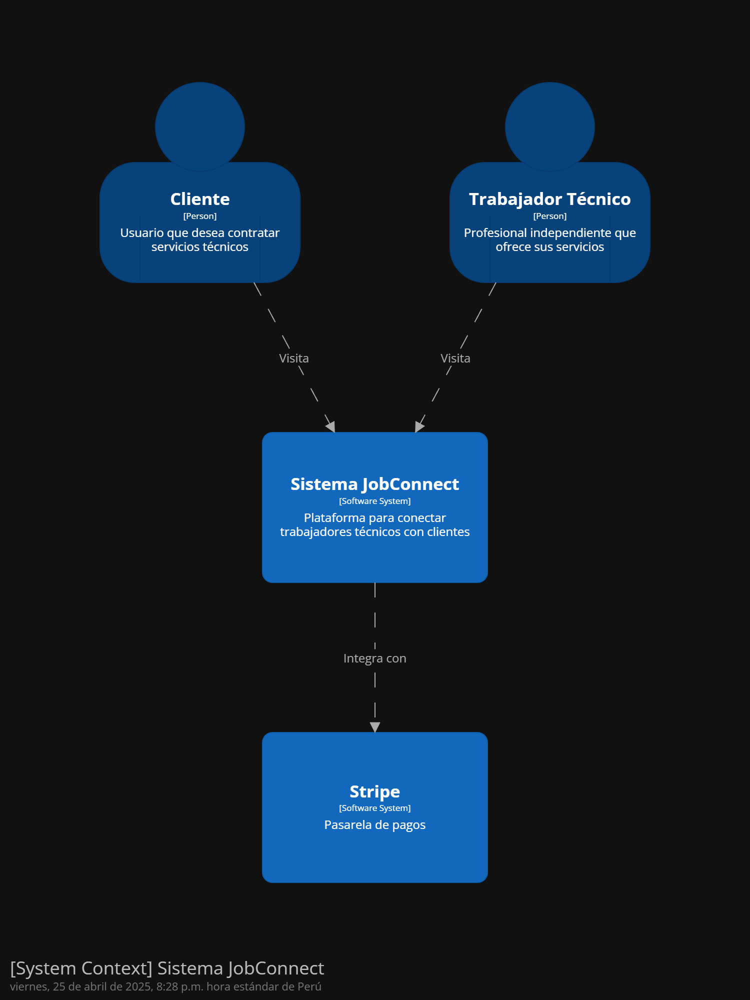
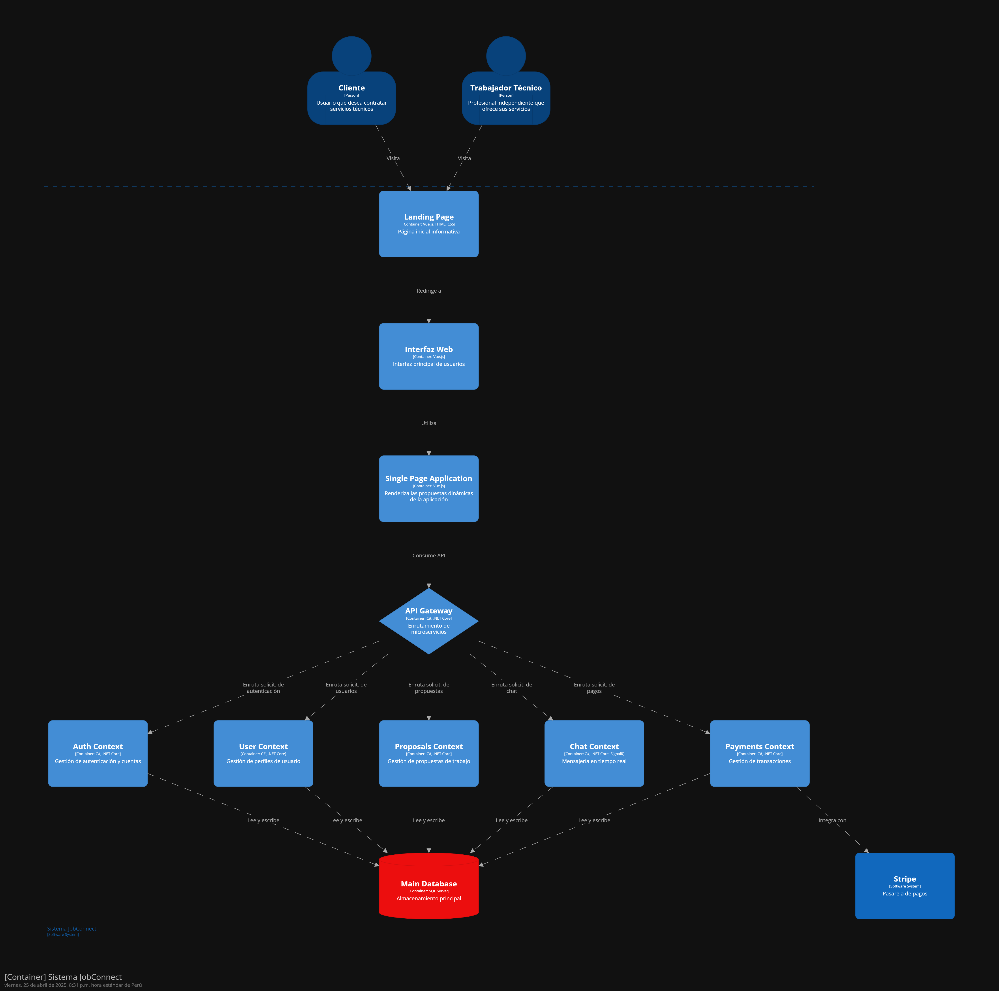

# Informe del Trabajo Final

**Universidad Peruana de Ciencias Aplicadas**

**Ingeniería de software**

**1ASI0730 Aplicaciones Web**

**Sección:** 4381

**Profesor:** Villafuerte Bazan, Oscar Ivan

**Nombre del StartUp:** TuChamba

**Nombre del Producto:** JobConnect

| Nombre                            | Código     |
| --------------------------------- | ---------- |
| Chi Cruzatt, Kevin Jorge          | U202313655 |
| Paucar Meneses, Jeremy Alion      | U202019449 |
| Hallasi Saravia, Miguel Angel     | U202312391 |
| Oroncoy Almeyda, Alejandro Daniel | U202313397 |
| Cossar Sanchez, Eduardo Jose      | U202312109 |
| Mostajo Orosco, Maria Fernanda    | U202312874 |

**Ciclo 2025-01**

# Registro de Versiones del Informe

| Version | Fecha      | Autor                                          | Descripción de modificación                                                |
| ------- | ---------- | ---------------------------------------------- | -------------------------------------------------------------------------- |
| 1ra     | 25/04/2025 | Chi, Paucar, Hallasi, Oroncoy, Cossar, Mostajo | TB1: Se realizo los capitulos 1, 2, 3, 4 y el primer sprint del capitulo 5 |

# Project Report Collaboration Insights

URL del repositorio para el proyecto: https://github.com/JobConnect-AW/tuchamba.pe

**TB1**

Para el desarrollo del informe perteneciente a la entrega TB1, se dividió la implementación de secciones de la siguiente forma
para cada integrante del equipo:

| Integrantes            | Tareas Asignadas                                                                                                                                       |
| ---------------------- | ------------------------------------------------------------------------------------------------------------------------------------------------------ |
| Kevin Chi              | 2.3.1 User Persona, 3.2 User Stories, 4.7.1 Class Diagram, Diagramas C4                                                                                |
| Jeremy Paucar          | 2.3.2 User persona, 2.3.3 User Journey mapping, 2.3.4 Empathy mapping, 2.3.2 User matrix, 2.3.5. AS-IS Scenario Mapping, 4.8 Diagrama de base de datos |
| Miguel Hallasi         | 2.2 Entrevistas, 3.2 User Stories y Diagramas c4                                                                                                       |
| Alejandro Oroncoy      | 2.2 Entrevistas, Capitulo V: Product Implementation, Validation & Deployment                                                                           |
| Eduardo Cossar         | Capitulo I: Introducción, 2.1 Competidores, 4.3 Landing Page UI Desing, 4.4 Web Applications UX/UI Design, 4.7.2 Class Dictionary                      |
| Maria Fernanda Mostajo | 4.1 Style Guidelines, 4.2 Information Architecture, 4.3 Landing Page UI Desing, 4.4 Web Applications UX/UI Design                                      |

**Github Collaboration Insights**

Github también presenta un timeline de las ramas principales y los procesos de merge a los que se han sometido. Todas las
ramas se crearon tomando en cuenta el diseño de GitFlow para una buena organización cuando se usa un software de control
de versiones.

Los integrantes son:

- Kevin Chi (Krillsom)
- Jeremy Paucar (asmip10)
- Miguel Hallasi (mhallasi)
- Alejandro Oroncoy (alejooroncoy)
- Eduardo Cossar (coleeeee-dev)
- Maria Fernanda Mostajo (Mafer-m30)

Se explican las ramas más prominentes:

**main:** Es representada por el color negro. Se trata de la rama principal del proyecto y se actualiza para cada entregable. 
**develop:** Es representada por el color azul. Se trata de la rama principal para el proceso del desarrollo del proyecto. 
**feature/Nombre-del-integrante**:  

# Contenido

1. [Capítulo I: Introducción](#capítulo-i-introducción) 
   1.1. [Startup Profile](#11-startup-profile) 
   1.1.1. [Descripción de la Startup](#111-descripción-de-la-startup) 
   1.1.2. [Perfiles de integrantes del equipo](#112-perfiles-de-integrantes-del-equipo) 
   1.2. [Solution Profile](#12-solution-profile) 
   1.2.1 [Antecedentes y problemática](#121-antecedentes-y-problemática) 
   1.2.2 [Lean UX Process](#122-lean-ux-process) 
   1.2.2.1. [Lean UX Problem Statements](#1221-lean-ux-problem-statements) 
   1.2.2.2. [Lean UX Assumptions](#1222-lean-ux-assumptions) 
   1.2.2.3. [Lean UX Hypothesis Statements](#1223-lean-ux-hypothesis-statements) 
   1.2.2.4. [Lean UX Canvas](#1224-lean-ux-canvas) 
   1.3. [Segmentos objetivo](#13-segmentos-objetivo) 
2. [Capítulo II: Requirements Elicitation & Analysis](#capítulo-ii-requirements-elicitation--analysis) 
   2.1. [Competidores](#21-competidores) 
   2.1.1. [Análisis competitivo](#211-análisis-competitivo) 
   2.1.2. [Estrategias y tácticas frente a competidores](#212-estrategias-y-tácticas-frente-a-competidores) 
   2.2. [Entrevistas](#22-entrevistas) 
   2.2.1. [Diseño de entrevistas](#221-diseño-de-entrevistas) 
   2.2.2. [Registro de entrevistas](#222-registro-de-entrevistas) 
   2.2.3. [Análisis de entrevistas](#223-análisis-de-entrevistas) 
   2.3. [Needfinding](#23-needfinding) 
   2.3.1. [User Personas](#231-user-personas) 
   2.3.2. [User Task Matrix](#232-user-task-matrix) 
   2.3.3. [User Journey Mapping](#232-user-task-matrix) 
   2.3.4. [Empathy Mapping](#234-empathy-mapping) 
   2.3.5. [As-is Scenario Mapping](#235-as-is-scenario-mapping) 
   2.4. [Ubiquitous Language](#24-ubiquitous-language) 
3. [Capítulo III: Requirements Specification](#capítulo-iii-requirements-specification) 
   3.1. [To-Be Scenario Mapping](#31-to-be-scenario-mapping) 
   3.2. [User Stories](#32-user-stories) 
   3.3. [Impact Mapping](#33-impact-mapping) 
   3.4. [Product Backlog](#34-product-backlog) 
4. [Capítulo IV: Product Design](#capítulo-iv-product-design) 
   4.1. [Style Guidelines](#41-style-guidelines) 
   4.1.1. [General Style Guidelines](#411-general-style-guidelines) 
   4.1.2. [Web Style Guidelines](#412-web-style-guidelines) 
   4.2. [Information Architecture](#42-information-architecture) 
   4.2.1. [Organization Systems](#421-organization-systems) 
   4.2.2. [Labeling Systems](#422-labeling-systems) 
   4.2.3. [SEO Tags and Meta Tags](#423-seo-tags-and-meta-tags) 
   4.2.4. [Searching Systems](#424-searching-systems) 
   4.2.5. [Navigation Systems](#425-navigation-systems) 
   4.3. [Landing Page UI Design](#43-landing-page-ui-design) 
   4.3.1. [Landing Page Wireframe](#431-landing-page-wireframe) 
   4.3.2. [Landing Page Mock-up](#432-landing-page-mock-up) 
   4.4. [Web Applications UX/UI Design](#44-web-applications-uxui-design) 
   4.4.1. [Web Applications Wireframes](#441-web-applications-wireframes) 
   4.4.2. [Web Applications Wireflow Diagrams](#442-web-applications-wireflow-diagrams) 
   4.4.2. [Web Applications Mock-ups](#442-web-applications-mock-ups) 
   4.4.3. [Web Applications User Flow Diagrams](#443-web-applications-user-flow-diagrams) 
   4.5. [Web Applications Prototyping](#45-web-applications-prototyping) 
   4.6. [Domain-Driven Software Architecture](#46-domain-driven-software-architecture) 
   4.6.1. [Software Architecture Context Diagram](#461-software-architecture-context-diagram) 
   4.6.2. [Software Architecture Container Diagrams](#462-software-architecture-container-diagrams) 
   4.6.3. [Software Architecture Components Diagrams](#463-software-architecture-components-diagrams) 
   4.7. [Software Object-Oriented Design](#47-software-object-oriented-design) 
   4.7.1. [Class Diagrams](#471-class-diagrams) 
   4.7.2. [Class Dictionary](#472-class-dictionary) 
   4.8. [Database Design](#48-database-design) 
   4.8.1. [Database Diagram](#481-database-diagram) 
5. [Capítulo V: Product Implementation, Validation & Deployment](#capítulo-v-product-implementation-validation--deployment) 
   5.1. [Software Configuration Management](#51-software-configuration-management) 
   5.1.1. [Software Development Environment Configuration](#511-software-development-environment-configuration) 
   5.1.2. [Source Code Management](#512-source-code-management) 
   5.1.3. [Source Code Style Guide & Conventions](#513-source-code-style-guide--conventions) 
   5.1.4. [Software Deployment Configuration](#514-software-deployment-configuration) 
   5.2. [Landing Page, Services & Applications Implementation](#52-landing-page-services--applications-implementation) 
   5.2.1. [Sprint 1](#521-sprint-1) 
   5.2.1.1. [Sprint Planning 1](#5211-sprint-planning-1) 
   5.2.1.2. [Aspect Leaders and Collaborators](#5212-aspect-leaders-and-collaborators) 
   5.2.1.3. [Sprint Backlog 1](#5213-sprint-backlog-1) 
   5.2.1.4. [Development Evidence for Sprint Review](#5214-development-evidence-for-sprint-review) 
   5.2.1.5. [Execution Evidence for Sprint Review](#5215-execution-evidence-for-sprint-review) 
   5.2.1.6. [Services Documentation Evidence for Sprint Review](#5216-services-documentation-evidence-for-sprint-review) 
   5.2.1.7. [Software Deployment Evidence for Sprint Review](#5217-software-deployment-evidence-for-sprint-review) 
   5.2.1.8. [Team Collaboration Insights during Sprint](#5218-team-collaboration-insights-during-sprint) 

6. [Conclusiones](#conclusiones) 
   6.1 [Conclusiones y recomendaciones](#61-conclusiones-y-recomendaciones) 
7. [Bibliografía](#bibliografía) 
8. [Anexos](#anexos) 

# Student Outcomes

**Student Outcome 3**

| Criterio específico                                                    | Acciones realizadas                                                                                                                                                                                                                                                                                                                                                                                                                                                                                                                                                                                                                                                                                                                                                                                                                                                                                                                                                                                                                                                                                                                                                                                                                                                                                                                                                                                                                                                                                                                                                                                                                                                                                                                                                                    | Conclusiones                                                                                                                                                                                                                                                                                                                                                                            |
| ---------------------------------------------------------------------- | -------------------------------------------------------------------------------------------------------------------------------------------------------------------------------------------------------------------------------------------------------------------------------------------------------------------------------------------------------------------------------------------------------------------------------------------------------------------------------------------------------------------------------------------------------------------------------------------------------------------------------------------------------------------------------------------------------------------------------------------------------------------------------------------------------------------------------------------------------------------------------------------------------------------------------------------------------------------------------------------------------------------------------------------------------------------------------------------------------------------------------------------------------------------------------------------------------------------------------------------------------------------------------------------------------------------------------------------------------------------------------------------------------------------------------------------------------------------------------------------------------------------------------------------------------------------------------------------------------------------------------------------------------------------------------------------------------------------------------------------------------------------------------------- | --------------------------------------------------------------------------------------------------------------------------------------------------------------------------------------------------------------------------------------------------------------------------------------------------------------------------------------------------------------------------------------- |
| Comunica oralmente con efectividad a diferentes rangos de audiencia.   | **TB1**  **Alejandro Oroncoy:** Durante el desarrollo del TB1, participé activamente en las reuniones grupales, donde compartí mis ideas y opiniones de forma oral. Además, colaboré en la redacción del documento, asegurándome de que todas las decisiones acordadas fueran plasmadas de manera clara y precisa.  **Kevin Chi:** En el TB1, trabajé junto al equipo expresando mis propuestas durante las reuniones y escuchando las opiniones de los demás. También contribuí a la elaboración escrita del informe, donde dejamos constancia de las decisiones tomadas de manera colaborativa.  **Miguel Hallasi:** Mi aporte en el TB1 se basó en mantener una comunicación fluida con el equipo, participando de manera activa en cada reunión. Posteriormente, ayudé en la redacción del documento, organizando las ideas de forma ordenada para una mejor comprensión de los acuerdos alcanzados.  **Eduardo Cossar:** Para el TB1, intervine en las reuniones grupales proponiendo ideas y discutiendo alternativas con mis compañeros. Asimismo, participé en la redacción del documento final, reflejando correctamente el consenso logrado entre todos.  **María Fernanda Mostajo:** Durante la preparación del TB1, contribuí expresando mis puntos de vista y escuchando las sugerencias de los demás en las reuniones orales. También colaboré en la comunicación escrita, detallando de forma clara las decisiones que se tomaron en equipo.  **Jeremy Pauccar:** En el desarrollo del TB1, trabajé activamente en las reuniones, aportando ideas de forma oral y respetando las opiniones del grupo. Además, participé en la elaboración del documento escrito, asegurándome de que cada acuerdo estuviera debidamente registrado. | **TB1** Para la TB1, el equipo trabajó colaborativamente y se logró una participación activa de cada uno de los integrantes. Se realizaron reuniones grupales en la que cada miembro compartió sus ideas de manera oral o escrita y, a partir de ello, se logró una toma de decisiones en conjunto la cual benefició al equipo en la toma de decisiones y en la ejecución de tareas. |
| Comunica por escrito con efectividad a diferentes rangos de audiencia. | **TB1**  **Alejandro Oroncoy:** En el TB1, aporté en la redacción del documento, plasmando de manera clara las ideas que fueron acordadas en las reuniones.  **Kevin Chi:** Durante el TB1, contribuí a la elaboración escrita del informe, explicando de forma precisa los acuerdos logrados en equipo.  **Miguel Hallasi:** Mi participación en el TB1 incluyó el desarrollo de habilidades de comunicación escrita, dejando registradas las ideas consensuadas durante las reuniones.  **Eduardo Cossar:** En el desarrollo del TB1, colaboré en redactar el documento final, explicando adecuadamente las ideas discutidas en las sesiones de grupo.  **María Fernanda Mostajo:** Para el TB1, me enfoqué en la redacción de las ideas trabajadas en equipo, asegurando que estuvieran correctamente explicadas en el documento.  **Jeremy Pauccar:** En el TB1, participé en la redacción del documento, comunicando de manera efectiva los acuerdos logrados en nuestras reuniones de trabajo.                                                                                                                                                                                                                                                                                                                                                                                                                                                                                                                                                                                                                                                                                                                                               | **TB1** Para el TB1, el equipo comunicó las ideas tomadas en el documento de manera conjunta y equitativa, siendo todos parte y responsables del desarrollo del informe.                                                                                                                                                                                                             |

# Capítulo I: Introducción

## 1.1. Startup Profile

### 1.1.1. Descripción de la Startup

Somos JobConnect, una startup iniciada por estudiantes del quinto ciclo de la Universidad Peruana de Ciencias Aplicadas. Nuestro objetivo es acercar a los trabajadores técnicos a los clientes mediante herramientas informáticas modernas, accesibles y confiables. A través de nuestra solución digital, buscamos facilitar la conexión directa entre ambos, potenciando la visibilidad, formalización y crecimiento de los profesionales independientes.

A través de nuestra plataforma, los trabajadores técnicos pueden crear un perfil profesional, promocionar sus habilidades, experiencias y sus tarifas a los clientes. De esta manera los clientes se mantienen informados, teniendo la capacidad de escoger entre un alta red de trabajadores.

Nuestra misión es desarrollar una plataforma accesible a los usuarios, que permita a los trabajadores técnicos mejorar su visibilidad y ampliar su base de clientes. De esta manera, logramos formalizar el contacto con los clientes y brindar una mayor seguridad al usuario en el proceso de contratación.

Nuestra visión es convertirnos en la plataforma principal de servicios técnicos en el Perú, promoviendo la seguridad al usuario mediante un servicio confiable y que mejoren la experiencia tanto del cliente como del trabajador

### 1.1.2. Perfiles de integrantes del equipo

| **Perfil**                                                                                                                                                                                                                                                                                                                                                                                                                                                                                    | **Foto**                                                                        |
| --------------------------------------------------------------------------------------------------------------------------------------------------------------------------------------------------------------------------------------------------------------------------------------------------------------------------------------------------------------------------------------------------------------------------------------------------------------------------------------------- | ------------------------------------------------------------------------------- |
| **Jeremy Alión Paucar Meneses** Mi nombre es Jeremy, Tengo 22 años. En la actualidad estoy estudiando la carrera de ingeniería de software en la Universidad Peruana de Ciencias Aplicadas. Albergo conocimientos intermedios en algunos lenguajes de programación, tales como C++, JavaScript y Python. Me considero una persona responsable con disposición de apoyar al grupo, también me gustan mucho los retos y así mismo poder cumplirlos.                                          |   |
| **Kevin Jorge Chi Cruzatt** Mi nombre es Kevin Chi. Tengo 19 años y actualmente estoy cursando el 5° ciclo de ingeniería de software. Me considero una persona con capacidades de liderazgo y capaz de trabajar bajo presión.                                                                                                                                                                                                                                                              |    |
| **Miguel Angel Hallasi Saravia**  Soy Miguel Hallasi, estudiante del quinto ciclo de la carrera de Ingeniería de Software. Me gusta el aprendizaje continuo y adquirir nuevas experiencias.                                                                                                                                                                                                                                                                                                |   |
| **Alejandro Daniel Oroncoy Almeyda** Mi nombre es Alejandro Oroncoy. Tengo 19 años, soy estudiante de la carrera de ingeniería de software, estoy en 5to ciclo. Me considero una persona proactiva, autodidacta y orientada a objetivos.                                                                                                                                                                                                                                                   |    |
| **Eduardo Jose Cossar Sanchez** Mi nombre es Eduardo Cossar. Soy estudiante de la carrera de Ingeniería de Software, tengo 19 años y actualmente estoy cursando el quinto ciclo en la UPC. Me considero una persona responsable y comprometida con un gran interés por la tecnología. Como integrante de este equipo, me comprometo a brindar todo mi apoyo y participación activa para afrontar los desafíos que se presenten y dar lo mejor de mí para lograr el éxito de este proyecto. |  |
| **Maria Fernanda Mostajo Orosco** Mi nombre es Maria Fernanda Mostajo, estoy estudiando la carrera de Ingeniería de Software en la UPC, tengo conocimientos en los lenguajes de programación C++, Python, HTML, CSS, JavaScript y SQL. Además, cuento con habilidades de trabajo en equipo, el cual me permitira realizar un buen trabajo y cumplir con los objetivos planteados en el tiempo establecido.                                                                                 |  |

## 1.2. Solution Profile

En esta sección, se presenta en detalle el perfil de la solución, respaldado por
antecedentes sólidos y construido paso a paso siguiendo el proceso de
Lean UX

### 1.2.1 Antecedentes y problemática

En el Perú, una gran cantidad de trabajadores técnicos ofrecen sus servicios de manera informal, sin una plataforma que los respalde ni que facilite su visibilidad profesional. Esto genera desconfianza entre los clientes, dificulta el crecimiento de estos profesionales y reduce las oportunidades de empleo de calidad. JobConnect surge como una solución digital que busca formalizar esta relación, conectando a técnicos con clientes de forma segura, eficiente y profesional.

**What (Qué)**

##### ¿Cuál es el problema?

El problema principal es la falta de una plataforma especializada que conecte de forma efectiva a trabajadores técnicos independientes (electricistas, gasfiteros, carpinteros, etc.) con clientes que necesitan sus servicios. En la actualidad, muchos de estos profesionales dependen de métodos informales como recomendaciones boca a boca, redes sociales o grupos de WhatsApp, lo que limita su visibilidad, dificulta la generación de confianza y reduce sus oportunidades de crecimiento económico.

##### ¿Cuál es la relación con la persona en cuestión?

JobConnect busca resolver este problema proporcionando una plataforma digital que conecte a técnicos verificados con clientes en busca de servicios confiables. A través de la digitalización del proceso de búsqueda, solicitud y pago, JobConnect no solo mejora la experiencia del cliente, sino que también permite a los trabajadores técnicos formalizar sus servicios, aumentar su visibilidad y acceder a más oportunidades laborales. Según un informe del BID (2021), las plataformas digitales que promueven el empleo formal pueden incrementar hasta en 40% los ingresos de trabajadores independientes en América Latina.

**Who (Quién)**

##### ¿Quiénes están involucrados?

Los principales involucrados son los trabajadores técnicos independientes (electricistas, gasfiteros, técnicos de aire acondicionado, etc.), y los clientes que requieren sus servicios para el hogar, oficinas o negocios. También se incluyen microempresas que contratan técnicos de manera eventual..

##### ¿A quiénes le sucede el problema?

El problema afecta principalmente a los técnicos independientes, quienes no cuentan con medios eficientes para mostrar sus servicios ni herramientas para captar clientes nuevos. También afecta a los clientes, quienes se enfrentan a la incertidumbre de no encontrar técnicos de confianza de forma rápida y segura. Según el Ministerio de Trabajo (2022), casi un 60% de los trabajadores técnicos en el Perú no tienen presencia digital.

**Where (Dónde)**

##### ¿En dónde ocurre el problema?

Este problema ocurre principalmente en zonas urbanas del Perú donde hay una alta demanda de servicios técnicos, pero los trabajadores aún gestionan sus actividades mediante medios informales como llamadas, mensajes de texto o publicaciones esporádicas en redes sociales, lo que genera ineficiencia y desconfianza.

##### ¿En dónde nos enfocaremos?

Nos enfocaremos inicialmente en Lima, donde existe un alto volumen de clientes potenciales y trabajadores técnicos con acceso básico a tecnología móvil e internet. Estas zonas permiten una implementación escalable con impacto real y medible.

**When (Cuándo)**

##### ¿Cuándo sucede el problema?

El problema se presenta cada vez que un cliente requiere un servicio técnico y no encuentra rápidamente a un proveedor confiable, o cuando el trabajador técnico pierde oportunidades por no tener un canal activo de contacto o visibilidad en línea.

##### ¿Cuándo utiliza el cliente el producto?

El cliente utilizaría JobConnect al momento de necesitar un servicio técnico específico. La plataforma permitirá buscar por tipo de servicio, ubicación y disponibilidad. Del lado del técnico, el producto será utilizado tanto para gestionar sus citas como para visualizar reseñas, actualizar su disponibilidad y recibir pagos.

**Why (Por qué)**

##### ¿Cuál es la causa del problema?

Las principales causas del problema incluyen la informalidad del sector técnico, la baja digitalización de los trabajadores independientes y la falta de plataformas especializadas que respondan a sus necesidades específicas. Si bien existen plataformas como Workana o Clic, estas no están orientadas a servicios presenciales ni al perfil técnico, lo que deja un vacío en el mercado. Además, muchos trabajadores técnicos carecen de conocimientos para usar plataformas complejas o poco localizadas.

**How (Cómo)**

##### ¿En qué condiciones los clientes usan nuestro producto?

A través de una aplicación web o móvil ligera y fácil de usar, disponible en dispositivos con conexión a internet. JobConnect ofrecerá funcionalidades como búsqueda por cercanía, perfiles verificados, historial de servicios, sistema de pago seguro y soporte post-servicio. Para los técnicos, la interfaz permitirá recibir solicitudes, programar citas, subir evidencias de trabajos y recibir evaluaciones de clientes.

**How much (Cuánto)**

##### Estadísticas que sustentan la problemática.

Según el Instituto Nacional de Estadística e Informática (INEI, 2023), más del 70% de los trabajadores técnicos en Perú operan de manera informal, sin acceso a herramientas digitales que les permitan organizar y formalizar sus servicios. Esta situación conlleva a una baja visibilidad, desconfianza por parte de los clientes y pérdida de oportunidades laborales.

De acuerdo al Ministerio de Trabajo y Promoción del Empleo (MTPE, 2022), solo el 18% de los técnicos independientes en zonas urbanas usa plataformas digitales para la promoción o gestión de sus servicios. La gran mayoría depende de llamadas telefónicas, grupos de WhatsApp o recomendaciones informales para obtener trabajo.

Un estudio de la CAF (Banco de Desarrollo de América Latina, 2021), indica que la digitalización puede aumentar los ingresos de los trabajadores independientes hasta en un 40%, y mejorar la percepción de confiabilidad por parte de los clientes en un 60%.

### 1.2.2. Lean UX Process

El Lean UX es un enfoque de diseño centrado en la colaboración, la retroalimentación continua y la mejora iterativa. Se enfoca en construir productos útiles y funcionales desde etapas tempranas, validando constantemente las ideas con los usuarios reales. En el caso de JobConnect, este enfoque es esencial para crear una plataforma eficiente y confiable que conecte a trabajadores técnicos con clientes que necesitan servicios de calidad.

#### 1.2.2.1. Lean UX Problem Statements

El estado actual del mercado de servicios técnicos en Perú se ha centrado principalmente en redes informales de recomendación, donde los trabajadores independientes carecen de visibilidad digital, credibilidad y acceso a clientes de manera formal. Por su parte, los clientes enfrentan dificultades para verificar la calidad y confiabilidad del servicio, lo que genera desconfianza y pérdida de oportunidades.

Lo que los servicios existentes no logran abordar es la necesidad de una plataforma accesible y confiable que cierre la brecha entre trabajadores técnicos informales y clientes que buscan servicios verificados y seguros.

Nuestro servicio abordará esta brecha mediante la creación de una plataforma digital que permita a los trabajadores técnicos mostrar perfiles verificados, facilitar la comunicación transparente y contratar de forma segura mediante calificaciones y reseñas.

Nuestro enfoque inicial será los trabajadores técnicos independientes en zonas urbanas del Perú, así como clientes individuales que requieran servicios técnicos para el hogar o de uso personal.

Sabremos que hemos tenido éxito cuando veamos un aumento en la cantidad de trabajadores que crean perfiles verificados, un flujo constante de solicitudes de servicios a través de la plataforma y altos niveles de satisfacción reflejados en calificaciones positivas y uso recurrente.

**¿Cómo podemos diseñar una plataforma accesible que permita a los trabajadores técnicos visibilizar sus habilidades y a los clientes encontrar y contratar profesionales de forma confiable y segura?**

#### 1.2.2.2. Lean UX Assumptions

JobConnect está diseñado para facilitar el contacto entre trabajadores técnicos e independientes y personas que necesitan servicios confiables en el hogar o el negocio. Asumimos que la plataforma debe ser intuitiva, permitir mostrar portafolios y valoraciones, y ofrecer filtros eficientes para encontrar al profesional adecuado.

#### a. Assumption Worksheet

**¿Quién será nuestro usuario?**  
Trabajadores técnicos independientes (electricistas, gasfiteros, técnicos en refrigeración, etc.) y clientes residenciales o comerciales que requieren estos servicios.

**¿Dónde encaja nuestro producto en su vida?**  
Para los técnicos, como herramienta para conseguir más clientes y mejorar su reputación profesional. Para los clientes, como solución práctica para contratar servicios de forma segura y rápida.

**¿Qué problemas tiene nuestro producto y cómo se pueden resolver?**  
La informalidad del sector, la baja visibilidad de los trabajadores y la desconfianza del cliente. Esto se puede resolver brindando perfiles verificables, reseñas de otros clientes y un sistema de búsqueda simple pero eficaz.

**¿Cómo y cuándo es usado nuestro producto?**  
La plataforma se usa mediante computadoras y celulares, en el momento en que un cliente necesita contratar un técnico o cuando un trabajador quiere mejorar su presencia digital.

**¿Cómo debe verse nuestro producto y cómo debe comportarse?**  
Debe tener un diseño simple, visual y amigable. Fluido, con perfiles claros, filtros rápidos, sistema de valoraciones, y opción de contactar al profesional dentro de la app.

**¿Qué características son importantes?**

- Creación fácil de perfiles para técnicos.
- Sistema de calificaciones y comentarios.
- Filtros por ubicación, especialidad y precio.
- Seguridad en la verificación de identidad.
- Plataforma optimizada para móviles.
- Sistema de mensajes o contacto directo.

#### b. Business Outcomes

- JobConnect se posicionará como una plataforma confiable para contratar servicios técnicos.
- Aumentará el número de trabajadores técnicos formales registrados en el país.
- Reducirá la tasa de clientes insatisfechos al contar con perfiles verificados.
- Generará ingresos por comisiones y suscripciones premium para técnicos.
- Obtendrá buenas calificaciones en tiendas de apps por su facilidad y utilidad.

#### c. User Outcomes

- Los técnicos mejorarán su visibilidad y conseguirán más clientes.
- Los clientes se sentirán más seguros al contratar servicios verificados.
- Aumentará la confianza y satisfacción gracias al sistema de reseñas.
- Los usuarios encontrarán al profesional adecuado en menos tiempo.
- Se reducirá el número de incidentes o malas experiencias en contrataciones.

#### 1.2.2.3. Lean UX Hypothesis Statements

**Hipótesis 1:**  
Creemos que los trabajadores técnicos aumentarán su visibilidad y número de contrataciones al crear un perfil profesional en JobConnect.  
_Sabremos que estamos en lo correcto cuando, en los primeros 3 meses, al menos el 60% de los técnicos registrados reporten haber conseguido nuevos clientes a través de la plataforma._

**Hipótesis 2:**  
Creemos que los clientes se sentirán más seguros al contratar técnicos con perfiles verificados y reseñas visibles.  
_Sabremos que estamos en lo correcto cuando el 70% de los usuarios encuestados manifiesten sentirse más confiados al contratar mediante JobConnect que por medios tradicionales._

**Hipótesis 3:**  
Creemos que incluir un sistema de calificaciones y comentarios mejorará la calidad del servicio prestado por los técnicos.  
_Sabremos que estamos en lo correcto cuando las calificaciones promedio de los técnicos aumenten en un 20% en los primeros seis meses._

**Hipótesis 4:**  
Creemos que permitir a los clientes filtrar técnicos por especialidad, ubicación y precio facilitará el proceso de búsqueda y contratación.  
_Sabremos que estamos en lo correcto cuando el tiempo promedio que toma contratar a un técnico se reduzca en un 40%._

**Hipótesis 5:**  
Creemos que ofrecer una versión móvil optimizada de JobConnect aumentará la frecuencia de uso y retención.  
_Sabremos que estamos en lo correcto cuando el 80% de los usuarios activos utilicen la app desde el celular y la tasa de retención mensual supere el 50%._

#### 1.2.2.4. Lean UX Canva

#### 1.3. Segmento Objetivo

##### Trabajadores Técnicos Independientes

**Aspectos demográficos:**

- Sexo: Masculino y Femenino
- Edad: 20-55 años

**Aspectos geográficos:**

- Nacionalidad: Peruana
- Departamento: Lima

**Aspectos psicográficos:**

- Desean incrementar su visibilidad profesional y captar más clientes.
- Buscan oportunidades de formalizar su trabajo y generar confianza en sus servicios.
- Tienen interés en una plataforma digital sencilla que les permita promocionar sus habilidades.
- Están dispuestos a recibir retroalimentación mediante valoraciones para mejorar su reputación laboral.

##### Usuarios que requieren servicios técnicos

**Aspectos demográficos:**

- Sexo: Masculino y Femenino
- Edad: 25-60 años

**Aspectos geográficos:**

- Nacionalidad: Peruana
- Departamento: Lima Metropolitana

**Aspectos psicográficos:**

- Desean encontrar profesionales técnicos confiables y con buenas referencias.
- Buscan una plataforma práctica para comparar opciones por especialidad, precios y cercanía.
- Valoran la rapidez y facilidad al momento de contratar un servicio técnico.
- Quieren tener seguridad y confianza durante el proceso de contratación, evitando fraudes o estafas.

# Capítulo II: Requirements Elicitation & Analysis

### 2.1. Competidores

Hemos identificado tres competidores clave en el mercado peruano que ofrecen soluciones para conectar a profesionales independientes con potenciales clientes:

- **Chambea**  
  Aplicación móvil peruana diseñada para conectar a emprendedores y trabajadores independientes con posibles clientes en diversas categorías, como tecnología, comida, mascotas, delivery, automóviles y finanzas.

- **Workana**  
  Plataforma en línea que opera en varios países de América Latina, incluyendo Perú, enfocada en conectar a freelancers con empresas que buscan profesionales para proyectos en áreas como programación, diseño, traducción, marketing y más.

- **Clic**  
  Hub digital que ofrece servicios profesionales en diversos rubros, como medicina, psicología, nutrición, fisioterapia, derecho y consultoría. A través de su aplicación, las personas pueden contactar a especialistas y coordinar servicios según sus necesidades.

<h2>Análisis Competitivo</h2>

<table>
  <thead>
    <tr>
      <th>¿Por qué llevar a cabo este análisis?</th>
      <td colspan="4">Se llevó a cabo este análisis porque queremos ofrecer un mejor servicio a través de la recopilación de información de nuestros competidores.</td>
    </tr>
    <tr>
      <th></th>
      <th>JobConnect</th>
      <th>Chambea</th>
      <th>Workana</th>
      <th>Clic</th>
    </tr>
  </thead>
  <tbody>
    <tr>
      <th>Perfil</th>
      <td>Plataforma peruana que conecta trabajadores técnicos independientes con clientes</td>
      <td>App móvil que conecta emprendedores y trabajadores independientes con clientes</td>
      <td>Plataforma de freelancers para proyectos profesionales en LATAM</td>
      <td>App que conecta profesionales de salud y consultoría con clientes</td>
    </tr>
    <tr>
      <th>Ventaja competitiva</th>
      <td>Formalización y crecimiento de técnicos</td>
      <td>Diversidad en categorías y simplicidad</td>
      <td>Alcance regional y sistema de reputación</td>
      <td>Especialización en salud y profesiones específicas</td>
    </tr>
    <tr>
      <th>Perfil de marketing</th>
      <td>Clientes que requieren servicios técnicos y trabajadores independientes</td>
      <td>Emprendedores, independiente y clientes generales</td>
      <td>Empresas que requieren freelancers calificados</td>
      <td>Personas que necesitan servicios profesionales específicos</td>
    </tr>
    <tr>
      <th>Estrategias de marketing</th>
      <td>Publicidad en redes sociales</td>
      <td>Presencia en medios locales, redes sociales</td>
      <td>SEO, anuncios pagos, recomendaciones</td>
      <td>Promociones online</td>
    </tr>
    <tr>
      <th>Perfil de producto</th>
      <td>Directorio de técnicos, calificaciones - chat, pagos seguros</td>
      <td>Directorio de emprendedores por categoría</td>
      <td>Proyectos, perfiles, contrataciones y pagos</td>
      <td>Agendamiento, perfiles profesionales, contacto directo</td>
    </tr>
    <tr>
      <th>Precio & Costos</th>
      <td>Modelo Freemium</td>
      <td>Uso gratuito con modelos futuros de membresía</td>
      <td>Comisión por proyecto y opciones premium</td>
      <td>Tarifas por servicio profesional</td>
    </tr>
    <tr>
      <th>Canales de Distribución</th>
      <td>Web y app móvil</td>
      <td>App móvil</td>
      <td>Web</td>
      <td>Web y app</td>
    </tr>
  </tbody>
</table>

<h2>Análisis FODA</h2>

<table>
  <thead>
    <tr>
      <th></th>
      <th>JobConnect</th>
      <th>Chambea</th>
      <th>Workana</th>
      <th>Clic</th>
    </tr>
  </thead>
  <tbody>
    <tr>
      <th>Fortalezas</th>
      <td>Enfoque en servicios técnicos, confianza, formalización</td>
      <td>App local, variedad de rubros, sencillez</td>
      <td>Escala internacional, reputación, variedad de profesionales</td>
      <td>Especialización en profesiones clave, facilidad de uso</td>
    </tr>
    <tr>
      <th>Debilidades</th>
      <td>Aún en etapa inicial, menor alcance</td>
      <td>Menor formalidad y validación de perfiles</td>
      <td>Competencia alta, dificultad para destacar</td>
      <td>Enfocado solo en rubros específicos</td>
    </tr>
    <tr>
      <th>Oportunidades</th>
      <td>Ampliar servicios, alianzas con gremios y empresas</td>
      <td>Monetización a futuro, expansión a otros países</td>
      <td>Mayor presencia en mercados emergentes</td>
      <td>Ampliar rubros profesionales, integrar IA</td>
    </tr>
    <tr>
      <th>Amenazas</th>
      <td>Imitación del modelo, entrada de grandes plataformas</td>
      <td>Saturación de mercado, apps similares</td>
      <td>Nuevas plataformas, cambios en la demanda</td>
      <td>Poca diferenciación en rubros nuevos</td>
    </tr>
  </tbody>
</table>

### 2.1.2. Estrategias y tácticas frente a competidores

Desarrollar estrategias y tácticas efectivas para enfrentar a nuestros competidores requiere de un enfoque centrado en nuestras fortalezas tecnológicas, la experiencia del usuario y el conocimiento profundo del mercado peruano. A continuación, se presentan estrategias clave para obtener una ventaja competitiva:

- Diferenciación mediante la formalización de trabajadores técnicos: JobConnect puede posicionarse como la plataforma que impulsa la formalización laboral, brindando perfiles verificados, procesos seguros y herramientas de gestión para trabajadores técnicos como electricistas, plomeros, gasfiteros y otros oficios.

- Enfoque en la calidad y confiabilidad del servicio: Implementar un sistema robusto de calificaciones, reseñas y verificación de identidad, generando confianza tanto en usuarios como en profesionales técnicos.

- Plataforma centrada en servicios técnicos presenciales y por zonas: A diferencia de otras plataformas más generales o remotas, JobConnect puede optimizar su algoritmo para conectar por proximidad geográfica, asegurando rapidez en la atención y ahorro en costos de desplazamiento.

- Educación y soporte a trabajadores independientes: Ofrecer contenido educativo, talleres gratuitos y herramientas de gestión (como control de ingresos o recordatorios de citas), que agreguen valor y fomenten el uso recurrente de la plataforma.

## 2.2. Entrevistas.

#### 2.2.1 Diseño de entrevistas

##### Segmento 1: Trabajadores Técnicos Independientes

Preguntas generales:

- ¿Cuál es su edad y distrito?
- ¿Cuál es su ocupación principal y cuantos años de experiencia tiene en el rubro?
- ¿De que forma consigue clientes actualmente o que métodos utiliza (redes sociales, contactos, etc.)?
- ¿Ha tenia desconfianza por parte de los clientes? ¿Cómo los maneja?
- ¿Qué dispositivos usa frecuente para gestionar su trabajo?
- ¿Qué funcionalidades esperaría de una plataforma que lo conecto con clientes?
- Qué información le gustaría incluir a su perfil para generar confianza?

Preguntas complementarias:

- ¿Cómo describe su estilo de trabajo actualmente?
- ¿Prefiere recibir solicitudes de clientes por WhatsApp, llamadas o mensajes en un app?

##### Segmento 2: Usuarios que requieren servicios técnicos

Preguntas generales:

- ¿Cuál es su edad y distrito?
- ¿Cada cuanto requiere servicios técnicos?
- ¿Actualmente como suele encontrar técnicos (redes sociales, contactos, etc.)?
- ¿Ha tenido malas experiencias al contratar técnicos informales?
- ¿Qué datos considera al elegir un técnico (precio, reseñas, recomendaciones)?
- ¿Qué información le genera confianza para contratar a alguien?
- ¿Ha usado alguna app o plataforma para contratar servicios? ¿Cuál y por qué?

Preguntas complementarias:

- ¿Estaría dispuesto a pagar un precio más alto por un técnico verificado?
- ¿Prefiere comparar opciones antes de contratar o elegir rápidamente?

#### 2.2.2 Registro de entrevistas

**Link de la grabación:** [Entrevistas JobConnect](https://upcedupe-my.sharepoint.com/:v:/g/personal/u202312391_upc_edu_pe/ETRsN2Qt-ztDkIH1A5ZO_I4BPW0eZ3x5ieDkQOWZHTL1dA?nav=eyJyZWZlcnJhbEluZm8iOnsicmVmZXJyYWxBcHAiOiJPbmVEcml2ZUZvckJ1c2luZXNzIiwicmVmZXJyYWxBcHBQbGF0Zm9ybSI6IldlYiIsInJlZmVycmFsTW9kZSI6InZpZXciLCJyZWZlcnJhbFZpZXciOiJNeUZpbGVzTGlua0NvcHkifX0&e=FthuRz)

##### Segmento 1: Trabajadores Técnicos Independientes

- **Entrevista 1:**  
  **Nombre:** Godelino  
  **Género:** Masculino  
  **Edad:** 35 años  
  **Distrito:** La Victoria, Lima  
  **Duración:** 6:53  
  **Inicio:** 26:26  
  **Fin:** 33:19  
  **Screenshot:**  
  

  **Resumen:**  
  Godelino, un técnico de 35 años, con más de 10 años de experiencia en el rubro de comercio y técnico de sonido, menciona que actualmente trabaja como técnico de sonido y tiene un negocio de venta de equipos. Su forma de conseguir clientes es a través de contactos personales y redes sociales como Marketplace. Al inicio tuvo algo de desconfianza por parte de los clientes, pero con el tiempo ha logrado generar confianza al mostrar su trabajo y tener buenas referencias. Usualmente utiliza su laptop y su celular para gestionar su trabajo. Considera importante incluir información sobre videos de trabajos previos y reseñas de clientes en su perfil para generar confianza. Prefiere recibir solicitudes por WhatsApp.

- **Entrevista 2:**  
  **Nombre:** Jorge Videla  
  **Género:** Masculino  
  **Edad:** 27 años  
  **Distrito:** Lima, Perú  
  **Duración:** 07:39  
  **Inicio:** 14:50  
  **Fin:** 22:29  
  **Screenshot:**  
  

  **Resumen:**  
  Jorge es un desarrollador web independiente con un año de experiencia.  
  Principalmente, consigue clientes a través de redes sociales, especialmente el Marketplace de Facebook. En su último trabajo, enfrentó desconfianza de un cliente, lo que lo llevó a reunirse presencialmente para explicar el proyecto y generar mayor confianza, ofreciendo un precio más bajo.  
  Utiliza su laptop Asus para desarrollar los sitios web y su teléfono para la gestión del marketing y ventas.  
  En cuanto a las funcionalidades que esperaría de una plataforma que lo conecte con clientes, sugiere la opción de publicar solicitudes de manera privada.  
  Además, destacaría la posibilidad de adjuntar archivos o documentos como portafolios para mostrar su experiencia.  
  Su estilo de trabajo es flexible, controlando sus tiempos, ya que no está sujeto a un horario estricto.  
  Finalmente, prefiere recibir solicitudes de clientes a través de mensajes en una aplicación dedicada.

- **Entrevista 3:**  
  **Nombre:** Carlos Alberto Almeyda Romero  
  **Género:** Masculino  
  **Edad:** 47 años  
  **Distrito:** Santa  
  **Duración:** 09:27  
  **Inicio:** 05:22  
  **Fin:** 14:49  
  **Screenshot:**  
  

  **Resumen:**  
  Carlos, un técnico automotriz con 30 años de experiencia, trabaja de manera independiente después de haber sido parte de una empresa durante 20 años.  
  Consigue clientes a través de recomendaciones y redes sociales.  
  Aunque ha enfrentado casos de desconfianza de nuevos clientes, utiliza su experiencia para generar confianza explicando sus procesos de trabajo.  
  Carlos utiliza Excel para gestionar su trabajo y cotizaciones.  
  Cree que una plataforma que lo conecte con clientes podría ayudarle a expandir su alcance.  
  Entre las funcionalidades que espera de la plataforma, menciona la opción de pago seguro y la posibilidad de ofrecer diagnósticos mediante videos del trabajo realizado en los autos, lo que aumenta la transparencia con el cliente.  
  En cuanto a la información que debería incluir su perfil, destaca la importancia de mostrar su experiencia, los videos de trabajo realizados y las recomendaciones de otros clientes.  
  Prefiere recibir solicitudes de clientes principalmente por WhatsApp y llamadas, ya que la mayoría de sus clientes lo contactan por estos medios, especialmente en la fase inicial de su negocio independiente.  
  Él considera que la honestidad y la transparencia son clave para el éxito de su emprendimiento.

##### Segmento 2: Usuarios que requieren servicios técnicos

- **Entrevista 1:**  
  **Nombre:** Joseth Muñoz  
  **Género:** Masculino  
  **Edad:** 20 años  
  **Distrito:** La Victoria, Lima  
  **Duración:** 03:36  
  **Inicio:** 22:30  
  **Fin:** 26:06  
  **Screenshot:**  
  

  **Resumen:**  
  Joseth, un joven de 20 años que vive en Lima, comenta que cada año y medio necesita contratar a alguien para un servicio técnico.  
  Actualmente, su forma de encontrar técnicos es mediante contactos personales.  
  En una ocasión, tuvo una mala experiencia al contratar a un técnico para reparar su lavadora, ya que este hizo todo menos arreglarla: incluso retiró piezas que estaban en buen estado.  
  Joseth considera que datos como el precio y las reseñas le ayudarían a generar confianza al elegir un técnico.  
  Además, estaría dispuesto a pagar más por un técnico verificado, dependiendo de la gravedad del problema.

- **Entrevista 2:**  
  **Nombre:** Aide  
  **Género:** Femenino  
  **Edad:** 38 años  
  **Distrito:** Surco, Lima  
  **Duración:** 2:34  
  **Inicio:** 33:19  
  **Fin:** 35:53
    
  **Resumen:**  
  Aide de 38 años del distrito de Surco que requiere servicios técnicos cada dos meses debido a problemas con su hogar.  
  Suele encontrar técnicos mediante páginas de Facebook o por recomendaciones.  
  En una ocasión, tuvo una mala experiencia con alguien informal que terminó cobrándole de más sin solucionar su problema.  
  Al contratar a un técnico, le interesan mucho las reseñas, estudios y un portafolio de trabajos previos, ya que le genera confianza alguien con experiencia en el rubro.
  Debido a sus malas experiencias, estaría dispuesto a pagar más por un técnico verificado.

- **Entrevista 3:**  
  **Nombre:** Carol Vega  
  **Género:** Femenino  
  **Edad:** 39 años  
  **Distrito:** El Agustino  
  **Duración:** 5:21  
  **Inicio:** 0:00  
  **Fin:** 5:21  
  **Screenshot:**  
  

  **Resumen:**  
  Carol, de 39 años, vive en el distrito de El Agustino y requiere servicios técnicos aproximadamente cada dos años.  
  Para encontrar técnicos, utiliza principalmente redes sociales, anuncios en la calle y recomendaciones de conocidos.  
  Aunque ha tenido malas experiencias en el pasado al contratar de manera informal, también ha tenido trabajos satisfactorios.  
  Considera más importantes las recomendaciones de otras personas y las reseñas de los técnicos en redes sociales, así como la presencia de una tarjeta de presentación como una señal de profesionalismo.  
  Aunque no ha utilizado plataformas específicas para contratar estos servicios, estaría dispuesta a pagar un precio más alto por un técnico verificado, dado que experiencias anteriores con precios bajos no siempre resultaron en trabajos de calidad.  
  Carol prefiere comparar opciones antes de tomar una decisión, aunque en ocasiones contrata rápidamente si la necesidad es urgente.

### 2.2.3 Análisis de Entrevistas

#### Segmento 1: Trabajadores Técnicos Independientes

##### Características Objetivas y Subjetivas

| Característica               | Porcentaje | Sustento en Entrevistas                              | Relación con Entrevistas           |
| ---------------------------- | ---------- | ---------------------------------------------------- | ---------------------------------- |
| **Género masculino**         | 100%       | Los 3 entrevistados son hombres                      | Entrevistas 1, 2, 3                |
| **Edad promedio**            | 36 años    | Rango de 27-47 años                                  | Entrevistas 1 (35), 2 (27), 3 (47) |
| **Uso de redes sociales**    | 100%       | Todos mencionaron Marketplace/Facebook               | Godelino, Jorge, Carlos            |
| **Desconfianza inicial**     | 66.7%      | 2/3 enfrentaron desconfianza de clientes             | Jorge, Carlos                      |
| **Preferencia por WhatsApp** | 66.7%      | 2/3 prefieren contacto inicial por este medio        | Godelino, Carlos                   |
| **Gestión digital básica**   | 100%       | Uso de celular (100%), laptop (33.3%), Excel (33.3%) | Todos                              |

##### Hallazgos:

1. **Visibilidad Digital**

   - 100% usa redes sociales pero de forma no especializada
   - 100% requiere plataforma con portafolio visual (videos/trabajos previos)

2. **Generación de Confianza**

   - 66.7% prioriza mostrar experiencia concreta (Carlos: "Videos del trabajo realizado")
   - 100% valora sistema de reseñas verificadas

3. **Gestión Operativa**
   - 33.3% usa herramientas profesionales (Excel)
   - 66.7% prefiere integración con WhatsApp para comunicación

#### Segmento 2: Usuarios que requieren servicios técnicos

##### Características Objetivas y Subjetivas

| Característica                 | Porcentaje    | Sustento en Entrevistas                                          | Relación con Entrevistas |
| ------------------------------ | ------------- | ---------------------------------------------------------------- | ------------------------ |
| **Mala experiencia previa**    | 100%          | Los 3 entrevistados reportaron problemas con técnicos informales | Joseth, José, Carol      |
| **Frecuencia de contratación** | 33.3% mensual | Solo José Manuel contrata servicios mensualmente                 | José Manuel              |
| **Uso de redes sociales**      | 100%          | Todos mencionaron búsqueda mediante FB/Instagram                 | Joseth, José, Carol      |
| **Dispuestos a pagar más**     | 100%          | Los 3 pagarían extra por verificación                            | Todos                    |
| **Comparación de opciones**    | 66.7%         | 2/3 prefieren comparar antes de decidir                          | Joseth, Carol            |

##### Hallazgos:

1. **Factores de Decisión**

   - 100% prioriza reseñas y portafolios
   - 66.7% valora recomendaciones personales (Joseth: "Confío en contactos conocidos")

2. **Dolor Principal**

   - 100% sufrió pérdida económica por servicios deficientes
   - 66.7% mencionó falta de transparencia en precios (Carol: "Cobros adicionales sin aviso")

3. **Expectativas Tecnológicas**
   - 100% demanda perfiles con verificación oficial
   - 66.7% espera sistema de calificación post-servicio

## 2.3. Needfinding.

### 2.3.1. User Personas.

Segmento objetivo #1: Trabajadores independientes

Segmento objetivo #2: Usuarios que requieren servicios técnicos

### 2.3.2. User Task Matrix.

### Segmento objetivo #1: Juan Carlos (Gasfitero Independiente)

| Tarea                                                    | Frecuencia | Importancia |
| -------------------------------------------------------- | ---------- | ----------- |
| Buscar nuevos clientes                                   | Alta       | Alta        |
| Coordinar horarios con clientes                          | Alta       | Alta        |
| Negociar precios y condiciones                           | Media      | Alta        |
| Repartir volantes o buscar recomendaciones               | Media      | Media       |
| Recordar fechas o compromisos laborales                  | Alta       | Media       |
| Pedir reseñas o recomendaciones a clientes               | Baja       | Alta        |
| Usar redes sociales o apps para promoción                | Muy baja   | Media       |
| Hacer el trabajo técnico (reparaciones, instalaciones)   | Alta       | Alta        |
| Dar seguimiento a clientes anteriores                    | Baja       | Media       |
| Comprar materiales de ferretería                         | Media      | Alta        |
| Coordinar el precio del servicio por WhatsApp o teléfono | Alta       | Alta        |
| Transportarse entre un trabajo y otro                    | Alta       | Media       |
| Resolver problemas imprevistos en trabajos               | Media      | Alta        |
| Llevar el control de pagos recibidos y pendientes        | Media      | Alta        |

### Segmento objetivo #2: Jesus Lujan (Usuario dependiente)

| Tarea                                                  | Frecuencia | Importancia |
| ------------------------------------------------------ | ---------- | ----------- |
| Buscar profesionales para tareas del hogar o educación | Alta       | Alta        |
| Comparar precios, calificaciones y experiencia         | Media      | Alta        |
| Contactar al proveedor de servicio                     | Media      | Alta        |
| Coordinar horarios o agendar servicios                 | Media      | Alta        |
| Solicitar presupuesto o cotización                     | Media      | Alta        |
| Leer opiniones o referencias de otros usuarios         | Baja       | Media       |
| Guardar perfiles o servicios favoritos                 | Baja       | Media       |
| Cancelar o reagendar un servicio                       | Baja       | Media       |
| Dejar una reseña luego del servicio                    | Baja       | Alta        |
| Compartir el contacto con amigos o familiares          | Baja       | Baja        |
| Revisar si el servicio tiene garantías o soporte       | Baja       | Media       |
| Hacer seguimiento al estado del servicio contratado    | Baja       | Media       |
| Comparar diferentes tipos de servicios                 | Baja       | Media       |
| Evaluar si volvería a contratar al mismo proveedor     | Media      | Alta        |

### 2.3.3. User Journey Mapping.

En esta sección, vamos a analizar el recorrido del uso de la plataforma con su correspondiente contrata de servicio.
Desde el momento en el que un usuario se registra hasta lograr concretar realizar un servicio técnico, o en su caso contratar un servicio técnico, se puede observar que el usuario debe realizar una serie de acciones para poder lograrlo.

User Journey Mapping: Trabajadores independientes

User Journey Mapping: Usuarios que requieren servicios técnicos

### 2.3.4. Empathy Mapping.

En esta sección se presenta el Empathy Mapping, una herramienta para crear un perfil detallado de los user personas y desarrollar una comprensión profunda de su perspectiva y experiencia. Para cada user persona, se incluyen cinco elementos clave: lo que el usuario ve, lo que el usuario escucha, lo que el usuario dice, lo que el usuario hace y lo que el usuario siente. Además, se incluyen los pains y gains identificados en base a las preguntas: ¿Qué le preocupa? Y ¿Qué puede ayudar a resolver sus problemas? ¿Qué puede convencerlo de que somos la alternativa correcta? ¿Qué dice? Los mapas de empatía se han desarrollado con la herramienta UXPressia.

Empathy Mapping: Trabajadores independientes

Empathy Mapping: Usuarios que requieren servicios técnicos

### 2.3.5. As-is Scenario Mapping.

## 2.4. Ubiquitous Language.

| Término                                      | Definición                                                                                   | Ejemplo de uso                                 |
| -------------------------------------------- | -------------------------------------------------------------------------------------------- | ---------------------------------------------- |
| **User (Usuario)**                           | Persona que interactúa con la plataforma. Puede ser **Cliente** o **Trabajador**.            | “El Usuario inició sesión.”                    |
| **Client (Cliente)**                         | Usuario que crea una **Petición de Servicio** describiendo el trabajo que necesita.          | “El Cliente publicó una Petición de Servicio.” |
| **Worker (Trabajador)**                      | Usuario que responde a una Petición de Servicio con una **Propuesta**.                       | “El Trabajador envió una Propuesta.”           |
| **Profile (Perfil)**                         | Página pública que muestra foto, experiencia, tarifas y reseñas de un Usuario.               | “Abrió el Perfil del gasfitero.”               |
| **Service Request (Petición de Servicio)**   | Petición inicial que hace un Cliente con descripción del problema y detalles.                | “Petición: reparar fuga de caño en cocina.”    |
| **Proposal (Propuesta)**                     | Respuesta del Trabajador a una Petición con precio y plazo estimado.                         | “Propuesta: S/120 en 2 horas.”                 |
| **Confirmation (Confirmación)**              | Acción de aceptar una Propuesta, cerrando el acuerdo entre Cliente y Trabajador.             | “El Cliente confirmó la Propuesta.”            |
| **Internal Chat (Chat Interno)**             | Canal para negociar detalles de Petición y Propuesta sin salir de la app.                    | “Mandó un mensaje por el Chat Interno.”        |
| **Notification (Notificación)**              | Alerta automática sobre nuevas Peticiones, Propuestas o Confirmaciones.                      | “Recibió notificación de nueva Propuesta.”     |
| **Payment (Pago)**                           | Transacción que realiza el Cliente al Trabajador tras la Confirmación.                       | “Completó el Pago en la app.”                  |
| **Review (Reseña)**                          | Comentario y estrellas que deja un Cliente al finalizar el servicio.                         | “Dejó una Reseña de 5 estrellas.”              |
| **Rating (Calificación)**                    | Promedio de todas las Reviews visible en el Perfil del Trabajador.                           | “Calificación promedio: 4.9.”                  |
| **Verification (Verificación)**              | Proceso para validar identidad/documentos del Trabajador; genera un sello de “verificado”.   | “Obtuvo la Verificación de su DNI.”            |
| **Service History (Historial de Servicios)** | Registro completo de todas las Peticiones, Propuestas, Confirmaciones y Pagos de un Usuario. | “Consultó su Historial de Servicios.”          |

# Capítulo III: Requirements Specification

## 3.1. To-Be Scenario Mapping.

## 3.2. User Stories.

### 3.2.3 User Stories

| **Epic/User Story ID** | **Título**                              | **Descripción**                                                                                                                                                                                                                         | **Criterios de Aceptación**                                                                                                                                                                                                                                                                                          | **Relacion con (Epic ID)** |
| ---------------------- | --------------------------------------- | --------------------------------------------------------------------------------------------------------------------------------------------------------------------------------------------------------------------------------------- | -------------------------------------------------------------------------------------------------------------------------------------------------------------------------------------------------------------------------------------------------------------------------------------------------------------------- | -------------------------- |
| EP01                   | Creación de Cuenta y Autenticación      | **Como cliente o trabajador técnico**, quiero registrarme e iniciar sesión de forma segura, para acceder a todas las funcionalidades de la plataforma según mi rol.                                                                     |                                                                                                                                                                                                                                                                                                                      |                            |
| EP02                   | Navegación y Experiencia de Usuario     | **Como cliente**, quiero navegar fácilmente por categorías de servicios, para encontrar trabajadores técnicos cerca de mi ubicación. **Como trabajador**, quiero acceder a un panel intuitivo, para gestionar mis servicios y clientes. |                                                                                                                                                                                                                                                                                                                      |                            |
| EP03                   | Gestión de Perfiles                     | **Como trabajador técnico**, quiero completar mi perfil con mis habilidades, experiencia y tarifas, para atraer más clientes. **Como cliente**, quiero personalizar mis preferencias, para recibir recomendaciones relevantes.          |                                                                                                                                                                                                                                                                                                                      |                            |
| EP04                   | Sistema de Confiabilidad                | **Como cliente**, quiero ver perfiles de trabajadores verificados y leer reseñas de otros usuarios, para contratar con confianza. **Como trabajador**, quiero mostrar mis certificaciones, para demostrar mi profesionalismo.           |                                                                                                                                                                                                                                                                                                                      |                            |
| EP05                   | Búsqueda y Filtros                      | **Como cliente**, quiero buscar trabajadores técnicos por especialidad, precio o calificación, para encontrar al profesional que mejor se adapte a mis necesidades.                                                                     |                                                                                                                                                                                                                                                                                                                      |                            |
| EP06                   | Comparación de Perfiles                 | **Como cliente**, quiero comparar hasta 3 perfiles de trabajadores técnicos en una misma pantalla, para tomar la mejor decisión basada en habilidades, costos y reseñas.                                                                |                                                                                                                                                                                                                                                                                                                      |                            |
| EP07                   | Gestión de Suscripciones                | **Como trabajador técnico**, quiero conocer los planes de suscripción disponibles (gratis/premium), para aumentar mi visibilidad y oportunidades de trabajo en la plataforma.                                                           |                                                                                                                                                                                                                                                                                                                      |                            |
| EP08                   | Comunicación y Contratación             | **Como plataforma**, quiero facilitar la comunicación directa entre clientes y trabajadores, así como un sistema seguro para propuestas y pagos, para formalizar acuerdos y proteger a ambas partes.                                    |                                                                                                                                                                                                                                                                                                                      |                            |
| EP09                   | Landing Page y Contenido Informativo    | **Como plataforma**, quiero ofrecer una página de inicio con información esencial (testimonios, beneficios y funcionamiento), para captar nuevos usuarios y comunicar el valor de nuestros servicios.                                   |
| US01                   | Inicio de sesión                        | Como usuario, quiero iniciar sesión en la aplicación, para acceder a mi cuenta personal.                                                                                                                                                | 1. Dado que el usuario ingrese credenciales válidas, entonces deberá poder acceder al sistema.  2. Dado que las credenciales sean incorrectas, el sistema deberá mostrar un mensaje de error.                                                                                                                     | EP01                       |
| US02                   | Creación de cuenta                      | Como nuevo usuario, quiero registrarme en la plataforma, para poder usar los servicios.                                                                                                                                                 | 1. Dado que el usuario complete todos los campos requeridos, el sistema deberá permitir la creación de cuenta.  2. Dado que falte un dato obligatorio, el sistema deberá informar el error.                                                                                                                       | EP01                       |
| US03                   | Recuperar contraseña                    | Como usuario, quiero recuperar mi contraseña, para poder acceder si la olvido.                                                                                                                                                          | 1. Dado que el usuario introduzca su correo, el sistema deberá enviar un enlace de recuperación.  2. Dado que el enlace sea usado, el sistema deberá permitir establecer una nueva contraseña.                                                                                                                    | EP01                       |
| US04                   | Cambio de vista cliente/trabajador      | Como usuario, quiero cambiar entre vista de cliente y trabajador, para usar la plataforma según mi rol.                                                                                                                                 | 1. Dado que el usuario haga clic en el cambio de rol, la vista deberá actualizarse correctamente.  2. Dado que el rol cambie, las funcionalidades disponibles deberán adaptarse al nuevo rol.                                                                                                                     | EP02                       |
| US05                   | Navegación en la interfaz: Cliente      | Como cliente, quiero navegar por la interfaz fácilmente, para explorar y contratar trabajadores.                                                                                                                                        | 1. Dado que el cliente esté en su panel, deberá ver botones claros para buscar, comparar y contactar.  2. Dado que navegue entre secciones, el sistema deberá cargar el contenido sin errores.                                                                                                                    | EP02                       |
| US06                   | Navegación interfaz trabajador          | Como trabajador, quiero navegar fácilmente por mi panel, para gestionar mis servicios y clientes.                                                                                                                                       | 1. Dado que el trabajador ha iniciado sesión, cuando acceda a su panel, entonces deberá poder ver su calendario, mensajes y configuración.  2. Dado que el trabajador navegue entre secciones, estas deben cargar correctamente.                                                                                  | EP02                       |
| US07                   | Personalización de perfil técnico       | Como trabajador, quiero personalizar mi perfil, para destacar mis habilidades y experiencia.                                                                                                                                            | 1. Dado que el trabajador accede a su perfil, cuando edite sus datos, entonces deberá poder guardar la información con éxito.  2. Dado que haya completado su perfil, deberá visualizarse con formato profesional al público.                                                                                     | EP03                       |
| US08                   | Personalización de perfil cliente       | Como cliente, quiero personalizar mi perfil, para recibir mejores recomendaciones.                                                                                                                                                      | 1. Dado que el cliente acceda a su perfil, cuando actualice sus preferencias, entonces el sistema deberá guardar los cambios.  2. Dado que el perfil esté completo, el sistema deberá usarlo para mejorar la experiencia de búsqueda.                                                                             | EP03                       |
| US09                   | Configuración                           | Como usuario, quiero acceder a configuración de mi cuenta, para gestionar notificaciones, idioma, etc.                                                                                                                                  | 1. Dado que el usuario acceda a la configuración, podrá modificar sus preferencias y guardarlas.  2. Dado que se realicen cambios, estos deberán reflejarse inmediatamente en la interfaz correspondiente.                                                                                                        | EP03                       |
| US10                   | Verificación del perfil del trabajador  | Como cliente, quiero ver que un trabajador esté verificado, para confiar en contratarlo.                                                                                                                                                | 1. Dado que un trabajador haya verificado su identidad/documentos, el sistema deberá mostrar un sello de verificación.  2. Dado que un cliente vea un perfil verificado, deberá poder acceder al detalle del proceso.                                                                                             | EP04                       |
| US11                   | Sistema de reseñas y calificación       | Como cliente, quiero dejar una reseña y calificación, para ayudar a otros usuarios a tomar decisiones.                                                                                                                                  | 1. Dado que el cliente haya contratado un servicio, podrá calificarlo una vez finalizado.  2. Dado que una reseña sea publicada, esta deberá ser visible en el perfil del trabajador.                                                                                                                             | EP04                       |
| US12                   | Denuncia de perfil                      | Como usuario, quiero denunciar un perfil sospechoso, para mantener la seguridad de la plataforma.                                                                                                                                       | 1. Dado que un usuario encuentre un perfil sospechoso, podrá usar un botón para reportarlo.  2. Dado que se envíe un reporte, el sistema deberá notificar a los moderadores para revisión.                                                                                                                        | EP04                       |
| US13                   | Búsqueda por lenguaje natural           | Como cliente, quiero buscar trabajadores describiendo mi problema, para encontrar rápidamente a quien necesito.                                                                                                                         | 1. Dado que el cliente escriba una descripción, el sistema deberá mostrar resultados relevantes.  2. Dado que el sistema interprete el texto, deberá resaltar palabras clave y perfiles coincidentes.                                                                                                             | EP05                       |
| US14                   | Búsqueda por filtro                     | Como cliente, quiero filtrar trabajadores por ubicación, experiencia, etc., para encontrar el perfil ideal.                                                                                                                             | 1. Dado que el cliente aplique filtros, los resultados deberán actualizarse dinámicamente.  2. Dado que se combinen múltiples filtros, el sistema deberá mantener los criterios activos.                                                                                                                          | EP05                       |
| US15                   | Recomendación de perfil                 | Como cliente, quiero recibir recomendaciones de trabajadores, para agilizar mi elección.                                                                                                                                                | 1. Dado que el cliente navegue regularmente, el sistema deberá sugerir trabajadores según su comportamiento.  2. Dado que haya historial de contrataciones, el sistema deberá usarlo para mejorar las recomendaciones.                                                                                            | EP05                       |
| US16                   | Comparación de perfiles                 | Como cliente, quiero comparar varios perfiles, para tomar una mejor decisión de contratación.                                                                                                                                           | 1. Dado que el cliente seleccione varios perfiles, el sistema deberá mostrar una vista comparativa.  2. Dado que vea la comparación, podrá acceder a enlaces directos para contratar o contactar.                                                                                                                 | EP06                       |
| US17                   | Visualización de reseñas en comparación | Como cliente, quiero ver las reseñas durante la comparación, para valorar mejor a los trabajadores.                                                                                                                                     | 1. Dado que el cliente esté comparando perfiles, las reseñas deberán mostrarse de forma compacta y ordenada.  2. Dado que el cliente necesite más información, deberá poder expandir las reseñas desde la comparación.                                                                                            | EP06                       |
| US18                   | Gestión de disponibilidad               | Como trabajador, quiero actualizar mis horarios disponibles, para que los clientes sepan cuándo puedo atender.                                                                                                                          | 1. Dado que el trabajador edite su calendario, el sistema deberá reflejar los cambios en su perfil.  2. Dado que un cliente consulte un día ocupado, el sistema mostrará "No disponible".                                                                                                                         | EP03                       |
| US19                   | Subir portafolio de trabajos            | Como trabajador, quiero subir fotos de mis proyectos anteriores, para demostrar mi experiencia.                                                                                                                                         | 1. Dado que el trabajador adjunte imágenes, el sistema deberá permitir previsualizarlas.  2. Dado que el portafolio supere 10 fotos, el sistema mostrará un mensaje de límite.                                                                                                                                    | EP03                       |
| US20                   | Respuesta a reseñas                     | Como trabajador, quiero responder a las reseñas de los clientes, para aclarar dudas o agradecer.                                                                                                                                        | 1. Dado que el trabajador acceda a una reseña, podrá escribir una respuesta pública.  2. Dado que envíe una respuesta, esta se mostrará bajo la reseña original.                                                                                                                                                  | EP04                       |
| US21                   | Búsqueda por geolocalización            | Como cliente, quiero buscar trabajadores cerca de mi ubicación actual, para contratar servicios urgentes.                                                                                                                               | 1. Dado que el cliente active la geolocalización, el sistema mostrará trabajadores en un radio de 5 km.  2. Dado que no haya resultados cercanos, el sistema sugerirá ampliar el radio.                                                                                                                           | EP05                       |
| US22                   | Exportar comparación                    | Como cliente, quiero exportar la comparación de perfiles en PDF, para compartirla con otras personas.                                                                                                                                   | 1. Dado que el cliente finalice la comparación, el sistema ofrecerá un botón de exportación.  2. Dado que se genere el PDF, este incluirá imágenes y datos clave de los perfiles.                                                                                                                                 | EP06                       |
| US23                   | Chat personal                           | Como cliente, quiero comunicarme directamente con el trabajador técnico, para resolver dudas y coordinar detalles del servicio.                                                                                                         | 1. Dado que el cliente seleccione un trabajador, podrá iniciar un chat desde su perfil.  2. Dado que se envíe un mensaje, el sistema notificará al receptor en tiempo real.                                                                                                                                       | EP08                       |
| US24                   | Crear y enviar propuestas               | Como trabajador técnico, quiero enviar propuestas personalizadas a los clientes, para ofrecer soluciones y tarifas adaptadas a sus necesidades.                                                                                         | 1. Dado que el cliente describa su problema, el trabajador podrá crear una propuesta con costo y plazo.  2. Dado que el cliente reciba la propuesta, podrá aceptarla, rechazarla o negociar cambios.                                                                                                              | EP08                       |
| US25                   | Pago seguro dentro de la app            | Como usuario, quiero realizar pagos dentro de la plataforma, para garantizar seguridad y respaldo en caso de inconvenientes.                                                                                                            | 1. Dado que el cliente confirme un servicio, el sistema redirigirá a un gateway de pago integrado.  2. Dado que el pago sea exitoso, el trabajador recibirá una notificación y el monto se retendrá hasta la confirmación del servicio.                                                                           | EP08                       |
| US26                   | Gestión de habilidades técnicas         | Como trabajador técnico, quiero mantener actualizada mi lista de habilidades y campo de especialización, para que los clientes conozcan mis competencias específicas.                                                                   | 1. Dado que el trabajador agregue una habilidad, esta se añadirá a su lista de habilidades.  2. Dado que seleccione un campo de especialización, este se mostrará destacado en su perfil.                                                                                                                         | EP03                       |
| US27                   | Gestión de recomendaciones externas     | Como trabajador técnico, quiero poder agregar recomendaciones externas a mi perfil, para aumentar mi credibilidad profesional.                                                                                                          | 1. Dado que el trabajador añada una recomendación externa, esta se mostrará en una sección específica de su perfil.  2. Dado que tenga múltiples recomendaciones, se mostrarán ordenadas cronológicamente.                                                                                                        | EP03                       |
| US28                   | Gestión de tarifa por hora              | Como trabajador técnico, quiero establecer y actualizar mi tarifa por hora, para que los clientes conozcan mis costos antes de contactarme.                                                                                             | 1. Dado que el trabajador establezca su tarifa, el sistema la mostrará en su moneda local.  2. Dado que actualice su tarifa, el cambio se reflejará en todas las búsquedas y comparaciones.                                                                                                                       | EP03                       |
| US29                   | Formulario de contacto                  | Como visitante, quiero enviar consultas a través de un formulario, para resolver dudas sobre la plataforma.                                                                                                                             | 1. Dado que el visitante complete los campos obligatorios (nombre, correo, mensaje), el sistema enviará la consulta al equipo de soporte. 2. Dado que el formulario se envíe, el usuario recibirá un correo de confirmación.                                                                                      | EP09                       |
| US30                   | Sección de testimonios                  | Como visitante, quiero ver testimonios seleccionados por la plataforma, para confiar en los servicios ofrecidos.                                                                                                                        | 1. Dado que el visitante acceda al landing page, verá al menos 4 testimonios con foto, nombre y servicio contratado. 2. Dado que haya más testimonios, el sistema mostrará un botón "Ver más" para cargar otros 4.                                                                                                | EP09                       |
| US31                   | Categorías de servicios                 | Como visitante, quiero explorar las categorías de servicios disponibles (ej: plomería, electricidad), para conocer el alcance de la plataforma.                                                                                         | 1. Dado que el visitante navegue por la sección, verá hasta 6 categorías destacadas con iconos y descripciones breves. 2. Dado que el visitante quiera ver más, habrá un botón "Ver todos los servicios" que lo redirigirá al registro o búsqueda.                                                                | EP09                       |
| US32                   | Sección de beneficios                   | Como visitante, quiero conocer los beneficios de registrarme (seguridad, ahorro de tiempo, etc.), para decidir unirme a la plataforma.                                                                                                  | 1. Dado que el visitante revise la sección, verá 3 beneficios para clientes y 3 para trabajadores, con iconos y textos claros. 2. Dado que un beneficio incluya un enlace (ej: "Comenzar Ahora"), este funcionará correctamente.                                                                                  | EP09                       |
| US33                   | Sección "Cómo funciona"                 | Como visitante, quiero entender los pasos para usar la plataforma, tanto como cliente como trabajador, para saber cómo empezar.                                                                                                         | 1. Dado que el visitante acceda a la sección, verá dos flujos: Para trabajadores (crear perfil, promocionar servicios, conectar con clientes) y Para clientes (buscar, comparar, contratar). 2. Dado que el visitante esté interesado, habrá un botón "Comenzar ahora" que lo redirigirá al registro.             | EP09                       |
| US34                   | Cambiar idioma del landing              | Como visitante del segmento objetivo "Trabajador/Cliente", quiero cambiar el idioma del landing a español o inglés, para entender mejor los beneficios de la plataforma.                                                                | 1. Dado que el visitante acceda al landing, verá un selector de idioma (ES/EN). 2. Dado que seleccione un idioma, el contenido estático se actualizará.                                                                                                                                                           | EP09                       |
| US35                   | Contenido traducido                     | Como visitante del segmento objetivo "Trabajador/Cliente", quiero ver todo el contenido del landing en mi idioma preferido, para evaluar claramente el valor de la plataforma.                                                          | 1. Dado que el idioma se cambie, los textos clave (beneficios, testimonios, contacto) estarán traducidos. 2. Dado que el idioma sea inglés, los elementos de navegación (menús, botones) también estarán traducidos. 3. Dado que se cargue el landing, los testimonios se mostrarán en el idioma seleccionado. | EP09                       |

### 3.2.4 Technical Stories

| ID   | Título                                      | Descripción                                                                                                                                                 | Criterios de Aceptación                                                                                                                                                                                                                                                                                                                                                                                        | Epic Relacionado |
| ---- | ------------------------------------------- | ----------------------------------------------------------------------------------------------------------------------------------------------------------- | -------------------------------------------------------------------------------------------------------------------------------------------------------------------------------------------------------------------------------------------------------------------------------------------------------------------------------------------------------------------------------------------------------------- | ---------------- |
| TS01 | Integración con pasarela de pagos           | Como developer, quiero integrar Stripe para procesar pagos seguros de suscripciones y servicios.                                                            | **Escenario 1:** Pago exitoso Given un usuario elige un plan, When ingresa datos válidos, Then el sistema confirma el pago y actualiza su estado. **Escenario 2:** Tarjeta rechazada Given datos inválidos, When intenta pagar, Then el sistema muestra error detallado.                                                                                                                              | EP07, EP08       |
| TS02 | Implementar autenticación JWT               | Como developer, quiero usar JWT para gestionar sesiones seguras y autorización de roles (cliente/trabajador).                                               | **Escenario 1:** Login exitoso Given credenciales válidas, When el usuario inicia sesión, Then recibe un token JWT. **Escenario 2:** Token inválido Given un token expirado, When accede a recursos, Then el sistema deniega el acceso.                                                                                                                                                               | EP01, EP02       |
| TS03 | Encriptación de datos sensibles             | Como developer, quiero encriptar contraseñas y datos financieros usando bcrypt y AES-256, para cumplir con estándares de seguridad.                         | **Escenario 1:** Registro seguro Given un nuevo usuario, When se registra, Then su contraseña se almacena hasheada. **Escenario 2:** Filtro de datos Given una brecha de seguridad, Then los datos sensibles están ilegibles.                                                                                                                                                                         | EP01, EP04       |
| TS04 | Validación de formularios multi-nivel       | Como developer, quiero validar campos en frontend (JavaScript) y backend (C#), para prevenir inyecciones SQL.                                               | **Escenario 1:** Correo inválido Given un usuario ingresa "user@", When envía el formulario, Then el sistema bloquea el envío. **Escenario 2:** Script malicioso Given un campo con "<script>", Then el backend lo sanitiza.                                                                                                                                                                          | EP01, EP03       |
| TS05 | Diseño responsive para dispositivos móviles | Como developer, quiero garantizar que el 95% del sitio sea responsive usando CSS Grid y Flexbox, para móviles y tablets.                                    | **Escenario 1:** Vista móvil Given un smartphone, When el usuario navega, Then los botones y textos se adaptan. **Escenario 2:** Tablet Given una pantalla de 10", Then las imágenes no se pixelan.                                                                                                                                                                                                   | EP09             |
| TS06 | Endpoint para registro de trabajadores      | Como developer, quiero crear POST /api/workers para registrar perfiles técnicos con validación de habilidades.                                              | **Escenario 1:** Registro exitoso Given datos completos (habilidades, tarifas), When se envía, Then el sistema devuelve ID único. **Escenario 2:** Campos faltantes Given habilidades vacías, Then el sistema rechaza la solicitud.                                                                                                                                                                   | EP03             |
| TS07 | Endpoint para búsqueda/filtro               | Como developer, quiero desarrollar GET /api/search-worker con filtros dinámicos (ubicación, precio, rating), para clientes.                                 | **Escenario 1:** Búsqueda por ubicación Given "Lima", When se consulta, Then devuelve trabajadores en 10 km. **Escenario 2:** Sin resultados Given filtros muy estrictos, Then sugiere relajar parámetros.                                                                                                                                                                                            | EP05             |
| TS08 | Endpoint para comparación de perfiles       | Como developer, quiero implementar POST /api/compare para analizar hasta 3 perfiles técnicos y devolver métricas.                                           | **Escenario 1:** Comparación válida Given 3 IDs de trabajadores, When se solicitan, Then el sistema muestra tabla comparativa. **Escenario 2:** IDs inválidos Given un ID inexistente, Then devuelve error 404.                                                                                                                                                                                       | EP06             |
| TS09 | Endpoint para gestión de propuestas         | Como developer, quiero crear los endpoints POST /propuestas y PUT /proposal/{id}, para que los trabajadores envíen propuestas y los clientes las gestionen. | **Escenario 1:** Envío de propuesta válida Given un trabajador envía una propuesta con costo, descripción y plazo, When se procesa la solicitud, Then el sistema guarda la propuesta y notifica al cliente. **Escenario 2:** Aceptación de propuesta Given un cliente acepta una propuesta válida, When actualiza el estado a "aceptado", Then el sistema bloquea cambios y genera contrato temporal. | EP08             |

## 3.3. Impact Mapping.

## 3.4. Product Backlog.

| Orden | User Story ID | Título                                      | Descripción                                                                                                                                                                    | Story Points |
| ----- | ------------- | ------------------------------------------- | ------------------------------------------------------------------------------------------------------------------------------------------------------------------------------ | ------------ |
| 1     | US01          | Inicio de sesión                            | Como usuario, quiero iniciar sesión en la aplicación, para acceder a mi cuenta personal.                                                                                       | 3            |
| 2     | US02          | Creación de cuenta                          | Como nuevo usuario, quiero registrarme en la plataforma, para poder usar los servicios.                                                                                        | 3            |
| 3     | US03          | Recuperar contraseña                        | Como usuario, quiero recuperar mi contraseña, para poder acceder si la olvido.                                                                                                 | 3            |
| 4     | US04          | Cambio de vista cliente/trabajador          | Como usuario, quiero cambiar entre vista de cliente y trabajador, para usar la plataforma según mi rol.                                                                        | 3            |
| 5     | US05          | Navegación en la interfaz: Cliente          | Como cliente, quiero navegar por la interfaz fácilmente, para explorar y contratar trabajadores.                                                                               | 3            |
| 6     | US06          | Navegación interfaz trabajador              | Como trabajador, quiero navegar fácilmente por mi panel, para gestionar mis servicios y clientes.                                                                              | 3            |
| 7     | US07          | Personalización de perfil técnico           | Como trabajador, quiero personalizar mi perfil, para destacar mis habilidades y experiencia.                                                                                   | 5            |
| 8     | US08          | Personalización de perfil cliente           | Como cliente, quiero personalizar mi perfil, para recibir mejores recomendaciones.                                                                                             | 3            |
| 9     | US09          | Configuración                               | Como usuario, quiero acceder a configuración de mi cuenta, para gestionar notificaciones, idioma, etc.                                                                         | 2            |
| 10    | US10          | Verificación del perfil del trabajador      | Como cliente, quiero ver que un trabajador esté verificado, para confiar en contratarlo.                                                                                       | 5            |
| 11    | US11          | Sistema de reseñas y calificación           | Como cliente, quiero dejar una reseña y calificación, para ayudar a otros usuarios a tomar decisiones.                                                                         | 5            |
| 12    | US12          | Denuncia de perfil                          | Como usuario, quiero denunciar un perfil sospechoso, para mantener la seguridad de la plataforma.                                                                              | 3            |
| 13    | US13          | Búsqueda por lenguaje natural               | Como cliente, quiero buscar trabajadores describiendo mi problema, para encontrar rápidamente a quien necesito.                                                                | 8            |
| 14    | US14          | Búsqueda por filtro                         | Como cliente, quiero filtrar trabajadores por ubicación, experiencia, etc., para encontrar el perfil ideal.                                                                    | 5            |
| 15    | US15          | Recomendación de perfil                     | Como cliente, quiero recibir recomendaciones de trabajadores, para agilizar mi elección.                                                                                       | 8            |
| 16    | US16          | Comparación de perfiles                     | Como cliente, quiero comparar varios perfiles, para tomar una mejor decisión de contratación.                                                                                  | 5            |
| 17    | US17          | Visualización de reseñas en comparación     | Como cliente, quiero ver las reseñas durante la comparación, para valorar mejor a los trabajadores.                                                                            | 3            |
| 18    | US18          | Gestión de disponibilidad                   | Como trabajador, quiero actualizar mis horarios disponibles, para que los clientes sepan cuándo puedo atender.                                                                 | 3            |
| 19    | US19          | Subir portafolio de trabajos                | Como trabajador, quiero subir fotos de mis proyectos anteriores, para demostrar mi experiencia.                                                                                | 5            |
| 20    | US20          | Respuesta a reseñas                         | Como trabajador, quiero responder a las reseñas de los clientes, para aclarar dudas o agradecer.                                                                               | 3            |
| 21    | US21          | Búsqueda por geolocalización                | Como cliente, quiero buscar trabajadores cerca de mi ubicación actual, para contratar servicios urgentes.                                                                      | 5            |
| 22    | US22          | Exportar comparación                        | Como cliente, quiero exportar la comparación de perfiles en PDF, para compartirla con otras personas.                                                                          | 5            |
| 23    | US23          | Chat personal                               | Como cliente, quiero comunicarme directamente con el trabajador técnico, para resolver dudas y coordinar detalles del servicio.                                                | 8            |
| 24    | US24          | Crear y enviar propuestas                   | Como trabajador técnico, quiero enviar propuestas personalizadas a los clientes, para ofrecer soluciones y tarifas adaptadas a sus necesidades.                                | 8            |
| 25    | US25          | Pago seguro dentro de la app                | Como usuario, quiero realizar pagos dentro de la plataforma, para garantizar seguridad y respaldo en caso de inconvenientes.                                                   | 8            |
| 26    | US26          | Gestión de habilidades técnicas             | Como trabajador técnico, quiero mantener actualizada mi lista de habilidades y campo de especialización, para que los clientes conozcan mis competencias específicas.          | 3            |
| 27    | US27          | Gestión de recomendaciones externas         | Como trabajador técnico, quiero poder agregar recomendaciones externas a mi perfil, para aumentar mi credibilidad profesional.                                                 | 3            |
| 28    | US28          | Gestión de tarifa por hora                  | Como trabajador técnico, quiero establecer y actualizar mi tarifa por hora, para que los clientes conozcan mis costos antes de contactarme.                                    | 2            |
| 29    | US29          | Formulario de contacto                      | Como visitante, quiero enviar consultas a través de un formulario, para resolver dudas sobre la plataforma.                                                                    | 2            |
| 30    | US30          | Sección de testimonios                      | Como visitante, quiero ver testimonios seleccionados por la plataforma, para confiar en los servicios ofrecidos.                                                               | 3            |
| 31    | US31          | Categorías de servicios                     | Como visitante, quiero explorar las categorías de servicios disponibles (ej: plomería, electricidad), para conocer el alcance de la plataforma.                                | 3            |
| 32    | US32          | Sección de beneficios                       | Como visitante, quiero conocer los beneficios de registrarme (seguridad, ahorro de tiempo, etc.), para decidir unirme a la plataforma.                                         | 2            |
| 33    | US33          | Sección "Cómo funciona"                     | Como visitante, quiero entender los pasos para usar la plataforma, tanto como cliente como trabajador, para saber cómo empezar.                                                | 2            |
| 34    | US34          | Cambiar idioma del landing                  | Como visitante del segmento objetivo "Trabajador/Cliente", quiero cambiar el idioma del landing a español o inglés, para entender mejor los beneficios de la plataforma.       | 3            |
| 35    | US35          | Contenido traducido                         | Como visitante del segmento objetivo "Trabajador/Cliente", quiero ver todo el contenido del landing en mi idioma preferido, para evaluar claramente el valor de la plataforma. | 3            |
| 36    | TS01          | Integración con pasarela de pagos           | Como developer, quiero integrar Stripe para procesar pagos seguros de suscripciones y servicios.                                                                               | 5            |
| 37    | TS02          | Implementar autenticación JWT               | Como developer, quiero usar JWT para gestionar sesiones seguras y autorización de roles (cliente/trabajador).                                                                  | 5            |
| 38    | TS03          | Encriptación de datos sensibles             | Como developer, quiero encriptar contraseñas y datos financieros usando bcrypt y AES-256, para cumplir con estándares de seguridad.                                            | 5            |
| 39    | TS04          | Validación de formularios multi-nivel       | Como developer, quiero validar campos en frontend (JavaScript) y backend (C#), para prevenir inyecciones SQL.                                                                  | 3            |
| 40    | TS05          | Diseño responsive para dispositivos móviles | Como developer, quiero garantizar que el 95% del sitio sea responsive usando CSS Grid y Flexbox, para móviles y tablets.                                                       | 5            |
| 41    | TS06          | Endpoint para registro de trabajadores      | Como developer, quiero crear POST /api/workers para registrar perfiles técnicos con validación de habilidades.                                                                 | 3            |
| 42    | TS07          | Endpoint para búsqueda/filtro               | Como developer, quiero desarrollar GET /api/search-worker con filtros dinámicos (ubicación, precio, rating), para clientes.                                                    | 5            |
| 43    | TS08          | Endpoint para comparación de perfiles       | Como developer, quiero implementar POST /api/compare para analizar hasta 3 perfiles técnicos y devolver métricas.                                                              | 3            |
| 44    | TS09          | Endpoint para gestión de propuestas         | Como developer, quiero crear los endpoints POST /proposal y PUT /proposal/{id}, para que los trabajadores envíen propuestas y los clientes las gestionen.                      | 5            |

# Capítulo IV: Product Design

## 4.1. Style Guidelines

### 4.1.1. General Style Guidelines

El propósito de esta sección es establecer las pautas generales de estilo que guiarán el desarrollo visual y de comunicación de JobConnect, una plataforma orientada a conectar técnicos independientes con clientes que necesitan servicios confiables y de calidad en distintos rubros del hogar y la tecnología. Estas directrices están diseñadas para asegurar la coherencia estética, funcional y de experiencia de usuario en todos los puntos de contacto con la plataforma, tanto en su versión web como móvil, utilizando herramientas de diseño como Figma. Esta sección funcionará como una guía centralizada para el equipo de diseño, desarrollo y marketing, garantizando que la identidad de JobConnect se mantenga consistente, profesional y alineada con los valores de cercanía, confianza y eficiencia.

- Branding

  El logotipo de JobConnect es uno de los principales elementos de identificación de la marca y, por tanto, juega un papel clave en la consolidación de su identidad. El diseño del logo presenta una fusión estilizada de las letras J y C en tonos blancos y naranja cálido (#FF7A00), sobre un fondo azul eléctrico (#0066FF), lo cual evoca una sensación de tecnología, profesionalismo y acción inmediata.

  **Figura 17**

  Logotipo de JobConnect

    

  A continuación, se detallan las decisiones relacionadas con su uso y aplicación:

  - Logo principal: El logotipo debe ser utilizado siempre que sea posible en su versión completa, sobre un fondo blanco o de color suave que no interfiera con su legibilidad.
  - Adaptación en Figma: El logotipo debe estar guardado como un componente en Figma para facilitar su uso consistente en múltiples pantallas y dispositivos. Se deberán crear versiones de alta resolución y con transparencias, ajustadas para diferentes aplicaciones visuales.

- **Typography**

  La tipografía es uno de los elementos más importantes en la creación de una identidad visual coherente. Para JobConnect , hemos seleccionado fuentes que transmiten tecnología, claridad y profesionalismo:

  - Fuente principal:

    La fuente seleccionada es "Poppins" . Se trata de una tipografía moderna y versátil, con formas geométricas que refuerzan la estética tecnológica del logotipo. Se utilizará en sus diferentes tamaños, principalmente Bold para los encabezados y títulos principales, mientras que Regular para el cuerpo de texto.

  - Fuente Secundaria:

    Se recomienda el uso de "Inter" para textos más pequeños, como subtítulos, descripciones y etiquetas de formularios. Esta fuente asegura alta legibilidad en pantalla y complementa la línea visual moderna y funcional de la marca.

  - Aplicación en Figma:

    Se deben crear Text Styles en Figma que incluyan los tamaños y pesos de Poppins e Inter previamente definidos, para garantizar un uso uniforme en todo el diseño. Los encabezados deben tener un tamaño de 32px , los subtítulos de 24px y el cuerpo de texto de 16px.

- **Colors**

  El color es un aspecto central en la creación de la experiencia visual. Para JobConnect, la paleta de colores se basa en tonos que reflejan tecnología, dinamismo y confianza, valores esenciales en una plataforma orientada a conectar talento con oportunidades laborales. A continuación, se detalla la paleta principal y sus aplicaciones:

  - Color primario

    #0066FF (Azul Eléctrico). Este color, tomado directamente del logotipo, será el color principal de la marca. Se utilizará para encabezados, botones primarios y elementos destacados que busquen transmitir profesionalismo, tecnología y confiabilidad.

  - Color secundario

    #FFFFFF (Blanco). Este color aporta claridad, espacio visual y equilibrio. Se utilizará como fondo principal en la mayoría de las interfaces para facilitar la lectura y la navegación.

  - Color Terciario

    #1A1A1A (Negro Suave). Será utilizado principalmente para los textos sobre fondos claros. Su tono asegura una excelente legibilidad sin resultar demasiado agresivo visualmente.

  - Color de Realce

    #FF9900 (Naranja Cálido). Este color se utilizará para botones secundarios, íconos interactivos o llamadas a la acción que requieren captar la atención del usuario de forma inmediata y accesible.

  - Aplicación en Figma
    En Figma, se deberá guardar estos colores como Estilos de color , de manera que sean fácilmente accesibles para todo el equipo. Estos estilos ayudarán a garantizar la consistencia en cada pantalla o componente que se diseña.

- **Spacing**

  El uso del espacio es fundamental para asegurar que la plataforma transmita una sensación de orden, claridad y eficiencia, en línea con los valores de JobConnect . La distribución visual debe mantenerse ligera y bien estructurada, permitiendo una navegación intuitiva sin generar saturación visual.

  - Padding y Márgenes:

    Para mantener una sensación de estructura y simplicidad, se recomienda utilizar 60px de padding entre secciones .entre secciones principales en pantallas de escritorio. Entre bloques de contenido debe haber un espacio de alrededor de 40px , asegurando que cada componente tenga espacio para “respirar” y que la información pueda ser escaneada visualmente con facilidad.

  - Espaciado entre Elementos:

    El espacio entre elementos interactivos (botones, íconos y campos de entrada) debe ser de 20px . Esto mejora la legibilidad, facilita la interacción con el contenido y permite una experiencia fluida tanto en pantallas grandes como en resoluciones adaptativas.

  - Aplicación en Figma:

    En Figma, se utilizará el sistema de Auto Layout para mantener la consistencia en los espacios y asegurar que los elementos se ajusten correctamente en diferentes tamaños de pantalla. Los componentes deberán incluir valores predefinidos de padding y margen.

- **Tono de Comunicación**

  El tono de comunicación es un elemento clave para proporcionar una experiencia de usuario coherente con los objetivos y valores de JobConnect . Este tono debe reflejar cercanía, dinamismo y confianza, alineado con la misión de facilitar la conexión entre trabajadores técnicos y clientes a través de herramientas modernas, accesibles y seguras. Como plataforma creada por jóvenes emprendedores para impulsar la formalización y crecimiento de profesionales independientes, es importante que el tono inspire profesionalismo accesible, transmitiendo seguridad y oportunidades sin dejar de ser amigable.

  - Tono general:

    Cercano y Empático: El lenguaje utilizado será amigable y accesible, con un enfoque que invita a la acción ya la confianza. Queremos que tanto los trabajadores técnicos como los clientes se sientan respaldados y comprendidos, promoviendo una interacción fluida y sin barreras.

    Positivo y Motivador: El tono debe generar una sensación de optimismo, destacando que cada paso en la plataforma es una oportunidad para crecer profesionalmente. Transmitimos un mensaje claro de que la conexión con nuevos clientes, la mejora de la visibilidad y la formalización del trabajo son procesos alcanzables y fáciles de lograr. La actitud es siempre proactiva, asegurando que el usuario se sienta capaz de alcanzar sus metas y superar cualquier desafío.

  - Aplicación en Figma

    Textos y botones: En elementos interactivos como botones y mensajes de ayuda, se utilizará el color naranja cálido (#FF7A00) , elegido por su capacidad de captar la atención de forma amigable y proactiva. Este color comunica acción inmediata sin generar tensión, y refuerza el carácter accesible de la plataforma.

    Mensajes de Alerta: Los mensajes de alerta serán claros pero no intrusivos. En lugar de generar presión, invitarán a la acción de manera suave, por ejemplo, "Explora nuevas oportunidades de trabajo" o "Actualiza tu perfil y consigue más clientes". Esto se logrará con una tipografía amigable y colores que denotan calma y seguridad, sin causar estrés ni urgencia innecesaria..

    En conclusión , el tono de comunicación de JobConnect debe crear un ambiente de empoderamiento y conexión, permitiendo que usuarios de distintos niveles tecnológicos se sientan cómodos, confiados y apoyados en el uso de la plataforma. El lenguaje claro, positivo y directo será esencial para consolidar la identidad de la marca como un puente entre oportunidades y crecimiento profesional.

### 4.1.2. Web Style Guidelines

- Typography

  Tipografía principal: Poppins

  Título principal (32px)

  Subtítulo (24px)

  Cuerpo de texto (16px)

  Tipografía secundaria: Inter

  Descripciones y textos pequeños (14px)

  Etiquetas y formularios (12px)

- Colors

  A continuación, presentaremos los colores elegidos junto a su respectivo código identificador en Figma.

  - Figura 18

    Colores elegidos para la versión web

      

- Spacing

  A continuación, presentaremos las decisiones de espaciado elegidas.

  - Figura 19

    Espaciado elegido entre elementos de la plataforma web

      

- Assets

  A continuación, mostraremos las imágenes referenciales de los assets elegidos.

  Figura 20

  Plantilla usada para la versión Desktop

    

  Figura 21

  Pantalla de inicio

    

  Figura 22

  Pantalla de Iniciar Sesión

    

  Figura 23

  Pantalla de Crear Cuenta

    

  Figura 24

  Pantalla de Menú principal del Cliente

    

  Figura 25

  Pantalla de Menú principal del Trabajador

    

  Figura 26

  Pantalla de Configuración de Cuenta

    

### **4.2. Information Architecture**

En esta sección, presentaremos las decisiones y las razones que guían la manera en que se estructura el contenido en las experiencias web y móviles, incluyendo la página de inicio (Landing Page) y las aplicaciones. Estas propuestas se enfocan mayormente en garantizar que los usuarios puedan adaptarse fácilmente a las funcionalidades de cada producto y encuentren sin dificultad lo que busquen.

- Figura 37

  Cuadro de cómo se estructura la información del landing page

    

- Figura 38
  Cuadro de cómo se estructura la información de la aplicación web
  

### 4.2.2. Labeling Systems

- Navegación y menús:
  Hemos considerado las siguientes etiquetas y categorías para la barra de navegación.

| Funcionalidad        | Descripción                                                                                        |
| -------------------- | -------------------------------------------------------------------------------------------------- |
| Iniciar sesión       | Botón para iniciar sesión en la plataforma                                                         |
| Inicio               | Muestra un dashboard de todas las actividades del cliente o trabajador                             |
| Buscar técnicos      | Muestra a todos los trabajadores con un filtro de búsqueda                                         |
| Comparar perfiles    | Se refiere a una lista de ciertos trabajadores del mismo sector con sus respectivas descripciones. |
| Ofertas (Cliente)    | Muestra el estado de la oferta que creó el cliente                                                 |
| Configuración        | Dirige al cliente a la configuración del perfil                                                    |
| Personalizar perfil  | Dirige al cliente o trabajador a su perfil con sus datos y sus preferencias                        |
| Buscar Ofertas       | Dirige al trabajador a las ofertas de trabajo que se le presentan                                  |
| Ofertas (Trabajador) | Muestra el estado de las ofertas del trabajador                                                    |
| Mi Reputación        | Muestra las valoraciones y reseñas hacia el trabajador                                             |

- Figura 39

  Etiquetas que aparecen en el aplicativo web

  Cliente

    

  Trabajador

    

### 4.2.2. SEO Tags and Meta Tags

### 4.2.4. Searching Systems

Se implementará un sistema de búsqueda dentro de la aplicación para facilitar la navegación de los usuarios.

La función de búsqueda se integrará en las siguientes vistas:

- Filtro de búsqueda de técnicos
- Filtro de búsqueda del servicio

Figura 40

Vistas en donde se integrará el sistema de búsqueda

  

### 4.2.5. Navigation Systems

Para que el usuario tenga una experiencia fluida, se han implementado dos tipos de navegaciones, respetando el sistema de organización del producto.

- **Menú de navegación de TuChamba.pe:**

  En la web se presenta un menú de navegación superior fijo, que se extiende horizontalmente en la parte superior de la página. Este menú ofrece un acceso organizado y visualmente limpio a las secciones principales del sitio:

  - **¿Cómo funciona?:** Guía paso a paso sobre cómo usar JobConnect, orientada tanto a técnicos como a clientes.

  - **Servicios:** Descripción de los profesionales en diversas áreas técnicas que se encuentran en la plataforma.

  - **Beneficios:** Comparativa de ventajas que ofrece la aplicación frente a métodos tradicionales.

  - **Contacto:** Espacio para consultas, soporte o contacto directo con el equipo.

  - **Iniciar sesión:** Botón destacado para que los usuarios existentes accedan rápidamente a la aplicación.

  - **Registrarse:** Llamado a la acción claro y visible para nuevos usuarios que desean unirse a JobConnect.

- **Menú de navegación de JobConnect:**

  En la plataforma, los usuarios cuentan con un menú de navegación lateral fijo a la izquierda. Este menú permite el acceso directo a las funcionalidades principales según el tipo de usuario (cliente o trabajador). Las secciones incluyen:

  - **Inicio:** Vista principal con indicadores de actividad y estadísticas.

  - **Buscar técnicos / Buscar ofertas:** Dependiendo del perfil, permite explorar técnicos disponibles o vacantes laborales.

  - **Ofertas:** Acceso a oportunidades laborales o a solicitudes enviadas.

  - **Comparar perfiles / Mi reputación:** Funcionalidades especializadas según el rol.

  - **Configuración:** Permite personalizar opciones del perfil y ajustes de cuenta.

  - **Personalizar perfil:** Acceso a los datos del usuario y sus preferencias.

  Cada ícono está acompañado de un texto descriptivo, lo que facilita la navegación intuitiva y rápida.

- Figura 41

  Sistema de navegación de la web

    

  Sistema de navegación de la plataforma

    
    

### 4.3. Landing Page UI Design

Esta sección se enfoca en el diseño de la interfaz de usuario (UI) de la Landing Page, que es esencial para captar la atención de los usuarios y comunicar de manera efectiva la propuesta de valor del sistema. A continuación, se presentan los wireframes y los mock-ups, dos etapas clave en el proceso de diseño que permiten visualizar y refinar la estructura y apariencia de la página.

### 4.3.1. Landing Page Wireframe

Con respecto a la arquitectura de la Landing Page, para versiones web hemos decidido adoptar un diseño estándar, como lo sería tener en la parte superior la barra de opciones como “¿Cómo funciona?”, “Servicios”, “Beneficios”, "Contacto", " Iniciar sesión" y "Registrarse". Mientras que la posición de las estructuras de texto e imágenes es bastante amplia separadas lo suficiente una de la otra en su mayoría, aprovechando al máximo la cantidad de espacio que ofrece la visualización desde un monitor, lo que nos permite tener un gran espacio disponible que podemos rellenar con información pero sin llegar a exagerar y hacer ver como si estuviera sobrecargado.

Para su mejor visualización se adjunta el enlace del figma:
https://www.figma.com/design/py3rabYJzPcLJN8k0b92su/Aplicaciones-Web?node-id=0-1&t=Pdr5EyHMWjawXyor-1

- Figura 42

  Ventana de inicio

    

- Figura 43

  Ventana de ¿Cómo funciona?

    

- Figura 44

  Ventana de Servicios

    

- Figura 45

  Ventana de Beneficios

    

- Figura 46

  Ventana de Testimonios

    

- Figura 47

  Ventana de Contacto

    

### 4.3.2. Landing Page Mock-up

- Figura 48

  Ventana de inicio

    

- Figura 49

  Ventana de ¿Cómo funciona?

    

- Figura 50

  Ventana de Servicios

    

- Figura 51

  Ventana de Beneficios

    

- Figura 52

  Ventana de Testimonios

    

- Figura 53

  Ventana de Contacto

    

### 4.4. Web Applications UX/UI Design

En el diseño de la interfaz de usuario de nueestra aplicación web "JobConnect", nos enfocamos en ofrecer una experiencia intuitiva, eficiente y visualmente atractiva. Asimismo, seguimos las guías de diseño para optimizar el rendimiento y garantizar que cada parte de la aplicación se adapte de manera fluida a los clientes y trabajadores.

### 4.4.1. Web Applications Wireframes

- Figura 54

  Wireframe de Iniciar Sesión

    

- Figura 55

  Wireframe de Crear Cuenta

    

- Figura 56

  Wireframes para Recuperar contraseña

    

    

    

- Figura 57

  Wireframes de error al iniciar Sesión o registrarse

    

    

- Figura 58

  Vista de inicio del cliente

    

- Figura 59

  Vista de Buscar Técnicos

    

- Figura 60

  Vista de Comparar Perfiles

    

- Figura 61

  Vistas relacionadas con Ofertas

    
    
    
    
    

- Figura 62

  Vista de configuración

    

- Figura 63

  Vistas de Personalizar Perfil

    
    

- Figura 64

  Vista de inicio del trabajador

    

- Figura 65

  Vista de buscar ofertas del trabajador

    

- Figura 66

  Vistas relacionadas con las ofertas del trabajador

    
    
    
    

- Figura 67

  Vista de reputacion del trabajador

    

- Figura 68

  Vistas de personalizar perfil del trabajador

    
    

### 4.4.2. Web Applications Wireflows Diagrams

En los Wireflow Diagrams de la plataforma JobConnect, se visualiza el recorrido completo que realiza el usuario, desde el registro hasta la utilización de todas las funciones disponibles. El flujo muestra cómo el usuario interactúa con la app en cada etapa, asegurando una experiencia intuitiva y fluida.

### User Persona

**Nombre:** Juan, Electricista

Juan es un técnico con experiencia que busca ampliar su red de clientes y conseguir trabajos de manera más eficiente. Desea encontrar oportunidades laborales cercanas, postularse rápidamente y hacer seguimiento a sus trabajos.

### User Goal

Para finales del primer trimestre de 2024, Juan podrá encontrar trabajos disponibles en su zona, postularse en menos de 2 minutos y recibir confirmaciones o rechazos con una tasa de respuesta superior al 90%.

### Task Flow

1. **Abrir la plataforma JobConnect**

   - **Acción:** Juan usa la plataforma
   - **Propósito:** Accede al apartado de Buscar Ofertas donde se muestran los trabajos disponibles
   - **Resultado Esperado:** En Buscar Ofertas, filtra los trabajos según sus preferencias (Ubicación, Disponibilidad, Rango de Pago Ofrecido, Medio de Pago, etc.)

2. **Buscar trabajos disponibles**

   - **Acción:** Juan explora los trabajos disponibles en el apartado Buscar Ofertas, usando filtros como Rango de Pago Ofrecido.
   - **Propósito:** Encontrar rápidamente oportunidades laborales que se ajusten a sus preferencias.
   - **Resultado esperado:** Se muestra una lista filtrada con ofertas de trabajo para un electricista, con un rango de precio, medio de pago y el estado de oferta.

3. **Postularse a un trabajo:**

   - **Acción:** Juan selecciona una oferta de trabajo que le ha gustado en el apartado de Buscar Ofertas y en el apartado de Ofertas postula a la que más le pareció.
   - **Propósito:** Enviar su solicitud al cliente.
   - **Resultado esperado:** Se envía la postulación y queda a la espera de la respuesta del cliente.

4. **Revisar estado de sus postulaciones:**

   - **Acción:** Juan entra al apartado "Ofertas" y revisa la sección "Mis Postulaciones" para ver el estado de sus postulaciones.
   - **Propósito:** Monitorear el progreso de sus solicitudes y prepararse para aceptar la oferta.
   - **Resultado esperado:** Se visualiza en la sección Pendiente el estado de la oferta mientras está en proceso.

5. **Realizar trabajo asignado:**
   - **Acción:** Al aceptar la oferta, Juan pasa a la sección de Pendiente en la que puede chatear con el cliente y ver detalles del trabajo.
   - **Propósito:** Ofrecer el servicio pedido por el cliente.
   - **Resultado esperado:** Juan termina el trabajo y puede reseñar la obra.

_Flujo de tareas para postularse a una oferta en la plataforma JobConnect_

_A continuación, algunas de nuestras User Stories junto con su diagrama:_

**US01**

**US02**

**US03**

### 4.4.3. Web Applications Mock-ups

Para su mejor visualización se adjunta el enlace del figma:
https://www.figma.com/design/py3rabYJzPcLJN8k0b92su/Aplicaciones-Web?node-id=0-1&t=Pdr5EyHMWjawXyor-1

- Figura 69

  Iniciar Sesión

    

- Figura 70

  Crear Cuenta

    

- Figura 71

  Vistas para Recuperar contraseña

    

    

    

- Figura 72

  Mockups de error al iniciar Sesión o registrarse

    

    

- Figura 73

  Vista de inicio del cliente

    

- Figura 74

  Vista de Buscar Técnicos

    

- Figura 75

  Vista de Comparar Perfiles

    

- Figura 76

  Vistas relacionadas con Ofertas

    
    
    
    
    

- Figura 77

  Vista de configuración

    

- Figura 78

  Vistas de Personalizar Perfil

    
    

- Figura 79

  Vista de inicio del trabajador

    

- Figura 80

  Vista de buscar ofertas del trabajador

    

- Figura 81

  Vistas relacionadas con las ofertas del trabajador

    
    
    
    

- Figura 82

  Vista de reputacion del trabajador

    

- Figura 83

  Vistas de personalizar perfil del trabajador

    
    

### 4.4.4. Web Applications Wireflows User Flow Diagrams

En el User Flow de JobConnect, se detalla el _happy path_ que sigue Juan, el electricista, para lograr su objetivo principal de encontrar una oferta que satisfaga sus preferencias. Este flujo asegura una experiencia de usuario clara y eficiente, facilitando el acceso a la información crítica y postularse a ofertas de manera sencilla. Cada paso ilustra como Juan interactúa con la aplicación sin encontrar obstáculos, desde el inicio de sesión hasta postularse a una oferta y culminarla.

1. **Inicio de sesión en JobConnect**

   - **Página:** Pantalla de inicio de sesión
   - **Acción:** Juan abre la plataforma e ingresa sus credenciales para acceder.
   - **Lógica:** El sistema valida las credenciales ingresadas.
   - **Resultado:** Juan accede a la pantalla principal, donde puede explorar ofertas de trabajo disponibles.

2. **Acceso a Buscar Ofertas**

   - **Página:** Panel principal - Buscar Ofertas.
   - **Acción:** Juan entra en la sección "Buscar Ofertas" desde el panel lateral.
   - **Lógica:** La aplicación carga las ofertas activas disponibles en su zona, basadas en su perfil y ubicación.
   - **Resultado:** Juan visualiza una lista de trabajos disponibles que puede filtrar según sus preferencias.

3. **Aplicación de Filtros de Búsqueda**

   - **Página:** Buscar Ofertas
   - **Acción:** Juan aplica filtros como "Ubicación", "Rango de pago", "Disponibilidad" y "Medio de pago".
   - **Lógica:** El sistema filtra automáticamente las ofertas de trabajo según los criterios seleccionados.
   - **Resultado:** Juan visualiza una lista precisa de ofertas que se ajustan a sus necesidades y perfil.

4. **Revisión de Detalles de una Oferta**

   - **Página:** Ofertas
   - **Acción:** Juan selecciona una oferta específica y revisa la descripción del trabajo, condiciones, presupuesto y datos del cliente.
   - **Lógica:** La plataforma muestra los detalles de la oferta y un botón de "Postularse".
   - **Resultado:** Juan evalúa si la oferta es adecuada y está listo para enviar su postulación.

5. **Postulación a la Oferta**

   - **Página:** Ofertas
   - **Acción:** Juan selecciona "Postularse"
   - **Lógica:** La plataforma actualiza el estado de la postulación en tiempo real.
   - **Resultado:** Juan visualiza el estado actual de su solicitud.

6. **Seguimiento de la Postulación**

   - **Página:** Sección "Ofertas" – Subsección "Pendientes"
   - **Acción:** Juan ingresa a la sección de "Pendientes" para revisar el estado de la oferta a la que postuló.
   - **Lógica:** La plataforma muestra la sección Pendiente en la que se ve detalles de la oferta y se habilita la mensajería directa.
   - **Resultado:** Juan visualiza el estado actual de su solicitud y se mantiene informado sobre su avance.

7. **Confirmación de Trabajo Culminado**
   - **Página:** Sección "Ofertas" – Subsección "Finalizado"
   - **Acción:** Juan recibe la notificación de que el trabajo ha sido terminado por el cliente.
   - **Lógica:** La plataforma muestra la sección Finalizado y permite reseñar o culminar el trabajo.
   - **Resultado:** Juan reseña el trabajo que realizó y al cliente.

_Ahora procederemos a mostrar el User Flow Diagram de JobConnect, detallando el happy path que sigue Juan, el electricista, para postularse a una oferta y culminarla de la manera más rápida y eficiente._

Nota. Este diagrama ilustra el flujo de usuario de Juan, elelectricista, en la postularse y trabajar en una oferta. Se detalla el proceso optimizado que sigue para garantizar una respuesta rápida y eficiente acción de buscar ofertas según sus preferencias.

_A continuación, algunas de nuestras User Stories junto con su diagrama:_

**US01:** Como usuario, quiero iniciar sesión en la aplicación, para acceder a mi cuenta personal.

User Persona: Clientes/Usuarios que requieren tecnicos

Happy path: El usuario completa sus datos correctamente en el formulario de iniciar sesión

Unhappy path: El usuario completa sus datos incorrectamente en el formulario de iniciar sesión

**US02:** Como nuevo usuario, quiero registrarme en la plataforma, para poder usar los servicios.

User Persona: Clientes/Usuarios que requieren tecnicos

Happy path: El usuario completa sus datos correctamente en el formulario de registro

Unhappy path: El usuario completa sus datos incorrectamente en el formulario de registro

**US03:** Como usuario, quiero recuperar mi contraseña, para poder acceder si la olvido.

User Persona: Clientes/Usuarios que requieren tecnicos

Happy path: El usuario valida su identidad satisfactoriamente y reestablece su contraseña

Unhappy path: El usuario no logra reestablecer su contraseña por no validar su identidad

### 4.5. Web Applications Prototyping

Los prototipos han sido diseñados para simular la interacción y la navegación, siguiendo los caminos establecidos en los diagramas de flujo de usuario. A través de estos prototipos, los usuarios pueden experimentar las funcionalidades clave de la aplicación y comprender cómo los distintos elementos interactúan entre sí.

Enlace: https://youtu.be/9PC1qOfyiXI

## 4.6. Domain-Driven Software Architecture.

### 4.6.1. Software Architecture Context Diagram.

### 4.6.2. Software Architecture Container Diagrams.

### 4.6.3. Software Architecture Components Diagrams.

#### Auth component

#### User component

#### Payment component

#### Proposal component

### 4.7. Software Object-Oriented Design.

### 4.7.1. Class Diagrams.

### 4.7.2. Class Dictionary.

<table>
        <thead>
            <tr>
                <th>Clase</th>
                <th>Descripción</th>
            </tr>
        </thead>
        <tbody>
            <tr>
                <td><strong>Account</strong></td>
                <td>Representa la cuenta base de acceso a la plataforma. Administra la autenticación (email y contraseña), y determina si un usuario está activo o inactivo.</td>
            </tr>
            <tr>
                <td><strong>AccountId</strong></td>
                <td> Identificador único de una cuenta. Asegura la identidad en todo el sistema, conectando múltiples contextos.</td>
            </tr>
            <tr>
                <td><strong>User</strong></td>
                <td>Representa a la identidad pública del usuario dentro de la plataforma. Almacena datos personales, rol, y perfil visible para otros usuarios.</td>
            </tr>
            <tr>
                <td><strong>Customer</strong></td>
                <td>Representa a un usuario con rol de cliente, es decir, aquel que solicita servicios. Incluye fecha de registro para historial.</td>
            </tr>
            <tr>
                <td><strong>Worker</strong></td>
                <td>Representa al usuario que ofrece servicios técnicos o profesionales. Gestiona su experiencia, habilidades, certificaciones, tarifas y disponibilidad.</td>
            </tr>
            <tr>
                <td><strong>Experience</strong></td>
                <td>Representa las experiencias laborales pasadas del trabajador. Aporta credibilidad y trayectoria al perfil del Worker.</td>
            </tr>
            <tr>
                <td><strong>Review</strong></td>
                <td>Representa una evaluación realizada por un usuario hacia otro tras una interacción o servicio completado. Permite generar confianza y reputación en la plataforma.</td>
            </tr>
            <tr>
                <td><strong>ReviewId</strong></td>
                <td>Identificador único que asegura trazabilidad de cada evaluación realizada en la plataforma.</td>
            </tr>
            <tr>
                <td><strong>Proposal</strong></td>
                <td>Representa una propuesta de trabajo que un Worker envía a un Customer. Define los términos del servicio como precio, tiempo estimado y descripción del trabajo.</td>
            </tr>
            <tr>
                <td><strong>SalesOrder_Payment</strong></td>
                <td>Representa la orden de pago relacionada a un servicio aceptado. Gestiona montos, estado del pago y registro de la garantía inicial.</td>
            </tr>
            <tr>
                <td><strong>GuaranteePayment</strong></td>
                <td>Representa una garantía inicial pagada al aceptar una propuesta. Asegura compromiso entre las partes.</td>
            </tr>
            <tr>
                <td><strong>Money</strong></td>
                <td>Representa el dinero (monto y moneda). Centraliza la lógica de operaciones monetarias como suma o resta.</td>
            </tr>
            <tr>
                <td><strong>Chat</strong></td>
                <td>Representa un canal de comunicación entre usuarios (cliente-trabajador). Puede incluir múltiples participantes y mensajes.</td>
            </tr>
            <tr>
                <td><strong>Message</strong></td>
                <td>Representa cada mensaje individual dentro de un chat. Contiene contenido, autor y fecha de envío.</td>
            </tr>
            <tr>
                <td><strong>Ticket</strong></td>
                <td>Representa una queja o disputa surgida durante una orden de servicio. Permite resolver conflictos entre usuarios, ya sea a favor del cliente o trabajador.</td>
            </tr>
<table>

## 4.8. Database Design.

### 4.8.1. Database Diagram.

# Capítulo V: Product Implementation, Validation & Deployment

El equipo ha definido un conjunto de herramientas para garantizar una configuración de entorno de desarrollo coherente; de esta maenra, se facilita una colaboración eficiente y el cumplimiento de los objetivos del proyecto. Estas herramientas abarcan diversas fases del ciclo de vida del producto MVP.

## 5.1. Software Configuration Management.

# Gestión de Proyectos

**Pivotal Tracker** es la herramienta principal que utiliza el equipo para gestionar el proyecto de manera ágil. Facilita la planificación, organización y el seguimiento del progreso de las historias de usuario, tareas y errores, empleando un enfoque basado en historias y priorización colaborativa.  
Ruta de referencia: [https://www.pivotaltracker.com](https://www.pivotaltracker.com)

**Whatsapp** es la plataforma que usamos para la comunicación en tiempo real entre los miembros del equipo. A través de grupos organizados por temas y funciones, realizamos reuniones, coordinaciones diarias y soporte instantáneo durante todo el proceso de desarrollo.

## Diseño de Producto UX/UI

**Figma** se utiliza como la herramienta principal para el diseño de interfaces gráficas (UI) y la experiencia de usuario (UX). Permite la colaboración simultánea entre varios miembros del equipo en la creación de prototipos interactivos, estructuras visuales y pruebas de diseño.  
Ruta de referencia: [https://www.figma.com](https://www.figma.com)

**UXPressia** complementa el trabajo de UX al posibilitar la creación y documentación de User Personas, Customer Journey Maps y Empathy Maps. Esto ayuda al equipo a comprender mejor a los usuarios finales y a alinear las decisiones de diseño con sus necesidades.  
Ruta de referencia: [https://uxpressia.com](https://uxpressia.com)

## Desarrollo de Software

**WebStorm** es el entorno de desarrollo integrado (IDE) que emplean los desarrolladores del equipo para escribir y depurar código en tecnologías web. Su integración con sistemas de control de versiones, linters y herramientas modernas de desarrollo lo convierte en un entorno robusto.  
Ruta de referencia: [https://www.jetbrains.com/webstorm](https://www.jetbrains.com/webstorm)

## Despliegue de Software

**Git** es el sistema de control de versiones utilizado para gestionar el historial de cambios en el código fuente. Permite a varios desarrolladores colaborar en paralelo, con control total sobre ramas, merges y versiones del proyecto.  
Ruta de referencia: [https://git-scm.com](https://git-scm.com)

## Documentación de Software y Gestión del Proyecto

**GitHub** se utiliza como repositorio remoto centralizado para almacenar y sincronizar el código del proyecto. También se emplea para la revisión del código (pull requests), registro de incidencias, documentación del proyecto y automatización de tareas de despliegue.  
Ruta de referencia: [https://github.com](https://github.com)

## Pruebas de Software

**Gherkin** es un sistema de etiquetado utilizado para describir los criterios de aceptación de la estructura de una user story.  
Ruta de referencia: [https://cucumber.io/docs/gherkin](https://cucumber.io/docs/gherkin)

## 5.1.1. Software Development Environment Configuration.

El proyecto seguirá las convenciones de flujo de trabajo establecidas por el modelo GitFlow para el control de versiones, utilizando GitHub como plataforma y sistema de control de versiones. A continuación, se detallará cómo se implementará GitFlow como WorkFlow de control de versiones, además de proporcionar los URL de los repositorios de GitHub para cada producto: Landing Page.

### 5.1.2. Source Code Management.

Hemos empleado Git Flow (<<cita>), para el desarrollo y mantenimiento de nuestro proyecto. Para ello, hemos creado 5 ramas principales, las cuale son Main, Hotfix, Release, Develop y feature. En este sentido, al inicializar el primer commit es en el main, desde el cual parte la rama develop, cada sección de nuestra landing page es una feature tiene su propia rama con la nomenclatura feature/<nombre_de_feature>, en donde se desarrolla cada sección por separado, como por ejemplo el Header, el footer o las secciones de nuestra landing. Luego, terminado el desarrollo de cada feature se hace un merge a la rama develop, donde se hace la unión de las secciones de la web, ya con la rama con un avance significativo (suele ser al termino de un sprint), se crea un nuevo release con nomenclatura semver (semantic versioning 2.0.0), donde
FORMA
122
se hace el testeo y documentación del código dentro del README.md. Además, utilizamos la rama HotFix para la solución de problemas en la rama main. Para esto, creamos una rama
hotfix/<nombre_de_hotfix>. Para finalizar, se sube a la rama main para la salida a producción.

Repositorios de GitHub:

Enlace para acceder a la organización de GitHub: https://github.com/UPC-PaxTech
Enlace para acceder a repositorio de la Landing Page: https://github.com/PaxTech-UPC/uTime-Landing-Page

### 5.1.3. Source Code Style Guide & Conventions.

#### Nomenclatura

- **Pascal Case**: Utilizaremos la nomenclatura Pascal Case para el nombramiento de nuestros componentes.
- **Camel Case**: Utilizaremos la nomenclatura Camel Case para el nombramiento de variables, funciones y otros elementos de programación.

#### HTML

- Crearemos nuestros componentes utilizando código HTML semántico.
- Seguiremos las convenciones estándar de HTML, tales como:
  - Declarar el documento HTML correctamente.
  - Utilizar **lowercase** para las etiquetas.
  - Asegurarnos de cerrar todas las etiquetas HTML.
  - Especificar los atributos **width** y **height** en las imágenes.
  - Mantener un buen formateo del código.

#### CSS

- Adoptaremos los principios de **utility-first** y **mobile-first** para la creación de nuestras clases.
- Emplearemos **Tailwind CSS** para este propósito.
- Además, seguiremos las convenciones estándar de CSS, como:
  - Mantener una buena indentación.
  - Realizar el reinicio de estilos.
  - Respetar la regla de cascada.
  - Gestionar correctamente la especificidad de los estilos.

#### Gherkin

- Para la implementación de los archivos de tipo **feature**, seguiremos el esquema establecido en los criterios de aceptación:
  - **Given** (Dado que), **When** (Cuando) y **Then** (Entonces).
  - Los **examples** estarán organizados en un cuadro y separados por el carácter `]`.

### 5.1.4. Software Deployment Configuration.

Hemos empleado el uso de un Software as Service llamado Netlify para el despliegue de nuestra landing page. Para esto, nos creamos una cuenta en Netlify y la conectamos con la cuenta de GitHub, la cual es creadora del repositorio. Después de esto, enlazamos el repositorio al hosting para que así tenga acceso al código. Para finalizar, configuramos tanto los comandos de inicialización como las variables de entorno y hacemos el deploy de nuestro proyecto.

Además, mediante Github Actions logramos implementar CI/CD en Netlify, el cual escucha los cambios en la rama main y hace un deploy a producción.

## 5.2. Landing Page, Services & Applications Implementation.

### 5.2.1. Sprint 1

#### 5.2.1.1. Sprint Planning 1.

#### 5.2.1.2. Aspect Leaders and Collaborators.

#### 5.2.1.3. Sprint Backlog 1.

#### 5.2.1.4. Development Evidence for Sprint Review.

#### 5.2.1.5. Execution Evidence for Sprint Review.

#### 5.2.1.6. Services Documentation Evidence for Sprint Review.

#### 5.2.1.7. Software Deployment Evidence for Sprint Review.

#### 5.2.1.8. Team Collaboration Insights during Sprint.

# Conclusiones

## 6.1 Conclusiones y recomendaciones

# Bibliografía

Informalidad en Perú: porcentaje sobre la población ocupada hasta 2023. (s/f). Statista. Recuperado el 26 de abril de 2025, de https://es.statista.com/estadisticas/1344716/economia-informal-poblacion-con-empleos-informales-en-peru/

EYNG. (2023, julio 19). Informalidad en Perú supera el 75% y afecta a millones de trabajadores. EYNG; Fernando Chevarría León, director de EYNG. https://eyng.pe/web/2023/07/19/informalidad-en-peru-supera-el-75-y-afecta-a-millones-de-trabajadores/?utm_source=chatgpt.com

Informalidad: 3 de cada 4 trabajadores son informales en el Perú. (2020, noviembre 17). RPP. https://rpp.pe/economia/economia/informalidad-3-de-cada-4-trabajadores-es-informal-en-el-peru-empleo-inei-noticia-1304506

Inga, R. (2023, marzo 27). Empleo informal en el Perú continúa creciendo. La Cámara; Cámara de Comercio de Lima. https://lacamara.pe/empleo-informal-en-el-peru-continua-creciendo/

# Anexos

Anexo A:
URL del Prototypes Navigation / Product Navigation:
https://www.figma.com/design/py3rabYJzPcLJN8k0b92su/Aplicaciones-Web?node-id=0-1&t=tiBJsyU4HbJmPlQd-1

Anexo B:
URL de las entrevistas:
https://upcedupe-my.sharepoint.com/:v:/g/personal/u202312391_upc_edu_pe/ETRsN2Qt-ztDkIH1A5ZO_I4BPW0eZ3x5ieDkQOWZHTL1dA?nav=eyJyZWZlcnJhbEluZm8iOnsicmVmZXJyYWxBcHAiOiJPbmVEcml2ZUZvckJ1c2luZXNzIiwicmVmZXJyYWxBcHBQbGF0Zm9ybSI6IldlYiIsInJlZmVycmFsTW9kZSI6InZpZXciLCJyZWZlcnJhbFZpZXciOiJNeUZpbGVzTGlua0NvcHkifX0&e=FthuRz
