## 4.1. Style Guidelines

### 4.1.1. General Style Guidelines

El propósito de esta sección es establecer las pautas generales de estilo que guiarán el desarrollo visual y de comunicación de JobConnect, una plataforma orientada a conectar técnicos independientes con clientes que necesitan servicios confiables y de calidad en distintos rubros del hogar y la tecnología. Estas directrices están diseñadas para asegurar la coherencia estética, funcional y de experiencia de usuario en todos los puntos de contacto con la plataforma, tanto en su versión web como móvil, utilizando herramientas de diseño como Figma. Esta sección funcionará como una guía centralizada para el equipo de diseño, desarrollo y marketing, garantizando que la identidad de JobConnect se mantenga consistente, profesional y alineada con los valores de cercanía, confianza y eficiencia.

- Branding
    
    El logotipo de JobConnect es uno de los principales elementos de identificación de la marca y, por tanto, juega un papel clave en la consolidación de su identidad. El diseño del logo presenta una fusión estilizada de las letras J y C en tonos blancos y naranja cálido (#FF7A00), sobre un fondo azul eléctrico (#0066FF), lo cual evoca una sensación de tecnología, profesionalismo y acción inmediata.

    **Figura 17**
    
    Logotipo de JobConnect
    
     

    A continuación, se detallan las decisiones relacionadas con su uso y aplicación:
    - Logo principal: El logotipo debe ser utilizado siempre que sea posible en su versión completa, sobre un fondo blanco o de color suave que no interfiera con su legibilidad.		
    							
    - Adaptación en Figma: El logotipo debe estar guardado como un componente en Figma para facilitar su uso consistente en múltiples pantallas y dispositivos. Se deberán crear versiones de alta resolución y con transparencias, ajustadas para diferentes aplicaciones visuales.

- **Typography**

    La tipografía es uno de los elementos más importantes en la creación de una identidad visual coherente. Para JobConnect , hemos seleccionado fuentes que transmiten tecnología, claridad y profesionalismo:

    - Fuente principal: 

        La fuente seleccionada es "Poppins" . Se trata de una tipografía moderna y versátil, con formas geométricas que refuerzan la estética tecnológica del logotipo. Se utilizará en sus diferentes tamaños, principalmente Bold para los encabezados y títulos principales, mientras que Regular para el cuerpo de texto.

    - Fuente Secundaria:
        
        Se recomienda el uso de "Inter" para textos más pequeños, como subtítulos, descripciones y etiquetas de formularios. Esta fuente asegura alta legibilidad en pantalla y complementa la línea visual moderna y funcional de la marca.

    - Aplicación en Figma:

        Se deben crear Text Styles en Figma que incluyan los tamaños y pesos de Poppins e Inter previamente definidos, para garantizar un uso uniforme en todo el diseño. Los encabezados deben tener un tamaño de 32px , los subtítulos de 24px y el cuerpo de texto de 16px.

- **Colors**

    El color es un aspecto central en la creación de la experiencia visual. Para JobConnect, la paleta de colores se basa en tonos que reflejan tecnología, dinamismo y confianza, valores esenciales en una plataforma orientada a conectar talento con oportunidades laborales. A continuación, se detalla la paleta principal y sus aplicaciones:

    - Color primario
    
        #0066FF (Azul Eléctrico). Este color, tomado directamente del logotipo, será el color principal de la marca. Se utilizará para encabezados, botones primarios y elementos destacados que busquen transmitir profesionalismo, tecnología y confiabilidad.

    - Color secundario
    
        #FFFFFF (Blanco). Este color aporta claridad, espacio visual y equilibrio. Se utilizará como fondo principal en la mayoría de las interfaces para facilitar la lectura y la navegación.

    - Color Terciario

        #1A1A1A (Negro Suave). Será utilizado principalmente para los textos sobre fondos claros. Su tono asegura una excelente legibilidad sin resultar demasiado agresivo visualmente.

    - Color de Realce

        #FF9900 (Naranja Cálido). Este color se utilizará para botones secundarios, íconos interactivos o llamadas a la acción que requieren captar la atención del usuario de forma inmediata y accesible.

    - Aplicación en Figma
        
        En Figma, se deberá guardar estos colores como Estilos de color , de manera que sean fácilmente accesibles para todo el equipo. Estos estilos ayudarán a garantizar la consistencia en cada pantalla o componente que se diseña.

- **Spacing**

    El uso del espacio es fundamental para asegurar que la plataforma transmita una sensación de orden, claridad y eficiencia, en línea con los valores de JobConnect . La distribución visual debe mantenerse ligera y bien estructurada, permitiendo una navegación intuitiva sin generar saturación visual.

    - Padding y Márgenes:

        Para mantener una sensación de estructura y simplicidad, se recomienda utilizar 60px de padding entre secciones .entre secciones principales en pantallas de escritorio. Entre bloques de contenido debe haber un espacio de alrededor de 40px , asegurando que cada componente tenga espacio para “respirar” y que la información pueda ser escaneada visualmente con facilidad.

    - Espaciado entre Elementos:

        El espacio entre elementos interactivos (botones, íconos y campos de entrada) debe ser de 20px . Esto mejora la legibilidad, facilita la interacción con el contenido y permite una experiencia fluida tanto en pantallas grandes como en resoluciones adaptativas.

    - Aplicación en Figma:

        En Figma, se utilizará el sistema de Auto Layout para mantener la consistencia en los espacios y asegurar que los elementos se ajusten correctamente en diferentes tamaños de pantalla. Los componentes deberán incluir valores predefinidos de padding y margen.

- **Tono de Comunicación**

    El tono de comunicación es un elemento clave para proporcionar una experiencia de usuario coherente con los objetivos y valores de JobConnect . Este tono debe reflejar cercanía, dinamismo y confianza, alineado con la misión de facilitar la conexión entre trabajadores técnicos y clientes a través de herramientas modernas, accesibles y seguras. Como plataforma creada por jóvenes emprendedores para impulsar la formalización y crecimiento de profesionales independientes, es importante que el tono inspire profesionalismo accesible, transmitiendo seguridad y oportunidades sin dejar de ser amigable.

    - Tono general: 

        Cercano y Empático: El lenguaje utilizado será amigable y accesible, con un enfoque que invita a la acción ya la confianza. Queremos que tanto los trabajadores técnicos como los clientes se sientan respaldados y comprendidos, promoviendo una interacción fluida y sin barreras.

        Positivo y Motivador: El tono debe generar una sensación de optimismo, destacando que cada paso en la plataforma es una oportunidad para crecer profesionalmente. Transmitimos un mensaje claro de que la conexión con nuevos clientes, la mejora de la visibilidad y la formalización del trabajo son procesos alcanzables y fáciles de lograr. La actitud es siempre proactiva, asegurando que el usuario se sienta capaz de alcanzar sus metas y superar cualquier desafío.

    - Aplicación en Figma

        Textos y botones: En elementos interactivos como botones y mensajes de ayuda, se utilizará el color naranja cálido (#FF7A00) , elegido por su capacidad de captar la atención de forma amigable y proactiva. Este color comunica acción inmediata sin generar tensión, y refuerza el carácter accesible de la plataforma.

        Mensajes de Alerta: Los mensajes de alerta serán claros pero no intrusivos. En lugar de generar presión, invitarán a la acción de manera suave, por ejemplo, "Explora nuevas oportunidades de trabajo" o "Actualiza tu perfil y consigue más clientes". Esto se logrará con una tipografía amigable y colores que denotan calma y seguridad, sin causar estrés ni urgencia innecesaria..

        En conclusión , el tono de comunicación de JobConnect debe crear un ambiente de empoderamiento y conexión, permitiendo que usuarios de distintos niveles tecnológicos se sientan cómodos, confiados y apoyados en el uso de la plataforma. El lenguaje claro, positivo y directo será esencial para consolidar la identidad de la marca como un puente entre oportunidades y crecimiento profesional.

### 4.1.2. Web Style Guidelines

- Typography

    Tipografía principal: Poppins

    Título principal (32px)
	
    Subtítulo (24px)
	
    Cuerpo de texto (16px)
    
    Tipografía secundaria: Inter
    
    Descripciones y textos pequeños (14px)
    
    Etiquetas y formularios (12px)

- Colors

    A continuación, presentaremos los colores elegidos junto a su respectivo código identificador en Figma.
    
    - Figura 18
    
        Colores elegidos para la versión web

        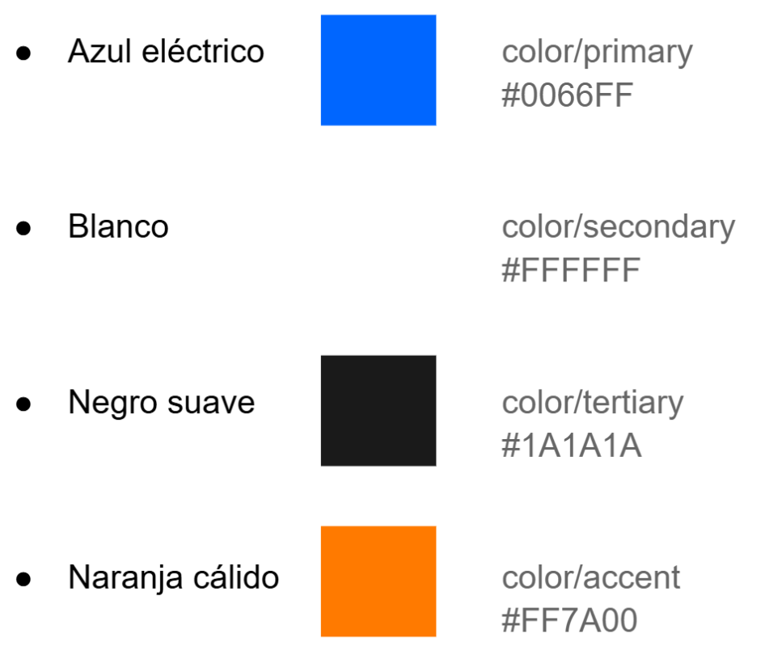
        
- Spacing

    A continuación, presentaremos las decisiones de espaciado elegidas.

    - Figura 19       

        Espaciado elegido entre elementos de la plataforma web

        

- Assets
    
    A continuación, mostraremos las imágenes referenciales de los assets elegidos.

    Figura 20

    Plantilla usada para la versión Desktop

    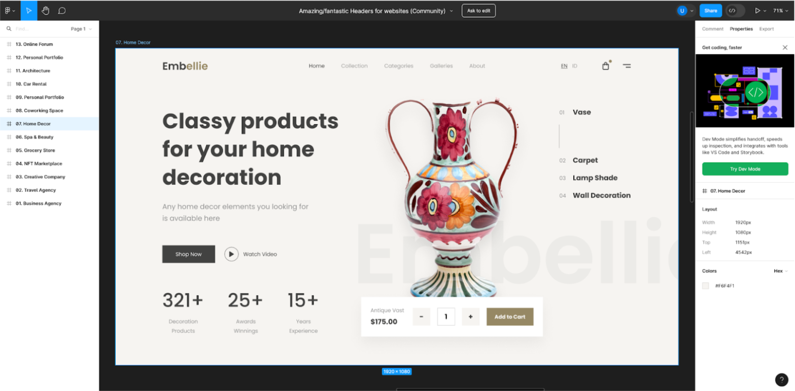

    Figura 21
    
    Pantalla de inicio

    

    Figura 22
    
    Pantalla de Iniciar Sesión

    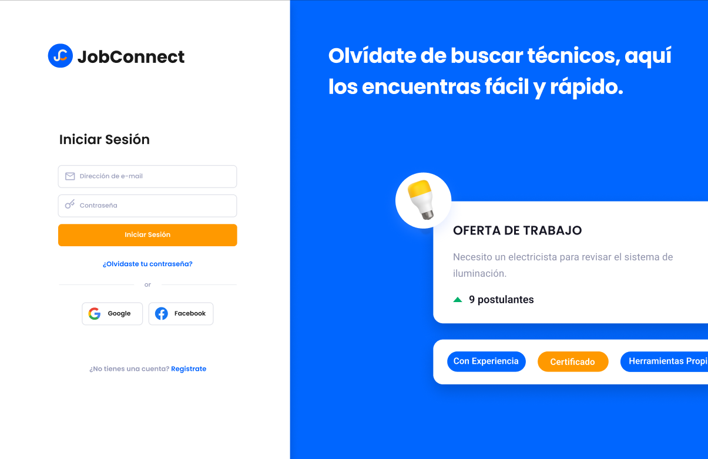

    Figura 23
    
    Pantalla de Crear Cuenta

    

    Figura 24
    
    Pantalla de Menú principal del Cliente
    
    

    Figura 25
    
    Pantalla de Menú principal del Trabajador

    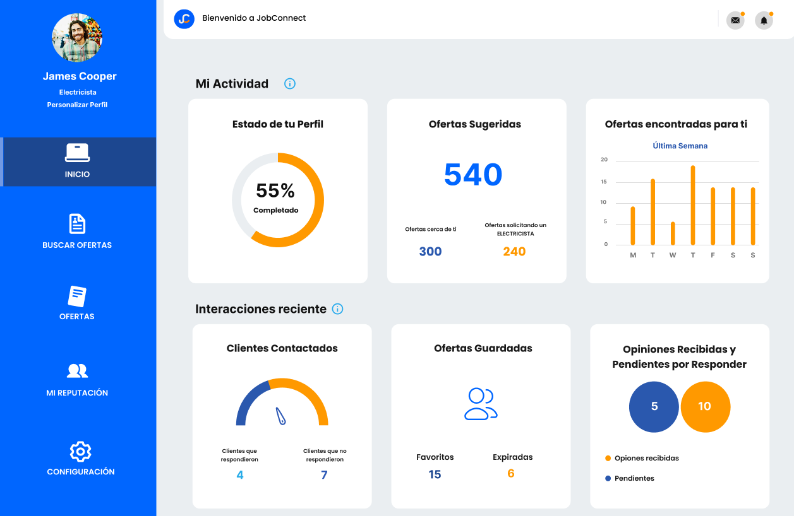

    Figura 26
    
    Pantalla de Configuración de Cuenta

    

### **4.2. Information Architecture**
    
En esta sección, presentaremos las decisiones y las razones que guían la manera en que se estructura el contenido en las experiencias web y móviles, incluyendo la página de inicio (Landing Page) y las aplicaciones. Estas propuestas se enfocan mayormente en garantizar que los usuarios puedan adaptarse fácilmente a las funcionalidades de cada producto y encuentren sin dificultad lo que busquen.

- Figura 37

    Cuadro de cómo se estructura la información del landing page

    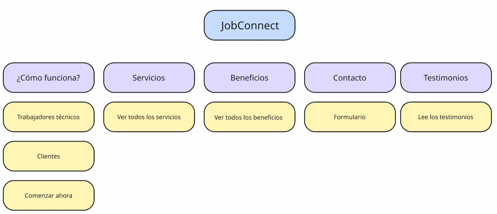

- Figura 38
    
    Cuadro de cómo se estructura la información de la aplicación web
        
    

### 4.2.2. Labeling Systems

- Navegación y menús: 
    
    Hemos considerado las siguientes etiquetas y categorías para la barra de navegación.

| Funcionalidad         | Descripción                                                                 |
|------------------------|------------------------------------------------------------------------------|
| Iniciar sesión         | Botón para iniciar sesión en la plataforma                                   |
| Inicio                 | Muestra un dashboard de todas las actividades del cliente o trabajador       |
| Buscar técnicos        | Muestra a todos los trabajadores con un filtro de búsqueda                   |
| Comparar perfiles      | Se refiere a una lista de ciertos trabajadores del mismo sector con sus respectivas descripciones. |
| Ofertas (Cliente)      | Muestra el estado de la oferta que creó el cliente                           |
| Configuración          | Dirige al cliente a la configuración del perfil                              |
| Personalizar perfil    | Dirige al cliente o trabajador a su perfil con sus datos y sus preferencias  |
| Buscar Ofertas         | Dirige al trabajador a las ofertas de trabajo que se le presentan            |
| Ofertas (Trabajador)   | Muestra el estado de las ofertas del trabajador                              |
| Mi Reputación          | Muestra las valoraciones y reseñas hacia el trabajador                       |

- Figura 39

    Etiquetas que aparecen en el aplicativo web

    Cliente   

    

    Trabajador

    

### 4.2.2. SEO Tags and Meta Tags

### 4.2.4. Searching Systems

Se implementará un sistema de búsqueda dentro de la aplicación para facilitar la navegación de los usuarios. 

La función de búsqueda se integrará en las siguientes vistas:
- Filtro de búsqueda de técnicos
- Filtro de búsqueda del servicio

Figura 40

Vistas en donde se integrará el sistema de búsqueda

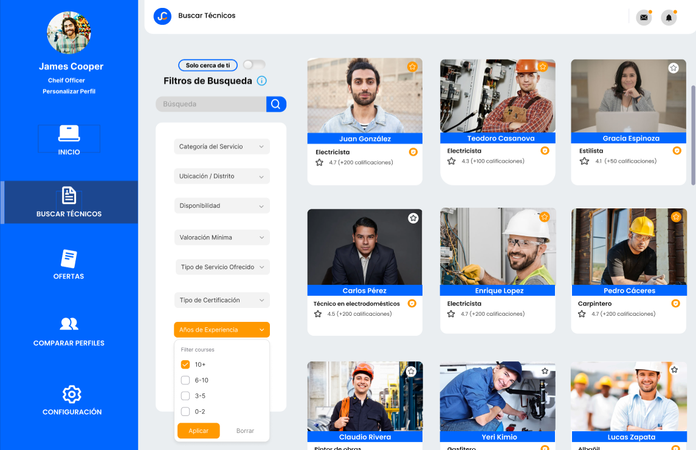  

### 4.2.5. Navigation Systems

Para que el usuario tenga una experiencia fluida, se han implementado dos tipos de navegaciones, respetando el sistema de organización del producto.

- **Menú de navegación de TuChamba.pe:**

    En la web se presenta un menú de navegación superior fijo, que se extiende horizontalmente en la parte superior de la página. Este menú ofrece un acceso organizado y visualmente limpio a las secciones principales del sitio:

    - **¿Cómo funciona?:** Guía paso a paso sobre cómo usar JobConnect, orientada tanto a técnicos como a clientes.

    - **Servicios:** Descripción de los profesionales en diversas áreas técnicas que se encuentran en la plataforma. 

    - **Beneficios:** Comparativa de ventajas que ofrece la aplicación frente a métodos tradicionales.

    - **Contacto:** Espacio para consultas, soporte o contacto directo con el equipo.

    - **Iniciar sesión:** Botón destacado para que los usuarios existentes accedan rápidamente a la aplicación.

    - **Registrarse:** Llamado a la acción claro y visible para nuevos usuarios que desean unirse a JobConnect.

- **Menú de navegación de JobConnect:**

    En la plataforma, los usuarios cuentan con un menú de navegación lateral fijo a la izquierda. Este menú permite el acceso directo a las funcionalidades principales según el tipo de usuario (cliente o trabajador). Las secciones incluyen:

    - **Inicio:** Vista principal con indicadores de actividad y estadísticas.

    - **Buscar técnicos / Buscar ofertas:** Dependiendo del perfil, permite explorar técnicos disponibles o vacantes laborales.

    - **Ofertas:** Acceso a oportunidades laborales o a solicitudes enviadas.

    - **Comparar perfiles / Mi reputación:** Funcionalidades especializadas según el rol.

    - **Configuración:** Permite personalizar opciones del perfil y ajustes de cuenta.

    - **Personalizar perfil:** Acceso a los datos del usuario y sus preferencias.

    Cada ícono está acompañado de un texto descriptivo, lo que facilita la navegación intuitiva y rápida.

- Figura 41
    
    Sistema de navegación de la web

    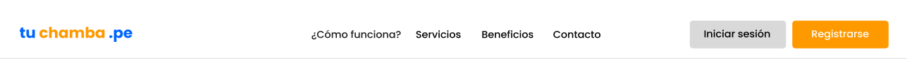

    Sistema de navegación de la plataforma

    
    

### 4.3. Landing Page UI Design

Esta sección se enfoca en el diseño de la interfaz de usuario (UI) de la Landing Page, que es esencial para captar la atención de los usuarios y comunicar de manera efectiva la propuesta de valor del sistema. A continuación, se presentan los wireframes y los mock-ups, dos etapas clave en el proceso de diseño que permiten visualizar y refinar la estructura y apariencia de la página.

### 4.3.1. Landing Page Wireframe

Con respecto a la arquitectura de la Landing Page, para versiones web hemos decidido adoptar un diseño estándar, como lo sería tener en la parte superior la barra de opciones como “¿Cómo funciona?”, “Servicios”, “Beneficios”, "Contacto", " Iniciar sesión" y "Registrarse". Mientras que la posición de las estructuras de texto e imágenes es bastante amplia separadas lo suficiente una de la otra en su mayoría, aprovechando al máximo la cantidad de espacio que ofrece la visualización desde un monitor, lo que nos permite tener un gran espacio disponible que podemos rellenar con información pero sin llegar a exagerar y hacer ver como si estuviera sobrecargado.

Para su mejor visualización se adjunta el enlace del figma: 
https://www.figma.com/design/py3rabYJzPcLJN8k0b92su/Aplicaciones-Web?node-id=0-1&t=Pdr5EyHMWjawXyor-1

- Figura 42
    
    Ventana de inicio

    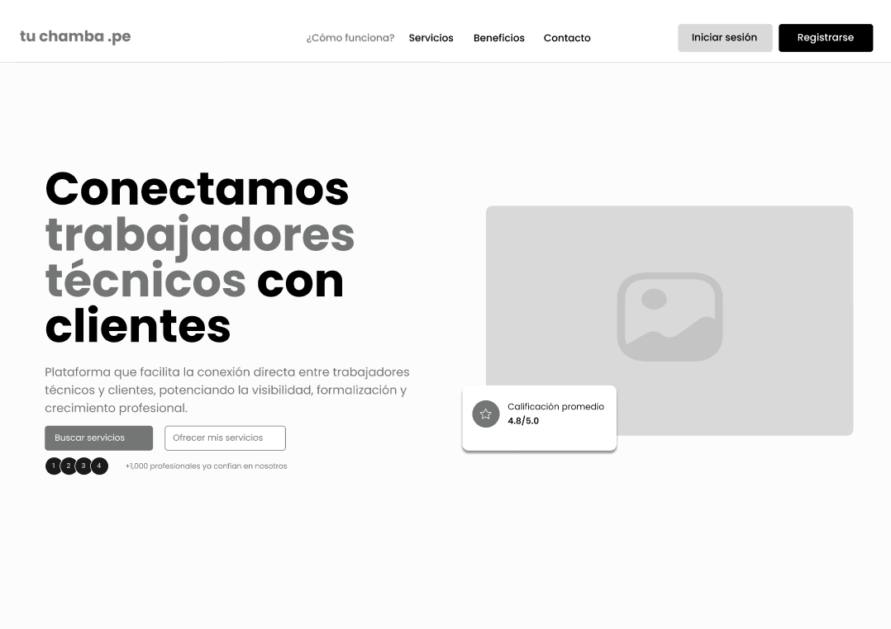

- Figura 43

    Ventana de ¿Cómo funciona?

    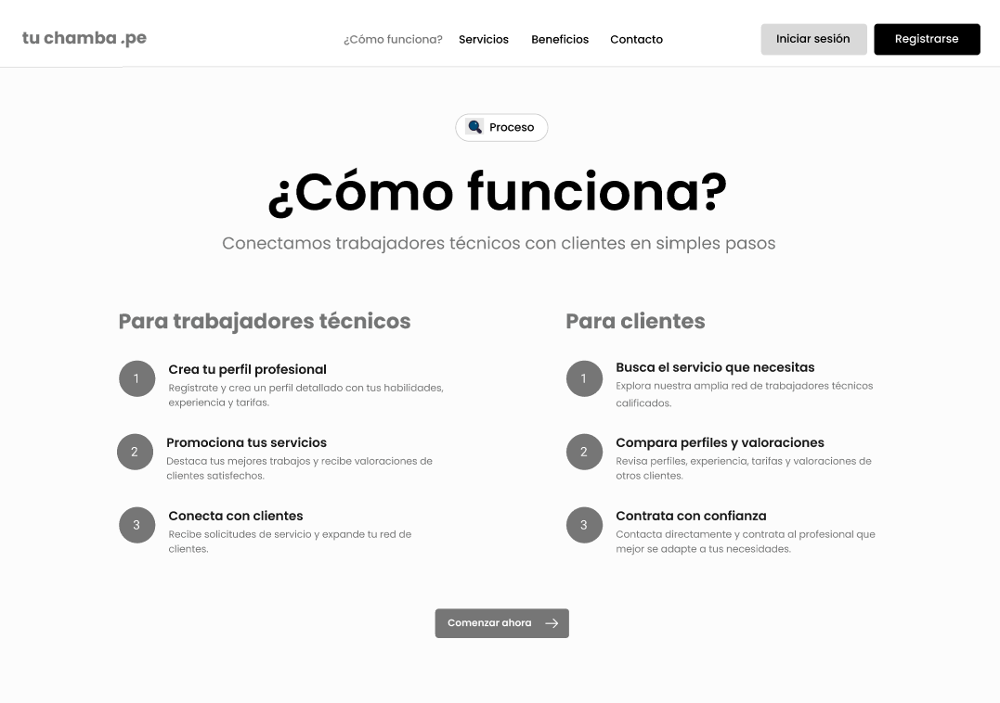

- Figura 44

    Ventana de Servicios

    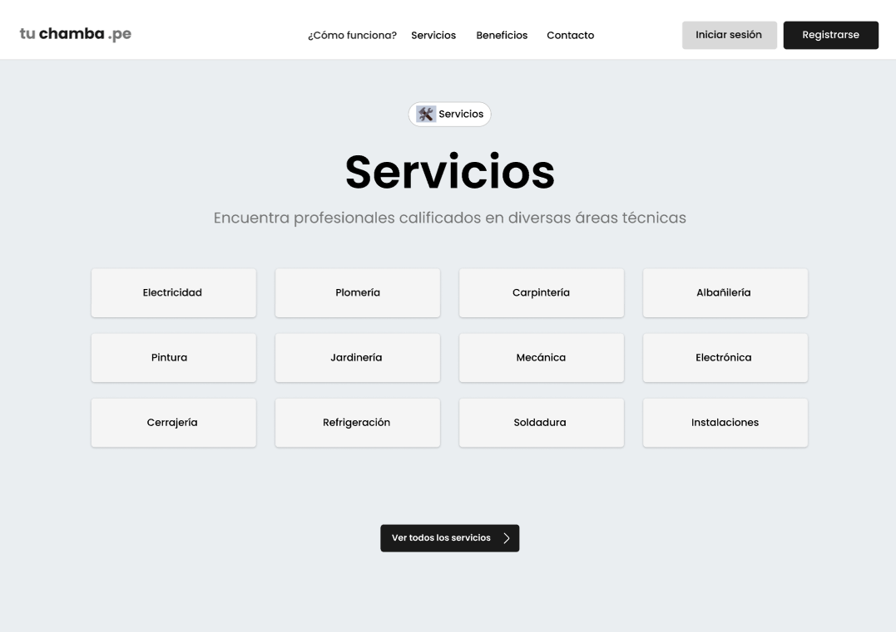

- Figura 45

    Ventana de Beneficios

    

- Figura 46

    Ventana de Testimonios

    

- Figura 47

    Ventana de Contacto

    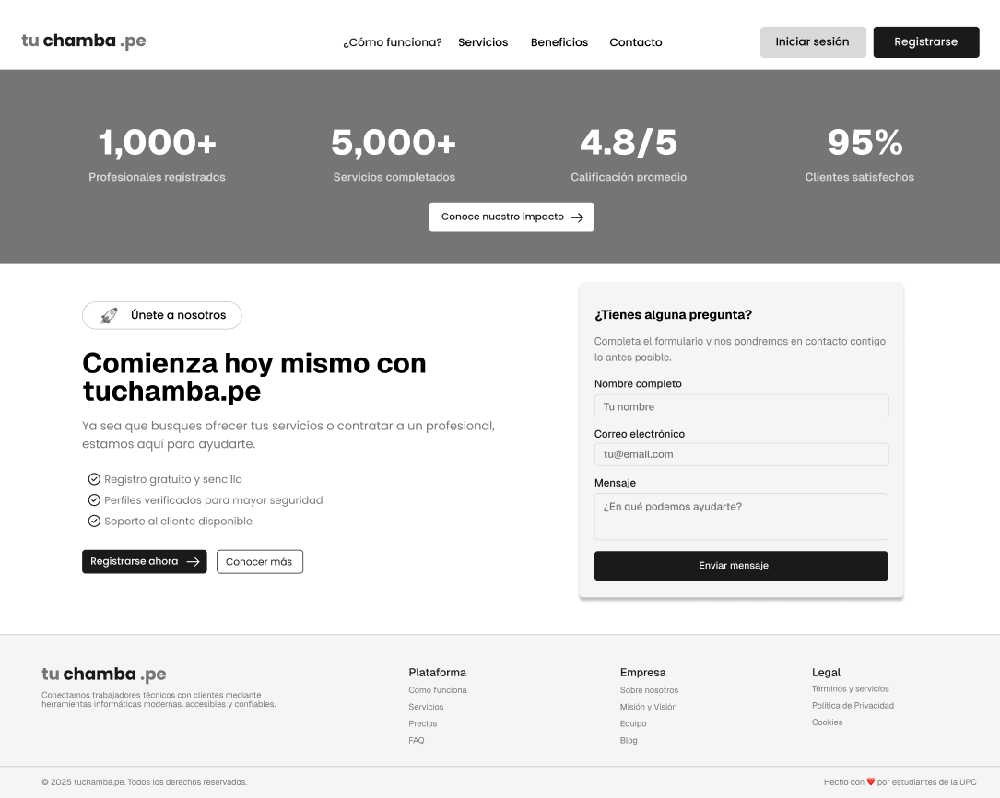

### 4.3.2. Landing Page Mock-up

- Figura 48

     Ventana de inicio

    

- Figura 49

    Ventana de ¿Cómo funciona?

    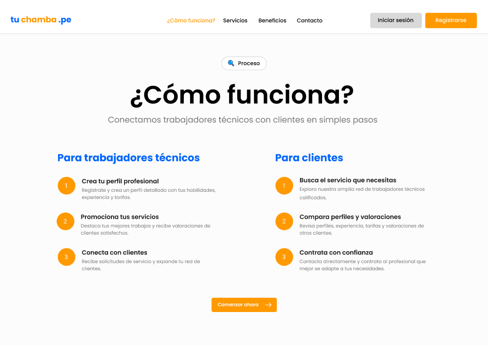

- Figura 50

    Ventana de Servicios

    

- Figura 51

    Ventana de Beneficios

    

- Figura 52

    Ventana de Testimonios

    

- Figura 53

    Ventana de Contacto

    

### 4.4. Web Applications UX/UI Design

En el diseño de la interfaz de usuario de nueestra aplicación web "JobConnect", nos enfocamos en ofrecer una experiencia intuitiva, eficiente y visualmente atractiva. Asimismo, seguimos las guías de diseño para optimizar el rendimiento y garantizar que cada parte de la aplicación se adapte de manera fluida a los clientes y trabajadores.

### 4.4.1. Web Applications Wireframes

- Figura 54

    Wireframe de Iniciar Sesión

    

- Figura 55

    Wireframe de Crear Cuenta

    

- Figura 56

    Wireframes para Recuperar contraseña

    

    

    

- Figura 57

    Wireframes de error al iniciar Sesión o registrarse

    

    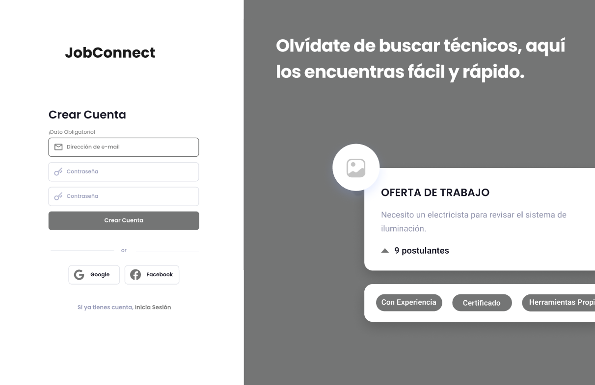

- Figura 58

    Vista de inicio del cliente

    

- Figura 59

    Vista de Buscar Técnicos

    

- Figura 60

    Vista de Comparar Perfiles

    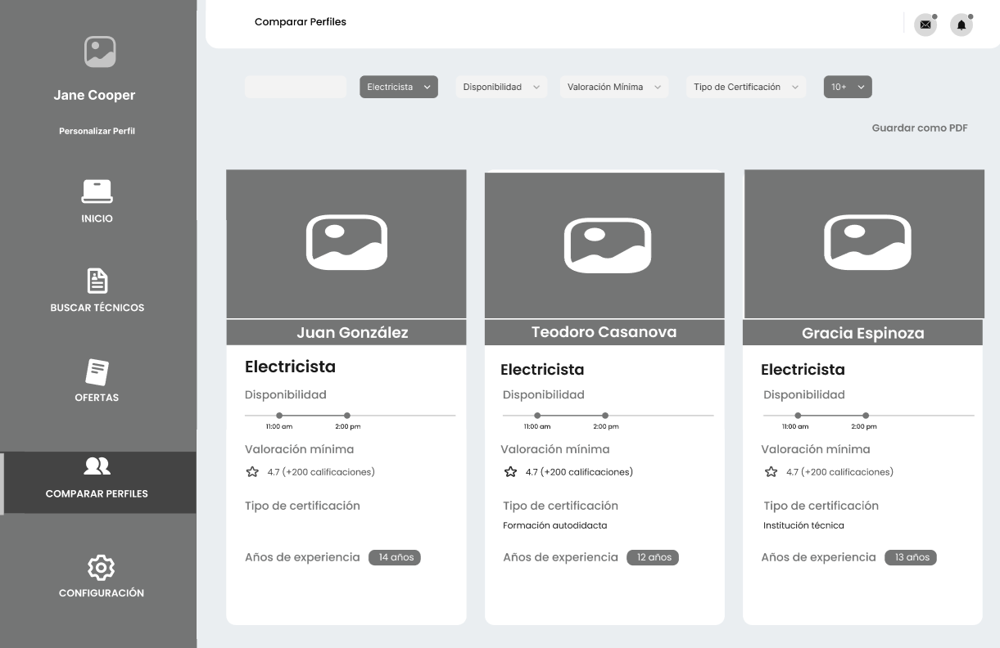

- Figura 61

    Vistas relacionadas con Ofertas

    
    
    
    
    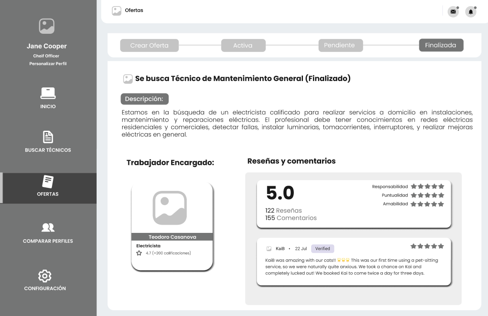

- Figura 62

    Vista de configuración

    

- Figura 63

    Vistas de Personalizar Perfil

    
    

- Figura 64

    Vista de inicio del trabajador

    

- Figura 65

    Vista de buscar ofertas del trabajador

    

- Figura 66

    Vistas relacionadas con las ofertas del trabajador

    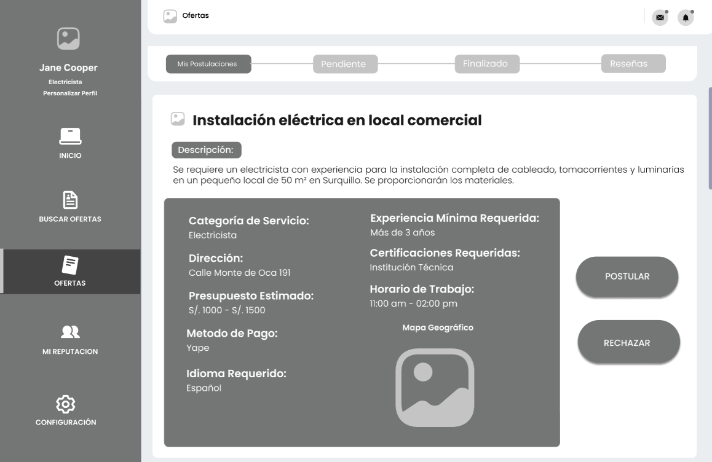
    
    
    

- Figura 67

    Vista de reputacion del trabajador

    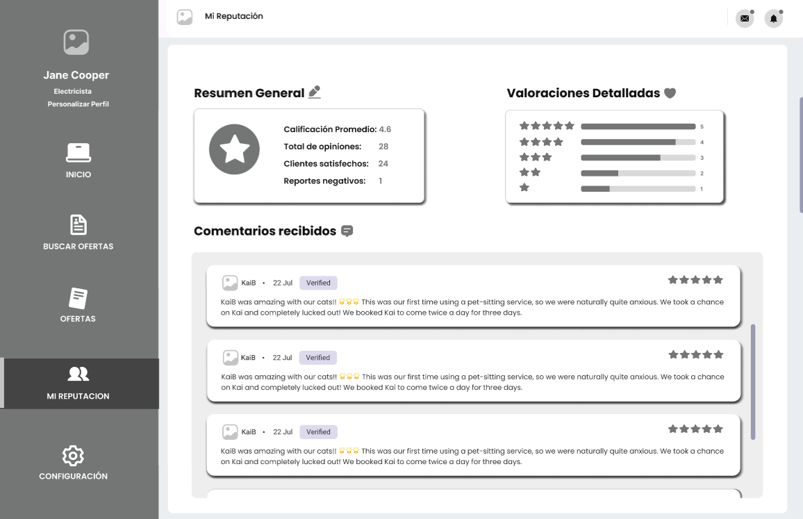

- Figura 68

    Vistas de personalizar perfil del trabajador

    
    

### 4.4.2. Web Applications Wireflows Diagrams

En los Wireflow Diagrams de la plataforma JobConnect, se visualiza el recorrido completo que realiza el usuario, desde el registro hasta la utilización de todas las funciones disponibles. El flujo muestra cómo el usuario interactúa con la app en cada etapa, asegurando una experiencia intuitiva y fluida.

### User Persona
**Nombre:** Juan, Electricista

Juan es un técnico con experiencia que busca ampliar su red de clientes y conseguir trabajos de manera más eficiente. Desea encontrar oportunidades laborales cercanas, postularse rápidamente y hacer seguimiento a sus trabajos.

### User Goal
Para finales del primer trimestre de 2024, Juan podrá encontrar trabajos disponibles en su zona, postularse en menos de 2 minutos y recibir confirmaciones o rechazos con una tasa de respuesta superior al 90%.

### Task Flow

1. **Abrir la plataforma JobConnect**
   - **Acción:** Juan usa la plataforma
   - **Propósito:** Accede al apartado de Buscar Ofertas donde se muestran los trabajos disponibles
   - **Resultado Esperado:** En Buscar Ofertas, filtra los trabajos según sus preferencias (Ubicación, Disponibilidad, Rango de Pago Ofrecido, Medio de Pago, etc.)

2. **Buscar trabajos disponibles**
   - **Acción:** Juan explora los trabajos disponibles en el apartado Buscar Ofertas, usando filtros como Rango de Pago Ofrecido.
   - **Propósito:** Encontrar rápidamente oportunidades laborales que se ajusten a sus preferencias.
   - **Resultado esperado:** Se muestra una lista filtrada con ofertas de trabajo para un electricista, con un rango de precio, medio de pago y el estado de oferta.

3. **Postularse a un trabajo:**
   - **Acción:** Juan selecciona una oferta de trabajo que le ha gustado en el apartado de Buscar Ofertas y en el apartado de Ofertas postula a la que más le pareció.
   - **Propósito:** Enviar su solicitud al cliente.
   - **Resultado esperado:** Se envía la postulación y queda a la espera de la respuesta del cliente.

4. **Revisar estado de sus postulaciones:**
   - **Acción:** Juan entra al apartado "Ofertas" y revisa la sección "Mis Postulaciones" para ver el estado de sus postulaciones.
   - **Propósito:** Monitorear el progreso de sus solicitudes y prepararse para aceptar la oferta.
   - **Resultado esperado:** Se visualiza en la sección Pendiente el estado de la oferta mientras está en proceso.

5. **Realizar trabajo asignado:**
   - **Acción:** Al aceptar la oferta, Juan pasa a la sección de Pendiente en la que puede chatear con el cliente y ver detalles del trabajo.
   - **Propósito:** Ofrecer el servicio pedido por el cliente.
   - **Resultado esperado:** Juan termina el trabajo y puede reseñar la obra.

*Flujo de tareas para postularse a una oferta en la plataforma JobConnect*

*A continuación, algunas de nuestras User Stories junto con su diagrama:*

**US01**

**US02**

**US03**

### 4.4.3. Web Applications Mock-ups

Para su mejor visualización se adjunta el enlace del figma: 
https://www.figma.com/design/py3rabYJzPcLJN8k0b92su/Aplicaciones-Web?node-id=0-1&t=Pdr5EyHMWjawXyor-1

- Figura 69

    Iniciar Sesión

    

- Figura 70

    Crear Cuenta

    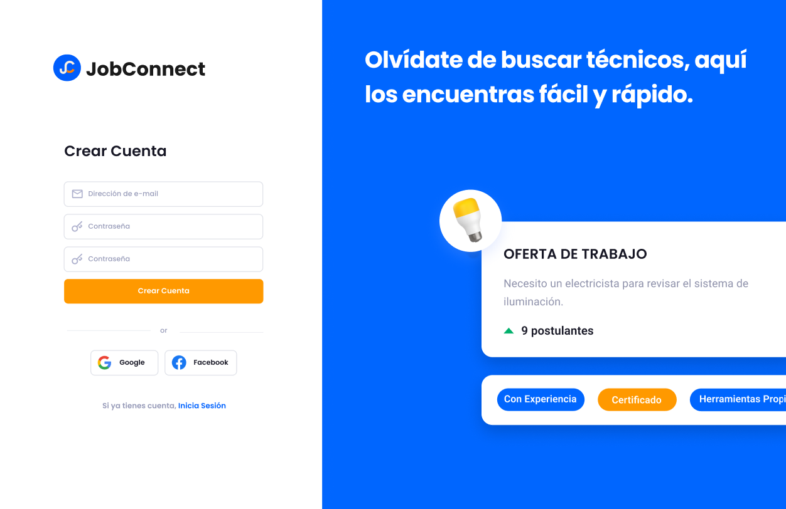

- Figura 71

    Vistas para Recuperar contraseña

    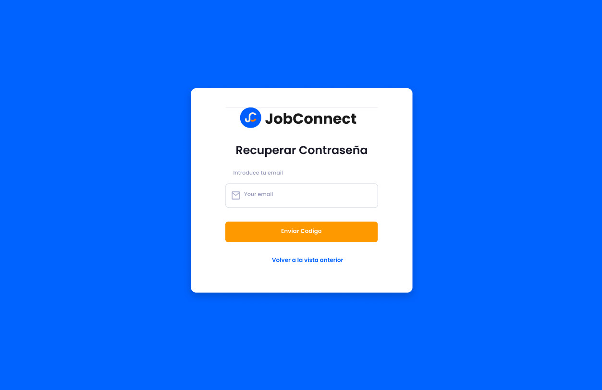

    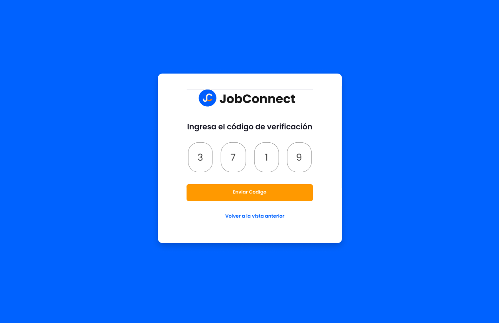

    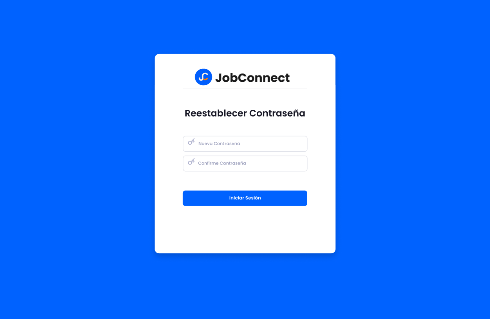

- Figura 72

   Mockups de error al iniciar Sesión o registrarse

    

    

- Figura 73

    Vista de inicio del cliente

    

- Figura 74

    Vista de Buscar Técnicos

    

- Figura 75

    Vista de Comparar Perfiles

    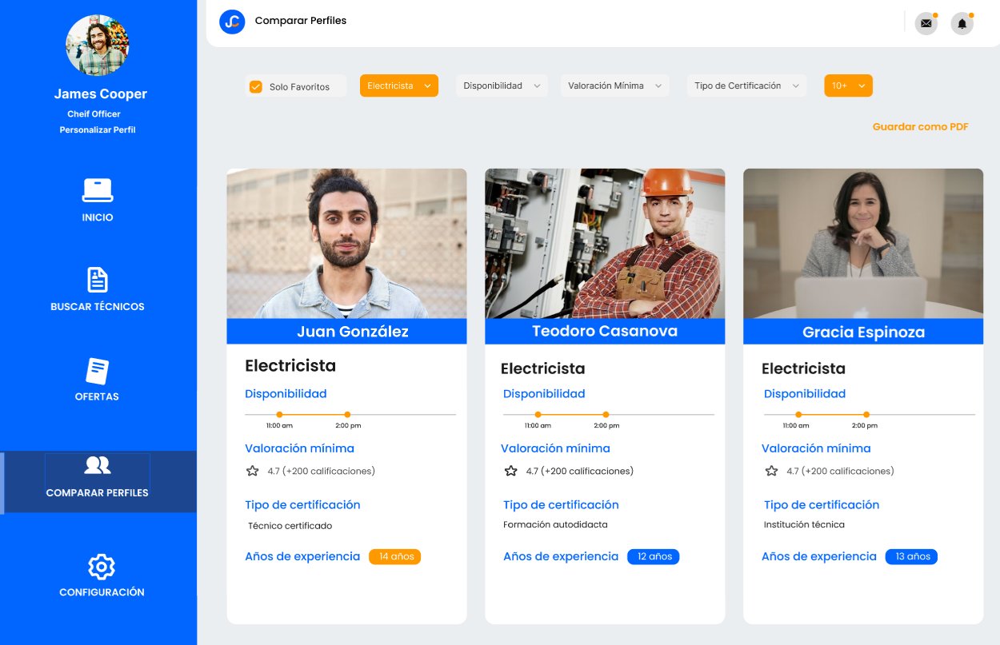

- Figura 76

    Vistas relacionadas con Ofertas

    
    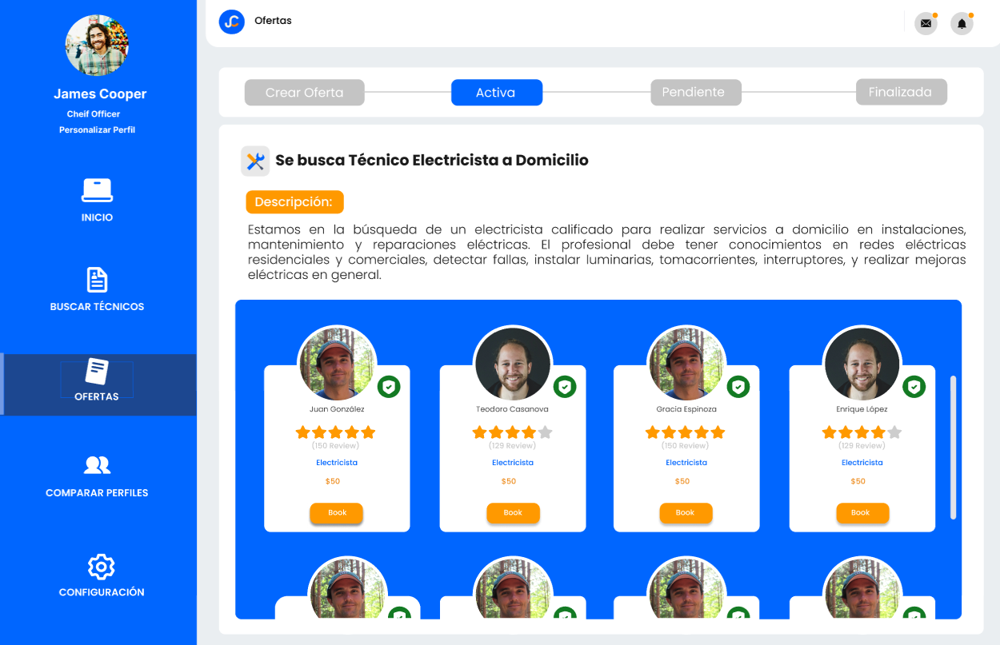
    
    
    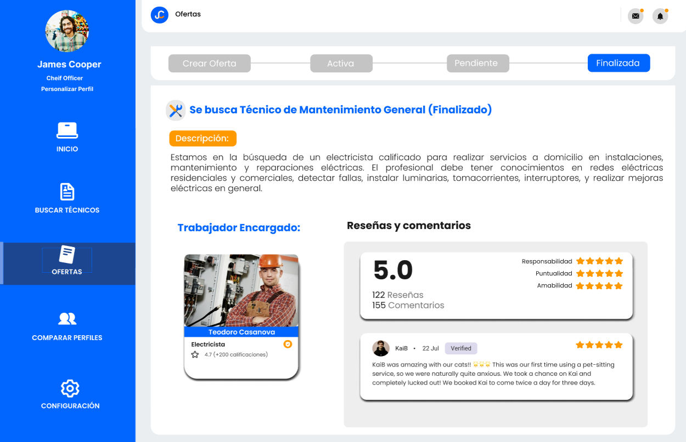

- Figura 77

    Vista de configuración

    

- Figura 78

    Vistas de Personalizar Perfil

    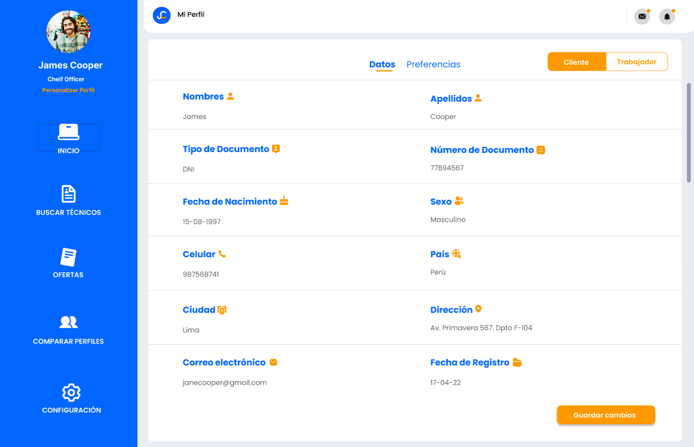
    

- Figura 79

    Vista de inicio del trabajador

    

- Figura 80

    Vista de buscar ofertas del trabajador

    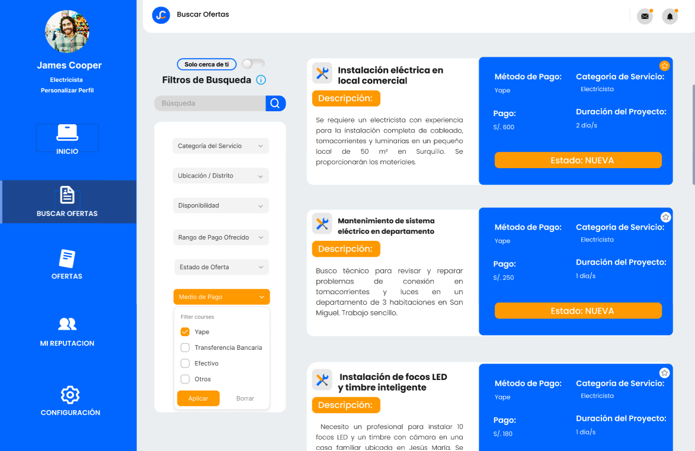

- Figura 81

    Vistas relacionadas con las ofertas del trabajador

    
    
    
    

- Figura 82

    Vista de reputacion del trabajador

    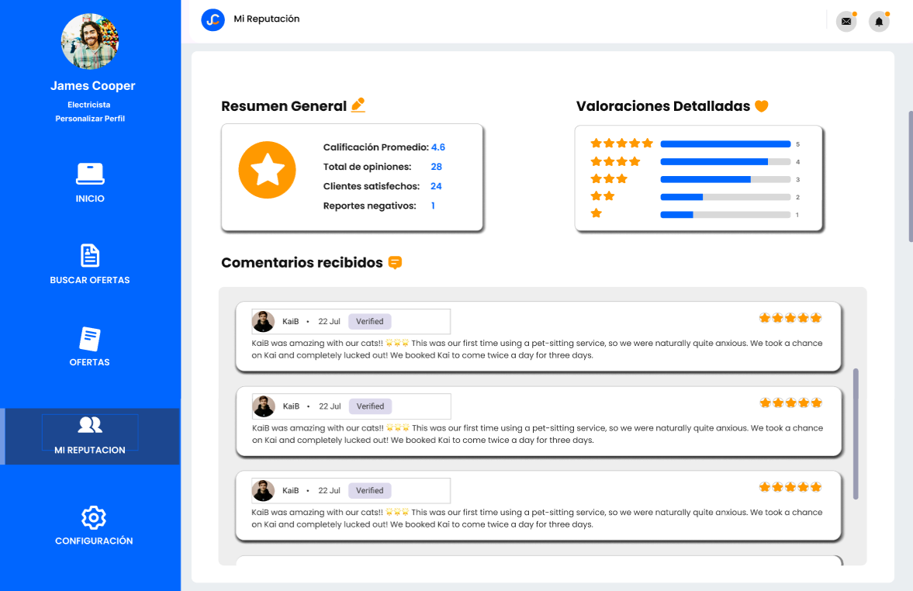

- Figura 83

    Vistas de personalizar perfil del trabajador

    
    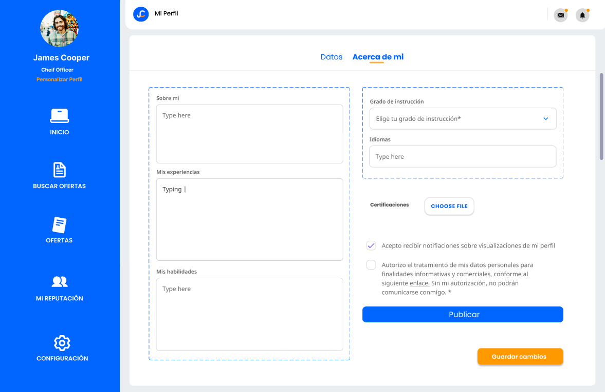

### 4.4.4. Web Applications Wireflows User Flow Diagrams

En el User Flow de JobConnect, se detalla el *happy path* que sigue Juan, el electricista, para lograr su objetivo principal de encontrar una oferta que satisfaga sus preferencias. Este flujo asegura una experiencia de usuario clara y eficiente, facilitando el acceso a la información crítica y postularse a ofertas de manera sencilla. Cada paso ilustra como Juan interactúa con la aplicación sin encontrar obstáculos, desde el inicio de sesión hasta postularse a una oferta y culminarla.

1. **Inicio de sesión en JobConnect**
   - **Página:** Pantalla de inicio de sesión
   - **Acción:** Juan abre la plataforma e ingresa sus credenciales para acceder.
   - **Lógica:** El sistema valida las credenciales ingresadas.
   - **Resultado:** Juan accede a la pantalla principal, donde puede explorar ofertas de trabajo disponibles.

2. **Acceso a Buscar Ofertas**
   - **Página:** Panel principal - Buscar Ofertas.
   - **Acción:** Juan entra en la sección "Buscar Ofertas" desde el panel lateral.
   - **Lógica:** La aplicación carga las ofertas activas disponibles en su zona, basadas en su perfil y ubicación.
   - **Resultado:** Juan visualiza una lista de trabajos disponibles que puede filtrar según sus preferencias.

3. **Aplicación de Filtros de Búsqueda**
   - **Página:** Buscar Ofertas
   - **Acción:** Juan aplica filtros como "Ubicación", "Rango de pago", "Disponibilidad" y "Medio de pago".
   - **Lógica:** El sistema filtra automáticamente las ofertas de trabajo según los criterios seleccionados.
   - **Resultado:** Juan visualiza una lista precisa de ofertas que se ajustan a sus necesidades y perfil.

4. **Revisión de Detalles de una Oferta**
   - **Página:** Ofertas
   - **Acción:** Juan selecciona una oferta específica y revisa la descripción del trabajo, condiciones, presupuesto y datos del cliente.
   - **Lógica:** La plataforma muestra los detalles de la oferta y un botón de "Postularse".
   - **Resultado:** Juan evalúa si la oferta es adecuada y está listo para enviar su postulación.

5. **Postulación a la Oferta**
   - **Página:** Ofertas
   - **Acción:** Juan selecciona "Postularse" 
   - **Lógica:** La plataforma actualiza el estado de la postulación en tiempo real.
   - **Resultado:** Juan visualiza el estado actual de su solicitud.

6. **Seguimiento de la Postulación**
   - **Página:** Sección "Ofertas" – Subsección "Pendientes"
   - **Acción:** Juan ingresa a la sección de "Pendientes" para revisar el estado de la oferta a la que postuló.
   - **Lógica:** La plataforma muestra la sección Pendiente en la que se ve detalles de la oferta y se habilita la mensajería directa.
   - **Resultado:** Juan visualiza el estado actual de su solicitud y se mantiene informado sobre su avance.

7. **Confirmación de Trabajo Culminado**
   - **Página:** Sección "Ofertas" – Subsección "Finalizado"
   - **Acción:** Juan recibe la notificación de que el trabajo ha sido terminado por el cliente.
   - **Lógica:** La plataforma muestra la sección Finalizado y permite reseñar o culminar el trabajo.
   - **Resultado:** Juan reseña el trabajo que realizó y al cliente.

*Ahora procederemos a mostrar el User Flow Diagram de JobConnect, detallando el happy path que sigue Juan, el electricista, para postularse a una oferta y culminarla de la manera más rápida y eficiente.*

Nota. Este diagrama ilustra el flujo de usuario de Juan, elelectricista, en la postularse y trabajar en una oferta. Se detalla el proceso optimizado que sigue para garantizar una respuesta rápida y eficiente acción de buscar ofertas según sus preferencias.

*A continuación, algunas de nuestras User Stories junto con su diagrama:*

**US01:** Como usuario, quiero iniciar sesión en la aplicación, para acceder a mi cuenta personal.	

User Persona: Clientes/Usuarios que requieren tecnicos

Happy path: El usuario completa sus datos correctamente en el formulario de iniciar sesión

Unhappy path: El usuario completa sus datos incorrectamente en el formulario de iniciar sesión

**US02:** Como nuevo usuario, quiero registrarme en la plataforma, para poder usar los servicios.	

User Persona: Clientes/Usuarios que requieren tecnicos

Happy path: El usuario completa sus datos correctamente en el formulario de registro

Unhappy path: El usuario completa sus datos incorrectamente en el formulario de registro

**US03:** Como usuario, quiero recuperar mi contraseña, para poder acceder si la olvido.	

User Persona: Clientes/Usuarios que requieren tecnicos

Happy path: El usuario valida su identidad satisfactoriamente y reestablece su contraseña

Unhappy path: El usuario no logra reestablecer su contraseña por no validar su identidad

### 4.5. Web Applications Prototyping

 Los prototipos han sido diseñados para simular la interacción y la navegación, siguiendo los caminos establecidos en los diagramas de flujo de usuario. A través de estos prototipos, los usuarios pueden experimentar las funcionalidades clave de la aplicación y comprender cómo los distintos elementos interactúan entre sí.

 Enlace: https://youtu.be/9PC1qOfyiXI 